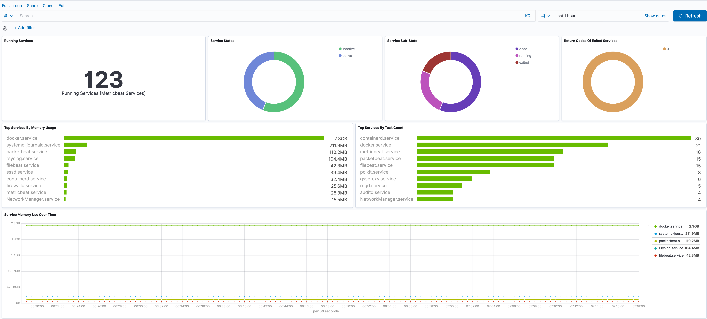

---
mapped_pages:
  - https://www.elastic.co/guide/en/beats/metricbeat/current/metricbeat-metricset-system-service.html
---

# System service metricset [metricbeat-metricset-system-service]

::::{warning}
This functionality is in beta and is subject to change. The design and code is less mature than official GA features and is being provided as-is with no warranties. Beta features are not subject to the support SLA of official GA features.
::::


The `service` metricset reports on the status of systemd services.

This metricset is available on:

* Linux


## systemd resource accounting and process metrics [_systemd_resource_accounting_and_process_metrics]

If systemd resource accounting is enabled, this metricset will report any resources tracked by systemd. On most distributions, `tasks` and `memory` are the only resources with accounting enabled by default. For more information, [see the systemd manual pages](https://www.freedesktop.org/software/systemd/man/systemd.resource-control.html).


## Configuration [_configuration_14]

**`service.state_filter`** - A list of service states to filter by. This can be any of the states or sub-states known to systemd. **`service.pattern_filter`** - A list of glob patterns to filter service names by. This is an "or" filter, and will report any systemd unit that matches at least one filter pattern.


## Dashboard [_dashboard_43]

The system service metricset comes with a predefined dashboard. For example:



## Fields [_fields_245]

For a description of each field in the metricset, see the [exported fields](/reference/metricbeat/exported-fields-system.md) section.

Here is an example document generated by this metricset:

```json
{
    "@timestamp": "2017-10-12T08:05:34.853Z",
    "event": {
        "dataset": "system.service",
        "duration": 115000,
        "module": "system"
    },
    "metricset": {
        "name": "service",
        "period": 10000
    },
    "process": {
        "exit_code": 0,
        "pid": 259
    },
    "service": {
        "type": "system"
    },
    "system": {
        "service": {
            "exec_code": "exited",
            "load_state": "loaded",
            "name": "dracut-pre-udev.service",
            "state": "inactive",
            "state_since": "2020-08-26T18:05:23.525244-07:00",
            "sub_state": "dead",
            "unit_file": {
                "state": "static",
                "vendor_preset": "disabled"
            }
        }
    },
    "systemd": {
        "fragment_path": "/usr/lib/dracut/modules.d/98dracut-systemd/dracut-pre-udev.service",
        "unit": "dracut-pre-udev.service"
    }
}
```


