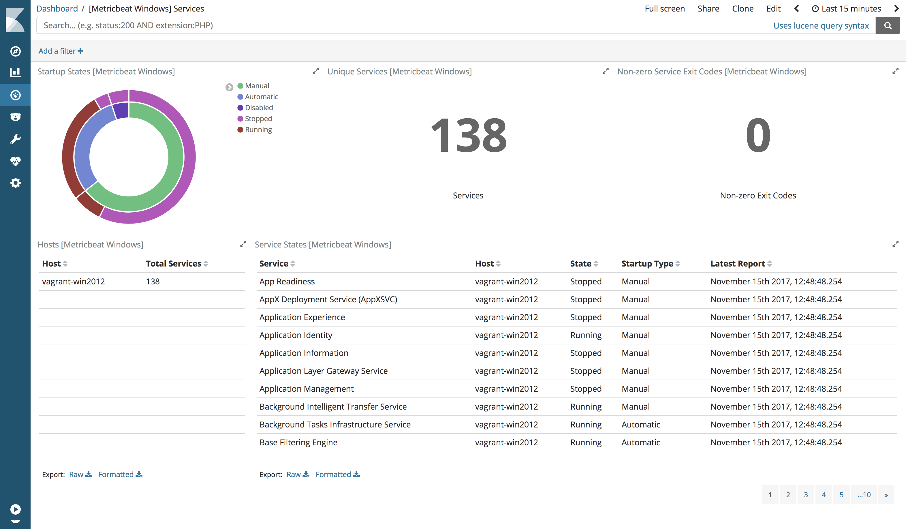

---
mapped_pages:
  - https://www.elastic.co/guide/en/beats/metricbeat/current/metricbeat-metricset-windows-service.html
---

# Windows service metricset [metricbeat-metricset-windows-service]

The `service` metricset of the Windows module reads the status of Windows services.


## Dashboard [_dashboard_47]

The service metricset comes with a predefined dashboard. For example:




## Configuration [_configuration_20]

```yaml
- module: windows
  metricsets: ["service"]
  period: 60s
```


## Filtering [_filtering_2]

Processors can be used to filter the events based on the service states or their names. The example below configures the metricset to drop all events except for the events for the firewall service. See [Processors](/reference/metricbeat/filtering-enhancing-data.md) for more information about using processors.

```yaml
- module: windows
  metricsets: ["service"]
  period: 60s
  processors:
    - drop_event.when.not.equals:
        windows.service.display_name: Windows Firewall
```

## Fields [_fields_264]

For a description of each field in the metricset, see the [exported fields](/reference/metricbeat/exported-fields-windows.md) section.

Here is an example document generated by this metricset:

```json
{
    "@timestamp": "2017-10-12T08:05:34.853Z",
    "event": {
        "dataset": "windows.service",
        "duration": 115000,
        "module": "windows"
    },
    "metricset": {
        "name": "service"
    },
    "service": {
        "type": "windows"
    },
    "windows": {
        "service": {
            "display_name": "Servicio de enrutador de AllJoyn",
            "exit_code": "ERROR_SERVICE_NEVER_STARTED",
            "id": "IOQgaoSLJ7",
            "name": "AJRouter",
            "start_type": "Manual (Triggered)",
            "state": "Stopped"
        }
    }
}
```


