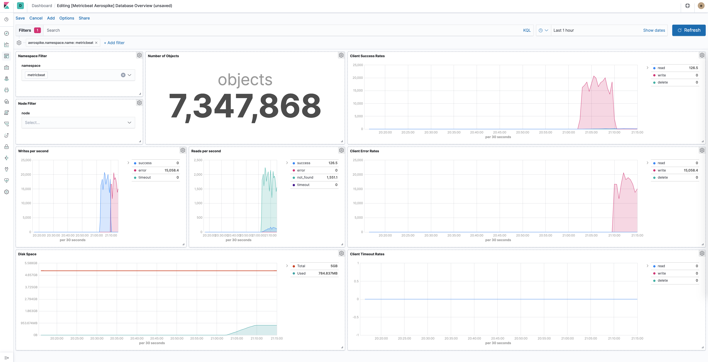

---
mapped_pages:
  - https://www.elastic.co/guide/en/beats/metricbeat/current/metricbeat-module-aerospike.html
---

# Aerospike module [metricbeat-module-aerospike]

The Aerospike module uses the [Info command](http://www.aerospike.com/docs/reference/info) to collect metrics. The default metricset is `namespace`.


## Compatibility [_compatibility_5]

The Aerospike metricsets were tested with Aerospike Enterprise Edition 7.2.0.1 and are expected to work with all versions >= 4.9.


## Dashboard [_dashboard]

The Aerospike module comes with a predefined dashboard for Aerospike namespace, node specific stats. For example:




## Example configuration [_example_configuration_2]

The Aerospike module supports the standard configuration options that are described in [Modules](/reference/metricbeat/configuration-metricbeat.md). Here is an example configuration:

```yaml
metricbeat.modules:
- module: aerospike
  metricsets: ["namespace"]
  enabled: true
  period: 10s
  hosts: ["localhost:3000"]

  # Aerospike Cluster Name
  #cluster_name: myclustername

  # Username of hosts. Empty by default.
  #username: root

  # Password of hosts. Empty by default.
  #password: secret

  # Authentication modes: https://aerospike.com/docs/server/guide/security/access-control
  # Possible values: internal (default), external, pki
  #auth_mode: internal

  # Optional SSL/TLS (disabled by default)
  #ssl.enabled: true

  # List of root certificates for SSL/TLS server verification
  #ssl.certificate_authorities: ["/etc/pki/root/ca.crt"]

  # Certificate for SSL/TLS client authentication
  #ssl.certificate: "/etc/pki/client/cert.crt"

  # Client certificate key file
  #ssl.key: "/etc/pki/client/cert.key"
```

This module supports TLS connections when using `ssl` config field, as described in [SSL](/reference/metricbeat/configuration-ssl.md).


## Metricsets [_metricsets_3]

The following metricsets are available:

* [namespace](/reference/metricbeat/metricbeat-metricset-aerospike-namespace.md)


