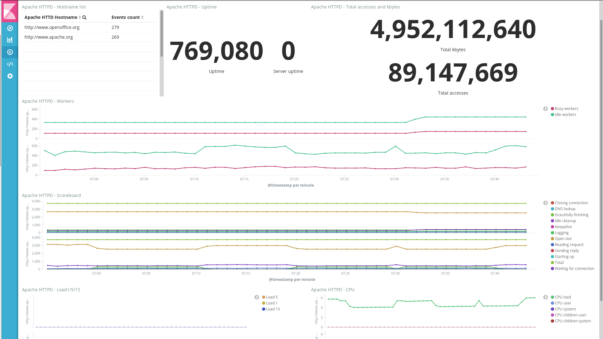

---
mapped_pages:
  - https://www.elastic.co/guide/en/beats/metricbeat/current/metricbeat-module-apache.html
---

# Apache module [metricbeat-module-apache]

:::::{admonition} Prefer to use {{agent}} for this use case?
Refer to the [Elastic Integrations documentation](integration-docs://reference/apache/index.md).

::::{dropdown} Learn more
{{agent}} is a single, unified way to add monitoring for logs, metrics, and other types of data to a host. It can also protect hosts from security threats, query data from operating systems, forward data from remote services or hardware, and more. Refer to the documentation for a detailed [comparison of {{beats}} and {{agent}}](docs-content://reference/fleet/index.md).

::::


:::::


This module periodically fetches metrics from [Apache HTTPD](https://httpd.apache.org/) servers. The default metricset is `status`.


## Compatibility [_compatibility_7]

The Apache metricsets were tested with Apache 2.4.12 and 2.4.54 and are expected to work with all versions >= 2.2.31 and >= 2.4.16.


## Dashboard [_dashboard_2]

The Apache module comes with a predefined dashboard. For example:




## Example configuration [_example_configuration_4]

The Apache module supports the standard configuration options that are described in [Modules](/reference/metricbeat/configuration-metricbeat.md). Here is an example configuration:

```yaml
metricbeat.modules:
- module: apache
  metricsets: ["status"]
  period: 10s
  enabled: true

  # Apache hosts
  hosts: ["http://127.0.0.1"]

  # Path to server status. Default server-status
  #server_status_path: "server-status"

  # Username of hosts.  Empty by default
  #username: username

  # Password of hosts. Empty by default
  #password: password
```

This module supports TLS connections when using `ssl` config field, as described in [SSL](/reference/metricbeat/configuration-ssl.md). It also supports the options described in [Standard HTTP config options](/reference/metricbeat/configuration-metricbeat.md#module-http-config-options).


## Metricsets [_metricsets_5]

The following metricsets are available:

* [status](/reference/metricbeat/metricbeat-metricset-apache-status.md)


