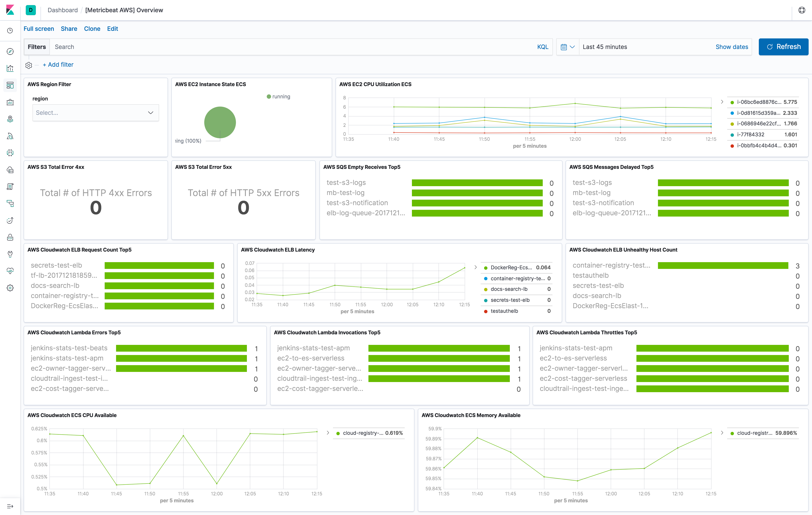
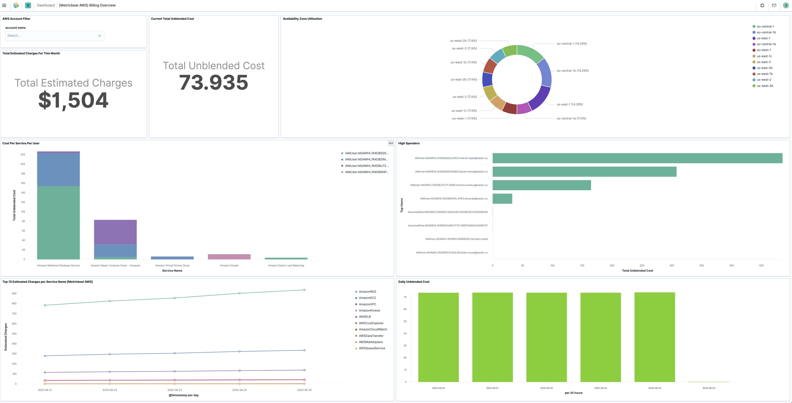
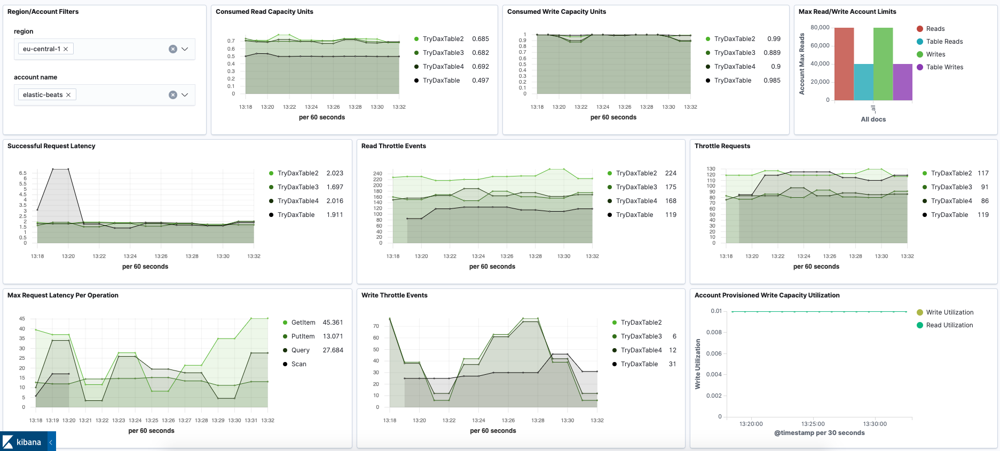
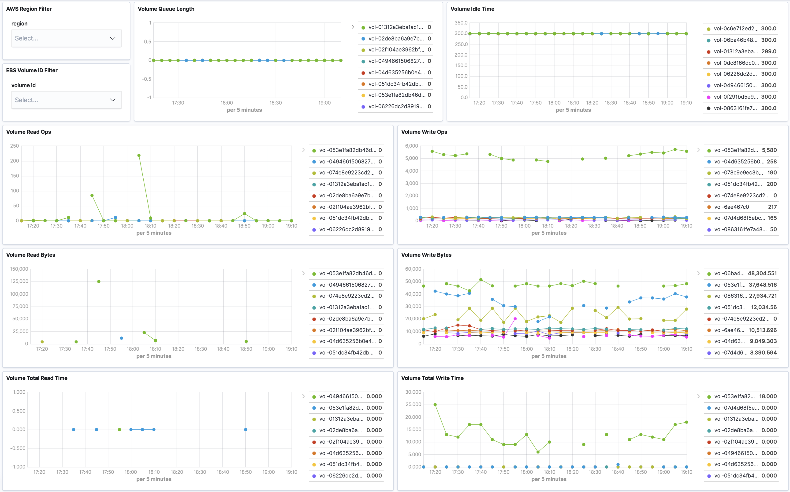
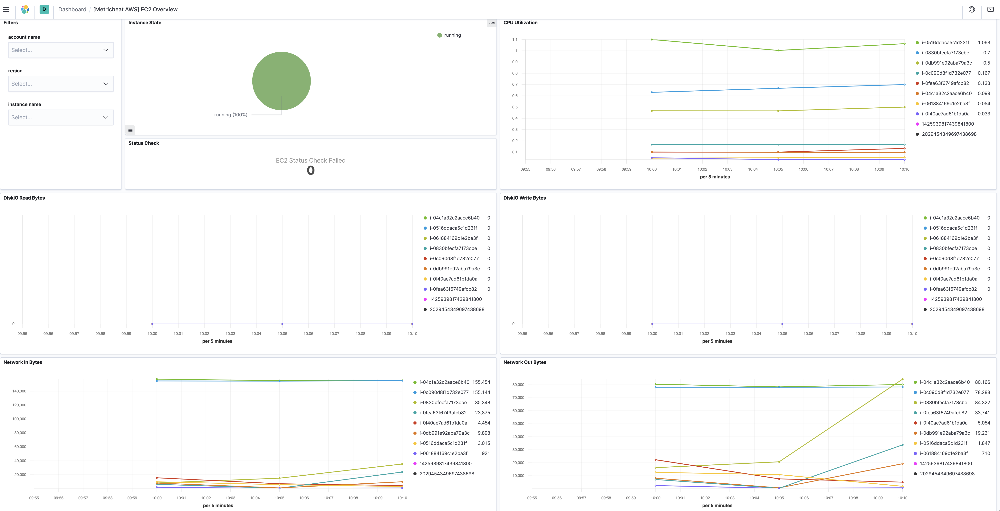
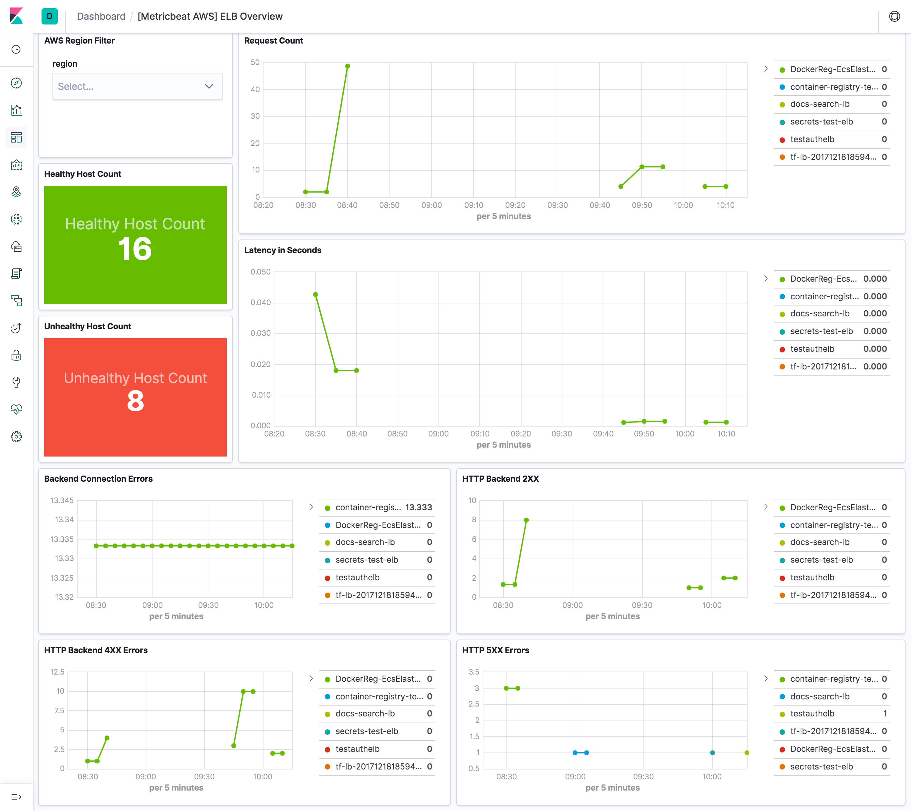
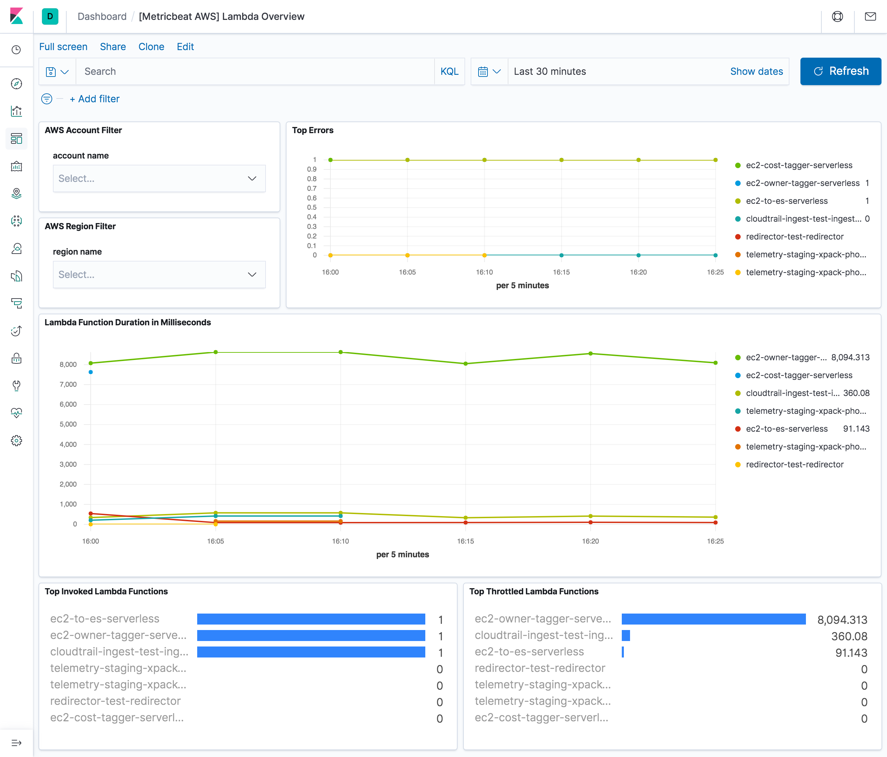
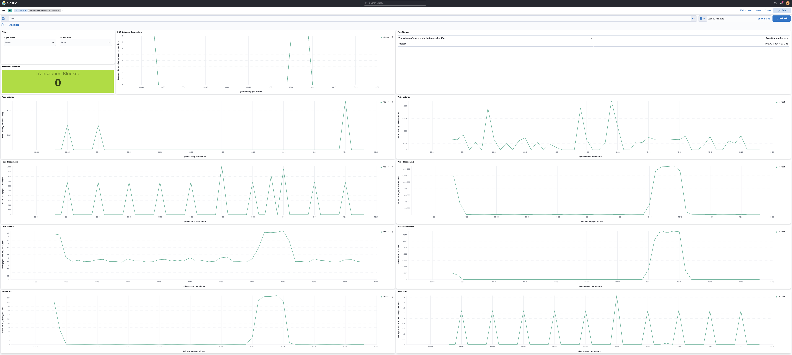
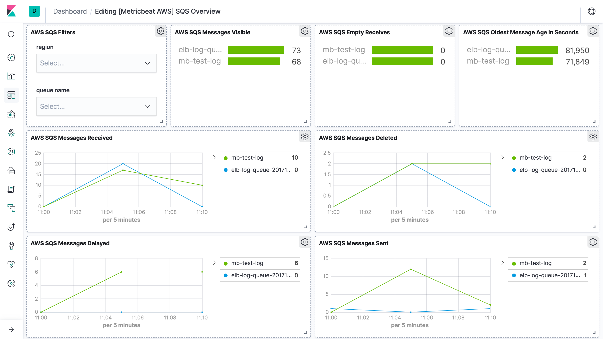
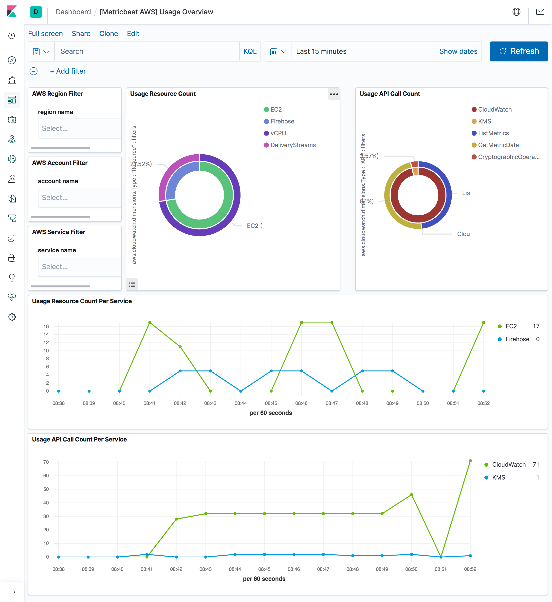

---
mapped_pages:
  - https://www.elastic.co/guide/en/beats/metricbeat/current/metricbeat-module-aws.html
---

# AWS module [metricbeat-module-aws]

:::::{admonition} Prefer to use {{agent}} for this use case?
Refer to the [Elastic Integrations documentation](integration-docs://reference/aws/index.md).

::::{dropdown} Learn more
{{agent}} is a single, unified way to add monitoring for logs, metrics, and other types of data to a host. It can also protect hosts from security threats, query data from operating systems, forward data from remote services or hardware, and more. Refer to the documentation for a detailed [comparison of {{beats}} and {{agent}}](docs-content://reference/fleet/index.md).

::::


:::::


This module periodically fetches monitoring metrics from AWS CloudWatch using [GetMetricData API](https://docs.aws.amazon.com/AmazonCloudWatch/latest/APIReference/API_GetMetricData.html) for AWS services.

All metrics are enabled by default.

::::{important}
Extra AWS charges on CloudWatch API requests will be generated by this module. Please see [AWS API requests](#aws-api-requests) for more details.
::::


## Module-specific configuration notes [_module_specific_configuration_notes]

* **AWS Credentials**

The `aws` module requires AWS credentials configuration in order to make AWS API calls. Users can either use `AWS_ACCESS_KEY_ID`, `AWS_SECRET_ACCESS_KEY` and/or `AWS_SESSION_TOKEN`, or use shared AWS credentials file. Please see [AWS credentials options](#aws-credentials-config) for more details.

If you use AWS CloudWatch cross-account observability, credentials of the monitoring account should be used here and Metricbeat will collect all metrics from both the monitoring account and the linked source accounts.

* **regions**

This module also accepts optional configuration `regions` to specify which AWS regions to query metrics from. If the `regions` parameter is not set in the config file, then by default, the `aws` module will query metrics from all available AWS regions. If `endpoint` is specified, `regions` becomes a required config parameter.

* **latency**

Some AWS services send monitoring metrics to CloudWatch with a latency to process larger than Metricbeat collection period. This will cause data points missing or none get collected by Metricbeat. In this case, please specify a `latency` parameter so collection start time and end time will be shifted by the given latency amount.

* **data_granularity**

AWS CloudWatch allows to define the granularity of the returned data points, by setting "Period" while querying metrics. Please see [MetricDataQuery parameters](https://docs.aws.amazon.com/AmazonCloudWatch/latest/APIReference/API_MetricDataQuery.html) for more information.

By default, metricbeat will query CloudWatch setting "Period" to Metricbeat collection period. If you wish to set a custom value for "Period", please specify a `data_granularity` parameter. By setting `period` and `data_granularity` together, you can control, respectively, how frequently you want your metrics to be collected and how granular they have to be.

If you are concerned about reducing the cost derived by CloudWatch API calls made by Metricbeat with an extra delay in retrieving metrics as trade off, you may consider setting `data_granularity` and increase Metricbeat collection period. For example, setting `data_granularity` to your current value for `period`, and doubling the value of `period`, may lead to a 50% savings in terms of GetMetricData API calls cost.

* **endpoint**

Most AWS services offer a regional endpoint that can be used to make requests. The general syntax of a regional endpoint is `protocol://service-code.region-code.endpoint-code`. Some services, such as IAM, do not support regions. The endpoints for these services do not include a region. In `aws` module, `endpoint` config is to set the `endpoint-code` part, such as `amazonaws.com`, `amazonaws.com.cn`, `c2s.ic.gov`, `sc2s.sgov.gov`.

If endpoint is specified, `regions` config becomes required.

* **include_linked_accounts**

The `include_linked_accounts` parameter is used to enable the inclusion of metrics from different accounts linked to a main monitoring account. By setting this parameter to true, users can gather metrics from multiple AWS accounts that are linked through the [CloudWatch cross-account observability](https://docs.aws.amazon.com/AmazonCloudWatch/latest/monitoring/CloudWatch-Unified-Cross-Account.html). By default, the `include_linked_accounts` parameter is set to true, meaning that metrics from the main monitoring account and all linked accounts are all collected. When set to false, the parameter allows the CloudWatch service to only retrieve metrics from the monitoring account.

If you need to collect metrics from a specific linked account, use `owning_account` configuration.

***Note*:** Users should ensure that the necessary IAM roles and policies are properly set up in order to link the monitoring account and source accounts together. Please see [Link monitoring accounts with source accounts](https://docs.aws.amazon.com/AmazonCloudWatch/latest/monitoring/CloudWatch-Unified-Cross-Account-Setup.html#CloudWatch-Unified-Cross-Account-Setup-permissions) for more details.

* **owning_account**

This configuration works together with `include_linked_accounts` configuration and allows to collect metrics from a specific linked account. The configuration accepts a valid account ID and internally it maps to the `OwningAccount` parameter of [ListMetrics API](https://docs.aws.amazon.com/AmazonCloudWatch/latest/APIReference/API_ListMetrics.html).

Note that, `include_linked_accounts` should be enabled (which is the default value) to use this parameter.

```yaml
include_linked_accounts: true
owning_account: 111111111111
```

* **tags_filter**

The tags to filter against. If tags are given in config, then only collect metrics from resources that have tag key and tag value matches the filter. For example, if tags parameter is given as `Organization=Engineering` under `AWS/ELB` namespace, then only collect metrics from ELBs with tag name equals to `Organization` and tag value equals to `Engineering`. In order to filter for different values for the same key, add the values to the value array (see example)

Note: tag filtering only works for metricsets with `resource_type` specified in the metricset-specific configuration.

```yaml
- module: aws
  period: 5m
  endpoint: amazonaws.com.cn
  regions: cn-north-1
  metricsets:
    - ec2
  tags_filter:
    - key: "Organization"
      value: ["Engineering", "Product"]
```

* **fips_enabled**

Enforces the use of FIPS service endpoints. See [AWS credentials options](#aws-credentials-config) for more information.

```yaml
- module: aws
  period: 5m
  fips_enabled: true
  regions:
    - us-east-1
    - us-east-2
    - us-west-1
    - us-west-2
  metricsets:
    - ec2
```

* **apigateway_max_results**

This configuration works together with AWS/APIGateway namespace. It defines the maximum number of returned results per page. The default value is 25 and the maximum value is 500. See [GetRestApisInput.Limit](https://pkg.go.dev/github.com/aws/aws-sdk-go-v2/service/apigateway@v1.25.8#GetRestApisInput.Limit)

```yaml
- module: aws
      period: 10s
      regions:
        - us-east-1
      metricsets:
        - cloudwatch
      metrics:
        - namespace: "AWS/ApiGateway"
          resource_type: "apigateway:restapis"
          apigateway_max_results: 40
```

The aws module comes with a predefined dashboard. For example:




## Metricsets [_metricsets_6]

Currently, we have `billing`, `cloudwatch`, `dynamodb`, `ebs`, `ec2`, `elb`, `kinesis` `lambda`, `mtest`, `natgateway`, `rds`, `s3_daily_storage`, `s3_request`, `sns`, `sqs`, `transitgateway`, `usage` and `vpn` metricset in `aws` module.


### `billing` [_billing]

Billing metric data includes the estimated charges for every service in the AWS account and the estimated overall total charge for the AWS account. The estimated charges are calculated and sent several times daily to CloudWatch. Therefore, `period` in aws module configuration is set to `12h`.

The billing metricset comes with a predefined dashboard:




### `cloudwatch` [_cloudwatch]

This metricset allows users to query metrics from AWS CloudWatch with any given namespaces or specific instance with a given period. Please see [AWS Services That Publish CloudWatch Metrics](https://docs.aws.amazon.com/AmazonCloudWatch/latest/monitoring/aws-services-cloudwatch-metrics.html) for a list of AWS services that publish metrics to CloudWatch.


### `dynamodb` [_dynamodb]

DynamoDB sends metrics to CloudWatch periodically for better monitoring how web application or service is performing.

The dynamodb metricset comes with a predefined dashboard:




### `ebs` [_ebs]

For basic monitoring in AWS EBS volumes, data is available automatically in 5-minute periods at no charge. This includes data for the root device volumes for EBS-backed instances. User can also enable detailed monitoring for provisioned IOPS SSD (io1) volumes to automatically send one-minute metrics to CloudWatch. Default period in aws module configuration is set to `5m` for ebs metricset.

The ebs metricset comes with a predefined dashboard:




### `ec2` [_ec2]

By default, Amazon EC2 sends metric data to CloudWatch every 5 minutes. With this basic monitoring, `period` in aws module configuration should be larger or equal than `300s`. If `period` is set to be less than `300s`, the same cloudwatch metrics will be collected more than once which will cause extra fees without getting more granular metrics. For example, in `US East (N. Virginia)` region, it costs $0.01/1000 metrics requested using GetMetricData. Please see [AWS CloudWatch Pricing](https://aws.amazon.com/cloudwatch/pricing/) for more details. To avoid unnecessary charges, `period` is preferred to be set to `300s` or multiples of `300s`, such as `600s` and `900s`. For more granular monitoring data you can enable detailed monitoring on the instance to get metrics every 1 minute. Please see [Enabling Detailed Monitoring](https://docs.aws.amazon.com/AWSEC2/latest/UserGuide/using-cloudwatch-new.html) for instructions on how to enable detailed monitoring. With detailed monitoring enabled, `period` in aws module configuration can be any number larger than `60s`. Since AWS sends metric data to CloudWatch in 1-minute periods, setting metricbeat module `period` less than `60s` will cause extra API requests which means extra charges on AWS. To avoid unnecessary charges, `period` is preferred to be set to `60s` or multiples of `60s`, such as `120s` and `180s`.

The ec2 metricset comes with a predefined dashboard:




### `elb` [_elb]

elb metricset collects CloudWatch metrics from classic load balancer, application load balancer and network load balancer.

All three kinds of elastic load balancing reports metrics to Cloudwatch only when requests are flowing through the load balancer. If there are requests flowing through the load balancer, Elastic Load Balancing measures and sends its metrics in 60-second intervals. If there are no requests flowing through the load balancer or no data for a metric, the metric is not reported. Therefore, `period` in aws module configuration is set to `1m`.

The elb metricset comes with a predefined dashboard:




### `lambda` [_lambda]

When an invocation completes, Lambda sends a set of metrics to CloudWatch for that invocation. Default period in aws module configuration is set to `5m` for lambda metricset. The lambda metricset comes with a predefined dashboard:




### `natgateway` [_natgateway]

CloudWatch collects information from NAT gateways and creates readable, near real-time metrics. This metricset enables users to collect these metrics from CloudWatch to monitor and troubleshoot their NAT gateway. NAT gateway metric data is provided at 1-minute intervals and therefore, `period` for `natgateway` metricset is recommended to be `1m` or multiples of `1m`.


### `rds` [_rds]

`period` for `rds` metricset is recommended to be `60s` or multiples of `60s` because Amazon RDS sends metrics and dimensions to Amazon CloudWatch every minute.

The rds metricset comes with a predefined dashboard:




### `s3_daily_storage` [_s3_daily_storage]

Daily storage metrics for S3 buckets are reported once per day with no additional cost. Since they are daily metrics, `period` for `s3_daily_storage` metricset is recommended to be `86400s` or multiples of `86400s`.


### `s3_request` [_s3_request]

Request metrics are available at 1-minute intervals with additional charges. The s3_request metricset will give more granular data to track S3 bucket usage. The `period` for `s3_request` metricset can be set to `60s` or multiples of `60s`. But because of the extra charges for querying these metrics, the `period` is recommended to set to `86400s`. The user can always adjust this to the granularity they want. Request metrics are not enabled by default for S3 buckets. Please see [How to Configure Request Metrics for S3](https://docs.aws.amazon.com/AmazonS3/latest/user-guide/configure-metrics.html) for instructions on how to enable request metrics for each S3 bucket.

The s3_daily_storage and s3_request metricset comes with a predefined combined dashboard:


### `sqs` [_sqs]

CloudWatch metrics for Amazon SQS queues are automatically collected and pushed to CloudWatch every 5 minutes, the `period` for `sqs` metricset is recommended to be `300s` or multiples of `300s`.

The sqs metricset comes with a predefined dashboard:




### `transitgateway` [_transitgateway]

Amazon VPC reports metrics to CloudWatch only when requests are flowing through the transit gateway. If there are requests flowing through the transit gateway, Amazon VPC measures and sends its metrics in 60-second intervals. `period` for `transitgateway` metricset is recommended to be `1m` or multiples of `1m`.


### `usage` [_usage_3]

CloudWatch collects metrics that track the usage of some AWS resources. These metrics correspond to AWS service quotas. Tracking these metrics can help proactively manage quotas. Service quota usage metrics are in the AWS/Usage namespace and are collected every minute. Therefore, `period` in aws module configuration for usage metricset is set to `1m`.

The usage metricset comes with a predefined dashboard:




### `vpn` [_vpn]

CloudWatch collects and processes raw data from the VPN service into readable, near real-time metrics for users to better understand the performance of their web applications and services.


## AWS API requests count [aws-api-requests]

This session is to document what are the AWS API called made by each metricset in `aws` module. This will be useful for users to estimate costs for using `aws` module.

Note: some AWS APIs need pagination like ListMetrics and GetMetricData. Count value is depends on the number of results.

ListMetrics max page size: 500, based on [AWS API ListMetrics](https://docs.aws.amazon.com/AmazonCloudWatch/latest/APIReference/API_ListMetrics.html)

GetMetricData max page size: 100, based on [AWS API GetMetricData](https://docs.aws.amazon.com/AmazonCloudWatch/latest/APIReference/API_GetMetricData.html)

| AWS API Name | AWS API Count | Frequency |
| --- | --- | --- |
| IAM ListAccountAliases | 1 | Once on startup |
| STS GetCallerIdentity | 1 | Once on startup |
| EC2 DescribeRegions | 1 | Once on startup |
| CloudWatch ListMetrics without specifying namespace in configuration | Total number of results / ListMetrics max page size | Per region per collection period |
| CloudWatch ListMetrics with specific namespaces in configuration | Total number of results / ListMetrics max page size * number of unique namespaces | Per region per collection period |
| CloudWatch GetMetricData | Total number of results / GetMetricData max page size | Per region per namespace per collection period |

`billing`, `ebs`, `elb`, `sns`, `usage` and `lambda` are the same as `cloudwatch` metricset.


### AWS Credentials Configuration [aws-credentials-config]

To configure AWS credentials, either put the credentials into the Metricbeat configuration, or use a shared credentials file, as shown in the following examples.


#### Configuration parameters [_configuration_parameters]

* **access_key_id**: first part of access key.
* **secret_access_key**: second part of access key.
* **session_token**: required when using temporary security credentials.
* **credential_profile_name**: profile name in shared credentials file.
* **shared_credential_file**: directory of the shared credentials file.
* **role_arn**: AWS IAM Role to assume.
* **external_id**: external ID to use when assuming a role in another account, see [the AWS documentation for use of external IDs](https://docs.aws.amazon.com/IAM/latest/UserGuide/id_roles_create_for-user_externalid.html).
* **proxy_url**: URL of the proxy to use to connect to AWS web services. The syntax is `http(s)://<IP/Hostname>:<port>`
* **fips_enabled**: Enabling this option instructs Metricbeat to use the FIPS endpoint of a service. All services used by Metricbeat are FIPS compatible except for `tagging` but only certain regions are FIPS compatible. See [https://aws.amazon.com/compliance/fips/](https://aws.amazon.com/compliance/fips/) or the appropriate service page, [https://docs.aws.amazon.com/general/latest/gr/aws-service-information.html](https://docs.aws.amazon.com/general/latest/gr/aws-service-information.html), for a full list of FIPS endpoints and regions.
* **ssl**: This specifies SSL/TLS configuration. If the ssl section is missing, the host’s CAs are used for HTTPS connections. See [SSL](/reference/metricbeat/configuration-ssl.md) for more information.
* **default_region**: Default region to query if no other region is set. Most AWS services offer a regional endpoint that can be used to make requests. Some services, such as IAM, do not support regions. If a region is not provided by any other way (environment variable, credential or instance profile), the value set here will be used.
* **assume_role.duration**: The duration of the requested assume role session. Defaults to 15m when not set. AWS allows a maximum session duration between 1h and 12h depending on your maximum session duration policies.
* **assume_role.expiry_window**: The expiry_window will allow refreshing the session prior to its expiration. This is beneficial to prevent expiring tokens from causing requests to fail with an ExpiredTokenException.


#### Supported Formats [_supported_formats]

::::{note}
The examples in this section refer to Metricbeat, but the credential options for authentication with AWS are the same no matter which Beat is being used.
::::


* Use `access_key_id`, `secret_access_key`, and/or `session_token`

Users can either put the credentials into the Metricbeat module configuration or use environment variable `AWS_ACCESS_KEY_ID`, `AWS_SECRET_ACCESS_KEY` and/or `AWS_SESSION_TOKEN` instead.

If running on Docker, these environment variables should be added as a part of the docker command. For example, with Metricbeat:

```bash
$ docker run -e AWS_ACCESS_KEY_ID=abcd -e AWS_SECRET_ACCESS_KEY=abcd -d --name=metricbeat --user=root --volume="$(pwd)/metricbeat.aws.yml:/usr/share/metricbeat/metricbeat.yml:ro" docker.elastic.co/beats/metricbeat:7.11.1 metricbeat -e -E cloud.auth=elastic:1234 -E cloud.id=test-aws:1234
```

Sample `metricbeat.aws.yml` looks like:

```yaml
metricbeat.modules:
- module: aws
  period: 5m
  access_key_id: ${AWS_ACCESS_KEY_ID}
  secret_access_key: ${AWS_SECRET_ACCESS_KEY}
  session_token: ${AWS_SESSION_TOKEN}
  metricsets:
    - ec2
```

Environment variables can also be added through a file. For example:

```bash
$ cat env.list
AWS_ACCESS_KEY_ID=abcd
AWS_SECRET_ACCESS_KEY=abcd

$ docker run --env-file env.list -d --name=metricbeat --user=root --volume="$(pwd)/metricbeat.aws.yml:/usr/share/metricbeat/metricbeat.yml:ro" docker.elastic.co/beats/metricbeat:7.11.1 metricbeat -e -E cloud.auth=elastic:1234 -E cloud.id=test-aws:1234
```

* Use `credential_profile_name` and/or `shared_credential_file`

If `access_key_id`, `secret_access_key` and `role_arn` are all not given, then metricbeat will check for `credential_profile_name`. If you use different credentials for different tools or applications, you can use profiles to configure multiple access keys in the same configuration file. If there is no `credential_profile_name` given, the default profile will be used.

`shared_credential_file` is optional to specify the directory of your shared credentials file. If it’s empty, the default directory will be used. In Windows, shared credentials file is at `C:\Users\<yourUserName>\.aws\credentials`. For Linux, macOS or Unix, the file is located at `~/.aws/credentials`. When running as a service, the home path depends on the user that manages the service, so the `shared_credential_file` parameter can be used to avoid ambiguity. Please see [Create Shared Credentials File](https://docs.aws.amazon.com/ses/latest/DeveloperGuide/create-shared-credentials-file.md) for more details.

* Use `role_arn`

`role_arn` is used to specify which AWS IAM role to assume for generating temporary credentials. If `role_arn` is given, metricbeat will check if access keys are given. If not, metricbeat will check for credential profile name. If neither is given, default credential profile will be used. Please make sure credentials are given under either a credential profile or access keys.

If running on Docker, the credential file needs to be provided via a volume mount. For example, with Metricbeat:

```bash
docker run -d --name=metricbeat --user=root --volume="$(pwd)/metricbeat.aws.yml:/usr/share/metricbeat/metricbeat.yml:ro" --volume="/Users/foo/.aws/credentials:/usr/share/metricbeat/credentials:ro" docker.elastic.co/beats/metricbeat:7.11.1 metricbeat -e -E cloud.auth=elastic:1234 -E cloud.id=test-aws:1234
```

Sample `metricbeat.aws.yml` looks like:

```yaml
metricbeat.modules:
- module: aws
  period: 5m
  credential_profile_name: elastic-beats
  shared_credential_file: /usr/share/metricbeat/credentials
  metricsets:
    - ec2
```

* Use AWS credentials in Metricbeat configuration

    ```yaml
    metricbeat.modules:
    - module: aws
      period: 300s
      metricsets:
        - ec2
      access_key_id: '<access_key_id>'
      secret_access_key: '<secret_access_key>'
      session_token: '<session_token>'
    ```

    or

    ```yaml
    metricbeat.modules:
    - module: aws
      period: 300s
      metricsets:
        - ec2
      access_key_id: '${AWS_ACCESS_KEY_ID:""}'
      secret_access_key: '${AWS_SECRET_ACCESS_KEY:""}'
      session_token: '${AWS_SESSION_TOKEN:""}'
    ```

* Use IAM role ARN

    ```yaml
    metricbeat.modules:
    - module: aws
      period: 300s
      metricsets:
        - ec2
      role_arn: arn:aws:iam::123456789012:role/test-mb
    ```

* Use shared AWS credentials file

    ```yaml
    metricbeat.modules:
    - module: aws
      period: 300s
      metricsets:
        - ec2
      credential_profile_name: test-mb
    ```

* Use IAM role ARN with shared AWS credentials file

    ```yaml
    metricbeat.modules:
    - module: aws
      period: 5m
      role_arn: arn:aws:iam::123456789012:role/test-mb
      shared_credential_file: /Users/mb/.aws/credentials_backup
      credential_profile_name: test
      metricsets:
        - ec2
    ```


#### AWS Credentials Types [_aws_credentials_types]

There are two different types of AWS credentials can be used: access keys and temporary security credentials.

* Access keys

`AWS_ACCESS_KEY_ID` and `AWS_SECRET_ACCESS_KEY` are the two parts of access keys. They are long-term credentials for an IAM user or the AWS account root user. Please see [AWS Access Keys and Secret Access Keys](https://docs.aws.amazon.com/general/latest/gr/aws-sec-cred-types.html#access-keys-and-secret-access-keys) for more details.

* IAM role ARN

An IAM role is an IAM identity that you can create in your account that has specific permissions that determine what the identity can and cannot do in AWS. A role does not have standard long-term credentials such as a password or access keys associated with it. Instead, when you assume a role, it provides you with temporary security credentials for your role session. IAM role Amazon Resource Name (ARN) can be used to specify which AWS IAM role to assume to generate temporary credentials. Please see [AssumeRole API documentation](https://docs.aws.amazon.com/STS/latest/APIReference/API_AssumeRole.html) for more details.

Here are the steps to set up IAM role using AWS CLI for Metricbeat. Please replace `123456789012` with your own account ID.

Step 1. Create `example-policy.json` file to include all permissions:

```yaml
{
    "Version": "2012-10-17",
    "Statement": [
        {
            "Sid": "VisualEditor0",
            "Effect": "Allow",
            "Action": [
                "s3:GetObject",
                "sqs:ReceiveMessage"
            ],
            "Resource": "*"
        },
        {
            "Sid": "VisualEditor1",
            "Effect": "Allow",
            "Action": "sqs:ChangeMessageVisibility",
            "Resource": "arn:aws:sqs:us-east-1:123456789012:test-fb-ks"
        },
        {
            "Sid": "VisualEditor2",
            "Effect": "Allow",
            "Action": "sqs:DeleteMessage",
            "Resource": "arn:aws:sqs:us-east-1:123456789012:test-fb-ks"
        },
        {
            "Sid": "VisualEditor3",
            "Effect": "Allow",
            "Action": [
                "sts:AssumeRole",
                "sqs:ListQueues",
                "tag:GetResources",
                "ec2:DescribeInstances",
                "cloudwatch:GetMetricData",
                "ec2:DescribeRegions",
                "iam:ListAccountAliases",
                "sts:GetCallerIdentity",
                "cloudwatch:ListMetrics"
            ],
            "Resource": "*"
        }
    ]
}
```

Step 2. Create IAM policy using the `aws iam create-policy` command:

```bash
$ aws iam create-policy --policy-name example-policy --policy-document file://example-policy.json
```

Step 3. Create the JSON file `example-role-trust-policy.json` that defines the trust relationship of the IAM role

```yaml
{
    "Version": "2012-10-17",
    "Statement": {
        "Effect": "Allow",
        "Principal": { "AWS": "arn:aws:iam::123456789012:root" },
        "Action": "sts:AssumeRole"
    }
}
```

Step 4. Create the IAM role and attach the policy:

```bash
$ aws iam create-role --role-name example-role --assume-role-policy-document file://example-role-trust-policy.json
$ aws iam attach-role-policy --role-name example-role --policy-arn "arn:aws:iam::123456789012:policy/example-policy"
```

After these steps are done, IAM role ARN can be used for authentication in Metricbeat `aws` module.

* Temporary security credentials

Temporary security credentials has a limited lifetime and consists of an access key ID, a secret access key, and a security token which typically returned from `GetSessionToken`. MFA-enabled IAM users would need to submit an MFA code while calling `GetSessionToken`. Please see [Temporary Security Credentials](https://docs.aws.amazon.com/IAM/latest/UserGuide/id_credentials_temp.html) for more details. `sts get-session-token` AWS CLI can be used to generate temporary credentials. For example. with MFA-enabled:

```bash
aws> sts get-session-token --serial-number arn:aws:iam::1234:mfa/your-email@example.com --token-code 456789 --duration-seconds 129600
```

Because temporary security credentials are short term, after they expire, the user needs to generate new ones and modify the aws.yml config file with the new credentials. Unless [live reloading](/reference/metricbeat/_live_reloading.md) feature is enabled for Metricbeat, the user needs to manually restart Metricbeat after updating the config file in order to continue collecting Cloudwatch metrics. This will cause data loss if the config file is not updated with new credentials before the old ones expire. For Metricbeat, we recommend users to use access keys in config file to enable aws module making AWS api calls without have to generate new temporary credentials and update the config frequently.

IAM policy is an entity that defines permissions to an object within your AWS environment. Specific permissions needs to be added into the IAM user’s policy to authorize Metricbeat to collect AWS monitoring metrics. Please see documentation under each metricset for required permissions.


## Running on EKS [_running_on_eks]

* **WebIdentity authentication flow**

See documentation in order to create a IAM Role for Service account: [https://docs.aws.amazon.com/eks/latest/userguide/specify-service-account-role.html](https://docs.aws.amazon.com/eks/latest/userguide/specify-service-account-role.html)

Once you have create the IRSA you can annotate `metricbeat` service account with it

```yaml
apiVersion: v1
kind: ServiceAccount
metadata:
  annotations:
    eks.amazonaws.com/role-arn: arn:aws:iam::<ACCOUNT_ID>:role/<IRSA_ID>
  name: metricbeat
  namespace: kube-system
  labels:
    k8s-app: metricbeat
```

In order to enable WebIdentity authentication flow you need to add a trust relationship to the IRSA:

```json
    {
      "Effect": "Allow",
      "Principal": {
        "Federated": "arn:aws:iam::<ACCOUNT_ID>:oidc-provider/oidc.eks.<REGION>.amazonaws.com/id/<OIDC_PROVIDER_ID>"
      },
      "Action": "sts:AssumeRoleWithWebIdentity",
      "Condition": {
        "StringEquals": {
          "oidc.eks.REGION.amazonaws.com/id/<OIDC_PROVIDER_ID>:sub": "system:serviceaccount:kube-system:metricbeat",
          "oidc.eks.REGION.amazonaws.com/id/<OIDC_PROVIDER_ID>:aud": "sts.amazonaws.com"
        }
      }
    }
```

In this case there’s no need to add `role_arn` to modules config.


### Example configuration [_example_configuration_5]

The AWS module supports the standard configuration options that are described in [Modules](/reference/metricbeat/configuration-metricbeat.md). Here is an example configuration:

```yaml
metricbeat.modules:
- module: aws
  period: 300s
  credential_profile_name: test-mb
  metricsets:
    - ec2
  tags_filter:
    - key: "Organization"
      value: "Engineering"
- module: aws
  period: 300s
  credential_profile_name: test-mb
  metricsets:
    - sqs
  regions:
    - us-west-1
- module: aws
  period: 86400s
  metricsets:
    - s3_request
    - s3_daily_storage
  access_key_id: '${AWS_ACCESS_KEY_ID:""}'
  secret_access_key: '${AWS_SECRET_ACCESS_KEY:""}'
  session_token: '${AWS_SESSION_TOKEN:""}'
- module: aws
  period: 300s
  credential_profile_name: test-mb
  metricsets:
    - cloudwatch
  include_linked_accounts: true
  # owning_account: 111111111111
  metrics:
    - namespace: AWS/EC2
      name: ["CPUUtilization"]
      dimensions:
        - name: InstanceId
          value: i-0686946e22cf9494a
    - namespace: AWS/EBS
    - namespace: AWS/ELB
      resource_type: elasticloadbalancing
      tags:
        - key: "Organization"
          value: "Engineering"
- module: aws
  period: 60s
  credential_profile_name: test-mb
  tags_filter:
    - key: "dept"
      value: "eng"
  metricsets:
    - elb
    - natgateway
    - rds
    - transitgateway
    - usage
    - vpn
- module: aws
  period: 1m
  latency: 5m
  include_linked_accounts: false
  metricsets:
    - s3_request
```


### Metricsets [_metricsets_7]

The following metricsets are available:

* [awshealth](/reference/metricbeat/metricbeat-metricset-aws-awshealth.md)
* [billing](/reference/metricbeat/metricbeat-metricset-aws-billing.md)
* [cloudwatch](/reference/metricbeat/metricbeat-metricset-aws-cloudwatch.md)
* [dynamodb](/reference/metricbeat/metricbeat-metricset-aws-dynamodb.md)
* [ebs](/reference/metricbeat/metricbeat-metricset-aws-ebs.md)
* [ec2](/reference/metricbeat/metricbeat-metricset-aws-ec2.md)
* [elb](/reference/metricbeat/metricbeat-metricset-aws-elb.md)
* [kinesis](/reference/metricbeat/metricbeat-metricset-aws-kinesis.md)
* [lambda](/reference/metricbeat/metricbeat-metricset-aws-lambda.md)
* [natgateway](/reference/metricbeat/metricbeat-metricset-aws-natgateway.md)
* [rds](/reference/metricbeat/metricbeat-metricset-aws-rds.md)
* [s3_daily_storage](/reference/metricbeat/metricbeat-metricset-aws-s3_daily_storage.md)
* [s3_request](/reference/metricbeat/metricbeat-metricset-aws-s3_request.md)
* [sns](/reference/metricbeat/metricbeat-metricset-aws-sns.md)
* [sqs](/reference/metricbeat/metricbeat-metricset-aws-sqs.md)
* [transitgateway](/reference/metricbeat/metricbeat-metricset-aws-transitgateway.md)
* [usage](/reference/metricbeat/metricbeat-metricset-aws-usage.md)
* [vpn](/reference/metricbeat/metricbeat-metricset-aws-vpn.md)


