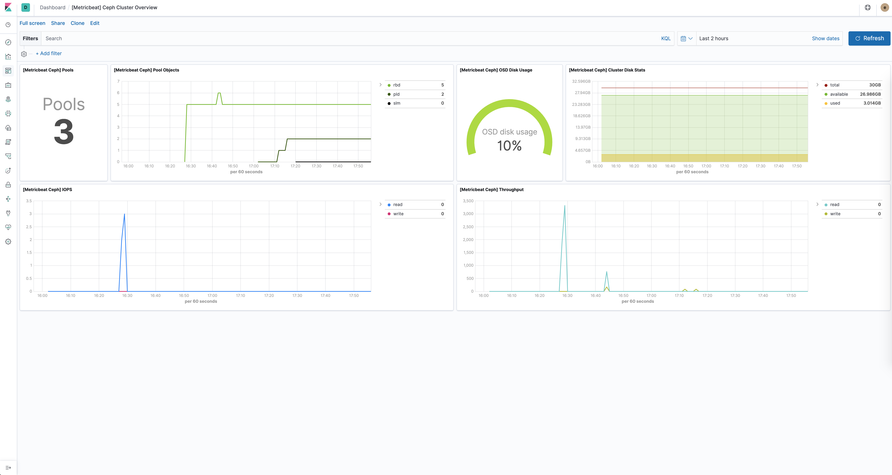

---
mapped_pages:
  - https://www.elastic.co/guide/en/beats/metricbeat/current/metricbeat-module-ceph.html
---

# Ceph module [metricbeat-module-ceph]

The Ceph module collects metrics by submitting HTTP GET requests to the [ceph-rest-api](https://docs.ceph.com/docs/jewel/man/8/ceph-rest-api/). The default metricsets are `cluster_disk`, `cluster_health`, `monitor_health`, `pool_disk`, `osd_tree`.

Metricsets connecting to the Ceph REST API uses by default the service exposed on port 5000. Metricsets using the Ceph Manager Daemon communicate with the API exposed by default on port 8003 (SSL encryption).


## Compatibility [_compatibility_9]

The Ceph module is tested with Ceph Jewel (10.2.10) and Ceph Nautilus (14.2.7).

Metricsets with the `mgr_` prefix are compatible with Ceph releases using the Ceph Manager Daemon.


## Dashboard [_dashboard_20]

The Ceph module comes with a predefined dashboard showing Ceph cluster related metrics. For example:




## Example configuration [_example_configuration_10]

The Ceph module supports the standard configuration options that are described in [Modules](/reference/metricbeat/configuration-metricbeat.md). Here is an example configuration:

```yaml
metricbeat.modules:
# Metricsets depending on the Ceph REST API (default port: 5000)
- module: ceph
  metricsets: ["cluster_disk", "cluster_health", "monitor_health", "pool_disk", "osd_tree"]
  period: 10s
  hosts: ["localhost:5000"]
  enabled: true

# Metricsets depending on the Ceph Manager Daemon (default port: 8003)
- module: ceph
  metricsets:
    - mgr_cluster_disk
    - mgr_osd_perf
    - mgr_pool_disk
    - mgr_osd_pool_stats
    - mgr_osd_tree
  period: 1m
  hosts: [ "https://localhost:8003" ]
  #username: "user"
  #password: "secret"
```

This module supports TLS connections when using `ssl` config field, as described in [SSL](/reference/metricbeat/configuration-ssl.md). It also supports the options described in [Standard HTTP config options](/reference/metricbeat/configuration-metricbeat.md#module-http-config-options).


## Metricsets [_metricsets_15]

The following metricsets are available:

* [cluster_disk](/reference/metricbeat/metricbeat-metricset-ceph-cluster_disk.md)
* [cluster_health](/reference/metricbeat/metricbeat-metricset-ceph-cluster_health.md)
* [cluster_status](/reference/metricbeat/metricbeat-metricset-ceph-cluster_status.md)
* [mgr_cluster_disk](/reference/metricbeat/metricbeat-metricset-ceph-mgr_cluster_disk.md)
* [mgr_cluster_health](/reference/metricbeat/metricbeat-metricset-ceph-mgr_cluster_health.md)
* [mgr_osd_perf](/reference/metricbeat/metricbeat-metricset-ceph-mgr_osd_perf.md)
* [mgr_osd_pool_stats](/reference/metricbeat/metricbeat-metricset-ceph-mgr_osd_pool_stats.md)
* [mgr_osd_tree](/reference/metricbeat/metricbeat-metricset-ceph-mgr_osd_tree.md)
* [mgr_pool_disk](/reference/metricbeat/metricbeat-metricset-ceph-mgr_pool_disk.md)
* [monitor_health](/reference/metricbeat/metricbeat-metricset-ceph-monitor_health.md)
* [osd_df](/reference/metricbeat/metricbeat-metricset-ceph-osd_df.md)
* [osd_tree](/reference/metricbeat/metricbeat-metricset-ceph-osd_tree.md)
* [pool_disk](/reference/metricbeat/metricbeat-metricset-ceph-pool_disk.md)


