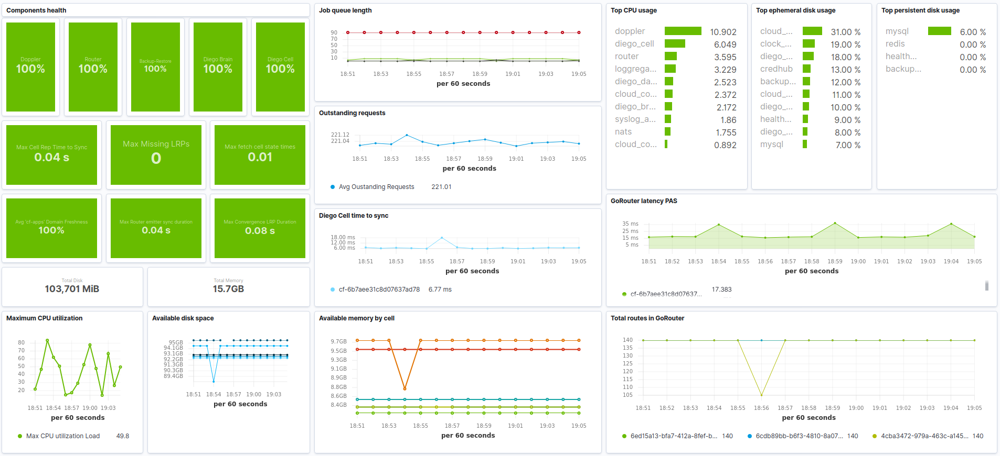
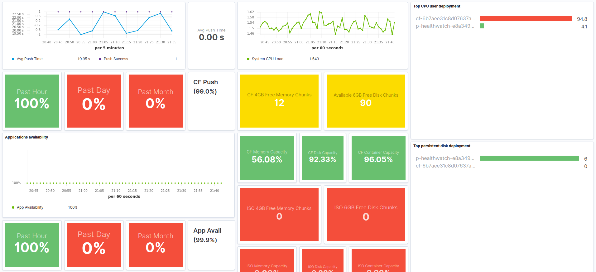

---
mapped_pages:
  - https://www.elastic.co/guide/en/beats/metricbeat/current/metricbeat-module-cloudfoundry.html
---

# Cloudfoundry module [metricbeat-module-cloudfoundry]

::::{warning}
This functionality is in beta and is subject to change. The design and code is less mature than official GA features and is being provided as-is with no warranties. Beta features are not subject to the support SLA of official GA features.
::::


This is the cloudfoundry module.

The Cloud Foundry module connects to Cloud Foundry loggregator to gather container, counter, and value metrics into a common data platform where it can be used for analysis, visualization, and alerting.

The cloudfoundry module metrics are numerical values that describe some aspect of a system at a particular point in time. They are collected when pushed from the loggregator and are identified with a timestamp, a name, a value, and one or more defining labels.

The cloudfoundry module mericsets are `container`, `counter` and `value`.


### Dashboards [_dashboards_2]

The Cloud Foundry module includes some dashboards.

The overview dashboard can be used to visualize the current status of your Cloud Foundry deployments.



The platform health dashboard includes visualizations that help diagnosting issues related to the applications deployed in Cloud Foundry.




### Module-specific configuration notes [_module_specific_configuration_notes_4]

All metrics come from the Cloud Foundry loggregator API. The loggregator API authenticates through the Cloud Foundry UAA API. This requires that a new client be added to UAA with the correct permissions. This can be done using the `uaac` client.

```bash
$ export CLOUDFOUNDRY_CLIENT_ID=metricbeat
$ export CLOUDFOUNDRY_CLIENT_SECRET=yoursecret
$ uaac client add $CLOUDFOUNDRY_CLIENT_ID --name $CLOUDFOUNDRY_CLIENT_ID --secret $CLOUDFOUNDRY_CLIENT_SECRET --authorized_grant_types client_credentials,refresh_token --authorities doppler.firehose,cloud_controller.admin_read_only
```

Then configuration of the module needs to contain the created `client_id` and `client_secret`.

```yaml
- module: cloudfoundry
  api_address: https://api.dev.cfdev.sh
  client_id: "${CLOUDFOUNDRY_CLIENT_ID}"
  client_secret: "${CLOUDFOUNDRY_CLIENT_SECRET}"
  ssl:
      verification_mode: none
```


## Metricsets [_metricsets_16]


### `container` [_container]

The container metricset of Cloud Foundry module allows you to collect container metrics that the loggregator sends to metricbeat.


### `counter` [_counter]

The counter metricset of Cloud Foundry module allows you to collect counter metrics that the loggregator sends to metricbeat.


### `value` [_value]

The value metricset of Cloud Foundry module allows you to collect value metrics that the loggregator sends to metricbeat.


## Configuration options [_configuration_options_18]

The `cloudfoundry` input supports the following configuration options.


### `api_address` [_api_address]

The URL of the Cloud Foundry API. Optional. Default: "http://api.bosh-lite.com".


### `doppler_address` [_doppler_address]

The URL of the Cloud Foundry Doppler Websocket. Optional. Default: "(value from ${api_address}/v2/info)".


### `uaa_address` [_uaa_address]

The URL of the Cloud Foundry UAA API. Optional. Default: "(value from ${api_address}/v2/info)".


### `rlp_address` [_rlp_address]

The URL of the Cloud Foundry RLP Gateway. Optional. Default: "(`log-stream` subdomain under the same domain as `api_server`)".


### `client_id` [_client_id_2]

Client ID to authenticate with Cloud Foundry. Default: "".


### `client_secret` [_client_secret]

Client Secret to authenticate with Cloud Foundry. Default: "".


### `shard_id` [_shard_id]

Shard ID for connection to the RLP Gateway. Use the same ID across multiple metricbeat to shard the load of events from the RLP Gateway.


#### `version` [_version_2]

Consumer API version to connect with Cloud Foundry to collect events. Use `v1` to collect events using Doppler/Traffic Control. Use `v2` to collect events from the RLP Gateway. Default: "`v1`".


### `ssl` [_ssl_6]

This specifies SSL/TLS common config. Default: not used.


### Example configuration [_example_configuration_11]

The Cloudfoundry module supports the standard configuration options that are described in [Modules](/reference/metricbeat/configuration-metricbeat.md). Here is an example configuration:

```yaml
metricbeat.modules:
- module: cloudfoundry
  metricsets:
    - container
    - counter
    - value
  enabled: true
  api_address: '${CLOUDFOUNDRY_API_ADDRESS:""}'
  doppler_address: '${CLOUDFOUNDRY_DOPPLER_ADDRESS:""}'
  uaa_address: '${CLOUDFOUNDRY_UAA_ADDRESS:""}'
  rlp_address: '${CLOUDFOUNDRY_RLP_ADDRESS:""}'
  client_id: '${CLOUDFOUNDRY_CLIENT_ID:""}'
  client_secret: '${CLOUDFOUNDRY_CLIENT_SECRET:""}'
  shard_id: metricbeat
  version: v1
```


### Metricsets [_metricsets_17]

The following metricsets are available:

* [container](/reference/metricbeat/metricbeat-metricset-cloudfoundry-container.md)
* [counter](/reference/metricbeat/metricbeat-metricset-cloudfoundry-counter.md)
* [value](/reference/metricbeat/metricbeat-metricset-cloudfoundry-value.md)


