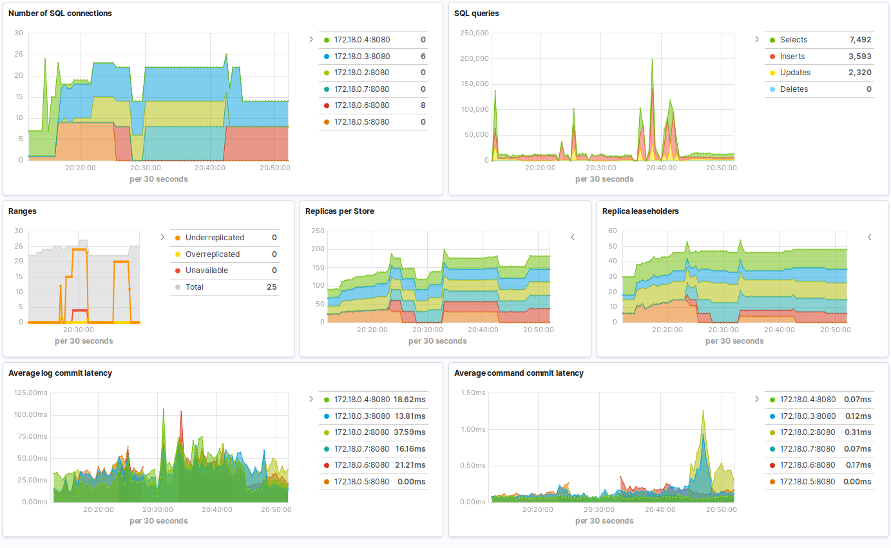

---
mapped_pages:
  - https://www.elastic.co/guide/en/beats/metricbeat/current/metricbeat-module-cockroachdb.html
---

# CockroachDB module [metricbeat-module-cockroachdb]

:::::{admonition} Prefer to use {{agent}} for this use case?
Refer to the [Elastic Integrations documentation](integration-docs://reference/cockroachdb/index.md).

::::{dropdown} Learn more
{{agent}} is a single, unified way to add monitoring for logs, metrics, and other types of data to a host. It can also protect hosts from security threats, query data from operating systems, forward data from remote services or hardware, and more. Refer to the documentation for a detailed [comparison of {{beats}} and {{agent}}](docs-content://reference/fleet/index.md).

::::


:::::


This module periodically fetches metrics from CockroachDB.


## Compatibility [_compatibility_10]

The CockroachDB `status` metricset is compatible with any CockroachDB version exposing metrics in Prometheus format.


## Dashboard [_dashboard_21]

The CockroachDB module includes a predefined dashboard with overview information of the monitored servers.




## Example configuration [_example_configuration_12]

The CockroachDB module supports the standard configuration options that are described in [Modules](/reference/metricbeat/configuration-metricbeat.md). Here is an example configuration:

```yaml
metricbeat.modules:
- module: cockroachdb
  metricsets: ['status']
  period: 10s
  hosts: ['localhost:8080']

  # This module uses the Prometheus collector metricset, all
  # the options for this metricset are also available here.
  #metrics_path: /_status/vars
```

This module supports TLS connections when using `ssl` config field, as described in [SSL](/reference/metricbeat/configuration-ssl.md). It also supports the options described in [Standard HTTP config options](/reference/metricbeat/configuration-metricbeat.md#module-http-config-options).


## Metricsets [_metricsets_18]

The following metricsets are available:

* [status](/reference/metricbeat/metricbeat-metricset-cockroachdb-status.md)


