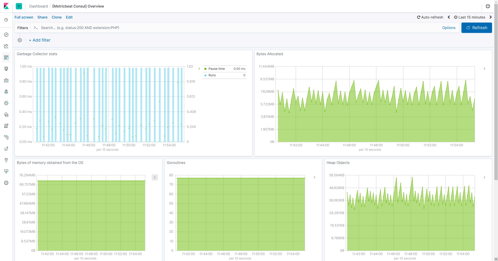

---
mapped_pages:
  - https://www.elastic.co/guide/en/beats/metricbeat/current/metricbeat-module-consul.html
---

# Consul module [metricbeat-module-consul]

::::{warning}
This functionality is in beta and is subject to change. The design and code is less mature than official GA features and is being provided as-is with no warranties. Beta features are not subject to the support SLA of official GA features.
::::


This is the [Hashicorp’s Consul](https://www.consul.io) Metricbeat module. It is still in beta and under active development to add new Metricsets and introduce enhancements.


## Compatibility [_compatibility_11]

The module is being tested with 1.4.2 and 1.9.3 versions of Consul.


## Dashboard [_dashboard_22]

The Consul module comes with a predefined dashboard:




## Example configuration [_example_configuration_13]

The Consul module supports the standard configuration options that are described in [Modules](/reference/metricbeat/configuration-metricbeat.md). Here is an example configuration:

```yaml
metricbeat.modules:
- module: consul
  metricsets:
  - agent
  enabled: true
  period: 10s
  hosts: ["localhost:8500"]
```

This module supports TLS connections when using `ssl` config field, as described in [SSL](/reference/metricbeat/configuration-ssl.md). It also supports the options described in [Standard HTTP config options](/reference/metricbeat/configuration-metricbeat.md#module-http-config-options).


## Metricsets [_metricsets_19]

The following metricsets are available:

* [agent](/reference/metricbeat/metricbeat-metricset-consul-agent.md)


