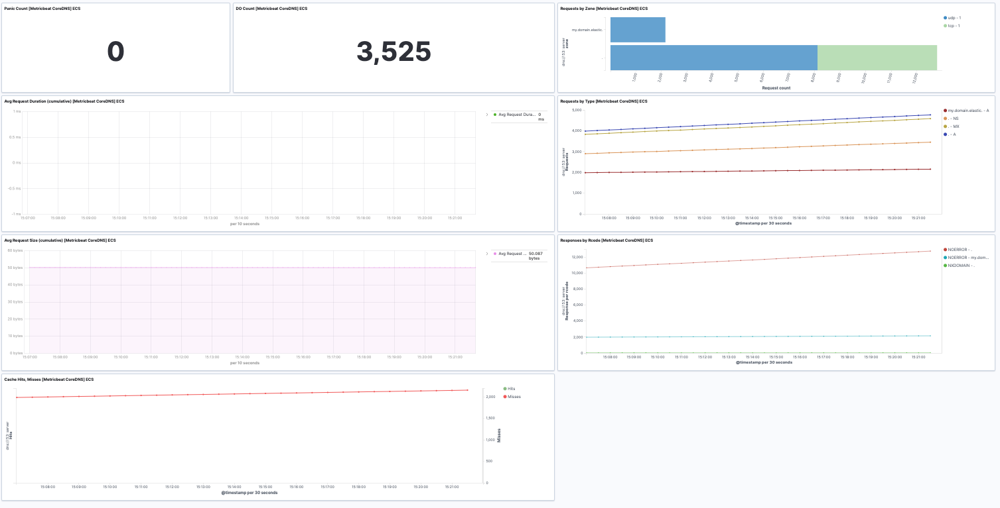

---
mapped_pages:
  - https://www.elastic.co/guide/en/beats/metricbeat/current/metricbeat-module-coredns.html
---

# Coredns module [metricbeat-module-coredns]

This is the CoreDNS module. The CoreDNS module collects metrics from the CoreDNS [prometheus exporter endpoint](https://github.com/coredns/coredns/tree/master/plugin/metrics).

The default metricset is `stats`.


## Compatibility [_compatibility_13]

The CoreDNS module is tested with CoreDNS 1.5.0


## Dashboard [_dashboard_23]

The CoreDNS module comes with a predefined dashboard. For example:




## Example configuration [_example_configuration_15]

The Coredns module supports the standard configuration options that are described in [Modules](/reference/metricbeat/configuration-metricbeat.md). Here is an example configuration:

```yaml
metricbeat.modules:
- module: coredns
  metricsets: ["stats"]
  period: 10s
  hosts: ["localhost:9153"]
```


## Metricsets [_metricsets_21]

The following metricsets are available:

* [stats](/reference/metricbeat/metricbeat-metricset-coredns-stats.md)


