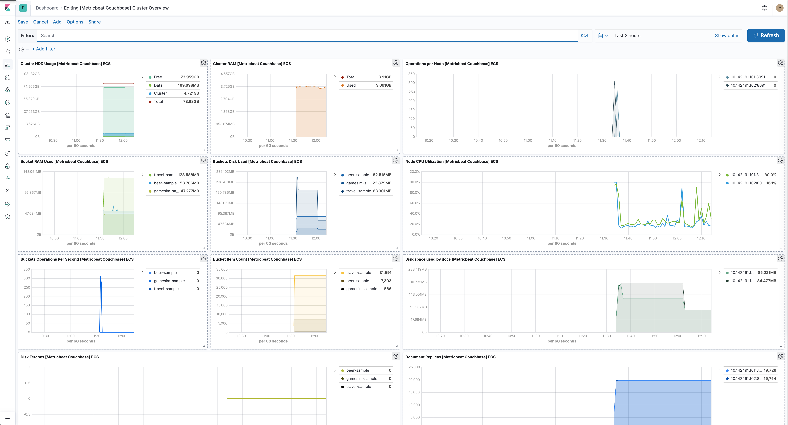

---
mapped_pages:
  - https://www.elastic.co/guide/en/beats/metricbeat/current/metricbeat-module-couchbase.html
---

# Couchbase module [metricbeat-module-couchbase]

This module periodically fetches metrics from [Couchbase](https://www.couchbase.com/) servers. The default metricsets are `bucket`, `cluster`, `node`.


## Compatibility [_compatibility_14]

The Couchbase module is tested with Couchbase 6.5.1.


## Dashboard [_dashboard_24]

The Couchbase module comes with a predefined dashboard for Couchbase cluster, node, bucket specific stats. For example:




## Example configuration [_example_configuration_16]

The Couchbase module supports the standard configuration options that are described in [Modules](/reference/metricbeat/configuration-metricbeat.md). Here is an example configuration:

```yaml
metricbeat.modules:
- module: couchbase
  metricsets: ["bucket", "cluster", "node"]
  period: 10s
  hosts: ["localhost:8091"]
  enabled: true
```

This module supports TLS connections when using `ssl` config field, as described in [SSL](/reference/metricbeat/configuration-ssl.md). It also supports the options described in [Standard HTTP config options](/reference/metricbeat/configuration-metricbeat.md#module-http-config-options).


## Metricsets [_metricsets_22]

The following metricsets are available:

* [bucket](/reference/metricbeat/metricbeat-metricset-couchbase-bucket.md)
* [cluster](/reference/metricbeat/metricbeat-metricset-couchbase-cluster.md)
* [node](/reference/metricbeat/metricbeat-metricset-couchbase-node.md)


