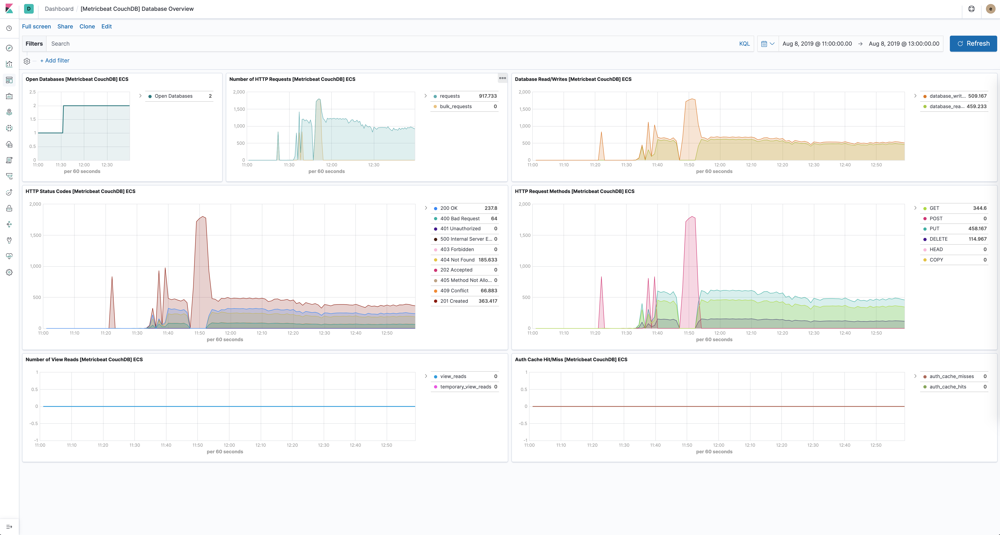

---
mapped_pages:
  - https://www.elastic.co/guide/en/beats/metricbeat/current/metricbeat-module-couchdb.html
---

# CouchDB module [metricbeat-module-couchdb]

This is the couchdb module.

The default metricset is `server`.


## Compatibility [_compatibility_15]

The Couchdb module is tested in CI with Couchdb 1.7 and 2.3. Because of the differences between v1 and v2 for exposing metrics, the path to request metrics for each version is different:

* v1.* uses `[host]:5984/_stats` so the hosts of your config should just be `[host]:5984`
* v2.* exposes metrics in various places. Local in `[host]:5986/_stats` and cluster wide in `[host]:5984/_node/[node-name]/_stats` or `[host]:5984/_node/_local/_stats`. Recommended config is `[host]:5986` to use the local path (double check that you are using port `5986`) or to use the full path on `5984`  `[host]:5984/_node/[node name or _local]/_stats`


## Dashboard [_dashboard_25]

The CouchDB module comes with a predefined dashboard for CouchDB database specific stats. For example:




## Example configuration [_example_configuration_17]

The CouchDB module supports the standard configuration options that are described in [Modules](/reference/metricbeat/configuration-metricbeat.md). Here is an example configuration:

```yaml
metricbeat.modules:
- module: couchdb
  metricsets: ["server"]
  period: 10s
  hosts: ["localhost:5984"]
```

This module supports TLS connections when using `ssl` config field, as described in [SSL](/reference/metricbeat/configuration-ssl.md). It also supports the options described in [Standard HTTP config options](/reference/metricbeat/configuration-metricbeat.md#module-http-config-options).


## Metricsets [_metricsets_23]

The following metricsets are available:

* [server](/reference/metricbeat/metricbeat-metricset-couchdb-server.md)


