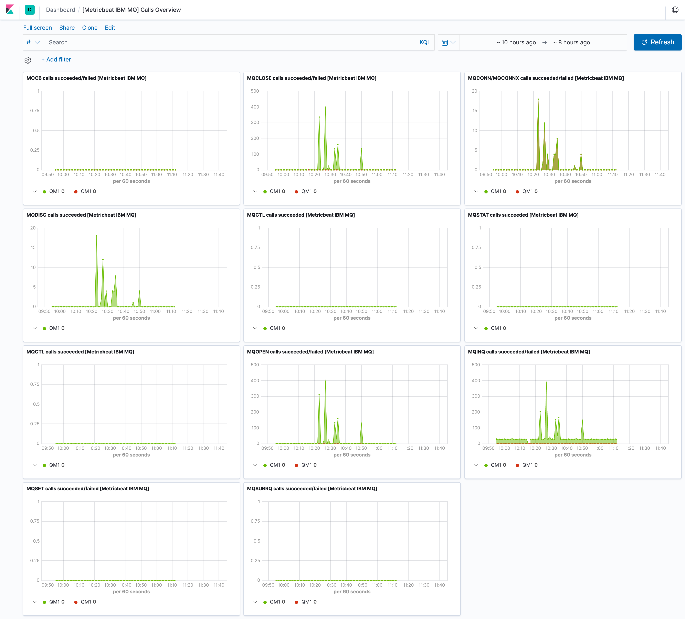
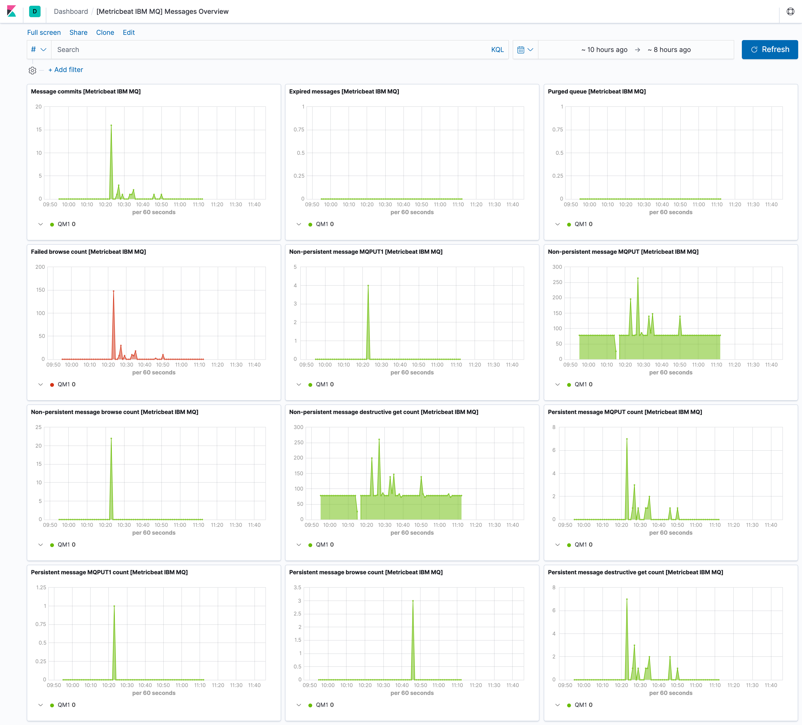
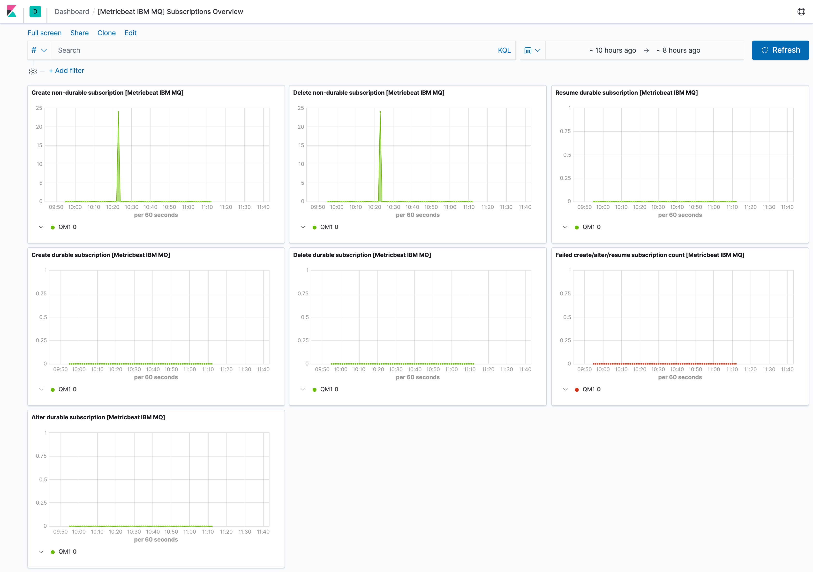

---
mapped_pages:
  - https://www.elastic.co/guide/en/beats/metricbeat/current/metricbeat-module-ibmmq.html
---

# IBM MQ module [metricbeat-module-ibmmq]

::::{warning}
This functionality is in beta and is subject to change. The design and code is less mature than official GA features and is being provided as-is with no warranties. Beta features are not subject to the support SLA of official GA features.
::::


This module periodically fetches metrics from a containerized distribution of IBM MQ.


## Compatibility [_compatibility_23]

The ibmmq `qmgr` metricset is compatible with a containerized distribution of IBM MQ (since version 9.1.0). The Docker image starts the `runmqserver` process, which spawns the HTTP server exposing metrics in Prometheus format ([source code](https://github.com/ibm-messaging/mq-container/blob/9.1.0/internal/metrics/metrics.go))).

The Docker container lifecycle, including metrics collection, has been described in the [Internals](https://github.com/ibm-messaging/mq-container/blob/9.1.0/docs/internals.md) document.

The image provides an option to easily enable metrics exporter using an environment variable:

`MQ_ENABLE_METRICS` - Set this to `true` to generate Prometheus metrics for the Queue Manager.


## Dashboard [_dashboard_26]

The ibmmq module includes predefined dashboards with overview information of the monitored Queue Manager, including subscriptions, calls and messages.








## Example configuration [_example_configuration_31]

The IBM MQ module supports the standard configuration options that are described in [Modules](/reference/metricbeat/configuration-metricbeat.md). Here is an example configuration:

```yaml
metricbeat.modules:
- module: ibmmq
  metricsets: ['qmgr']
  period: 10s
  hosts: ['localhost:9157']

  # This module uses the Prometheus collector metricset, all
  # the options for this metricset are also available here.
  metrics_path: /metrics
```

This module supports TLS connections when using `ssl` config field, as described in [SSL](/reference/metricbeat/configuration-ssl.md). It also supports the options described in [Standard HTTP config options](/reference/metricbeat/configuration-metricbeat.md#module-http-config-options).


## Metricsets [_metricsets_36]

The following metricsets are available:

* [qmgr](/reference/metricbeat/metricbeat-metricset-ibmmq-qmgr.md)


