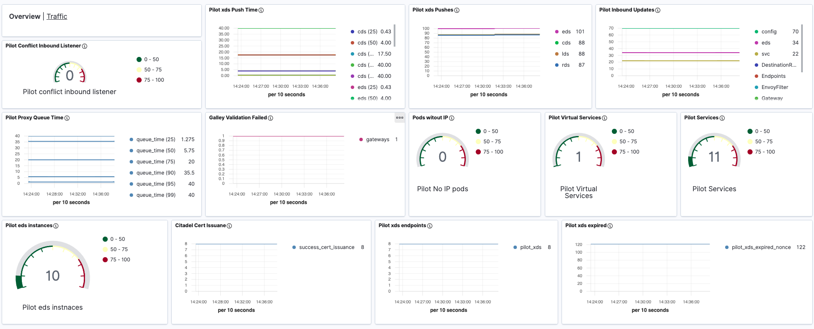
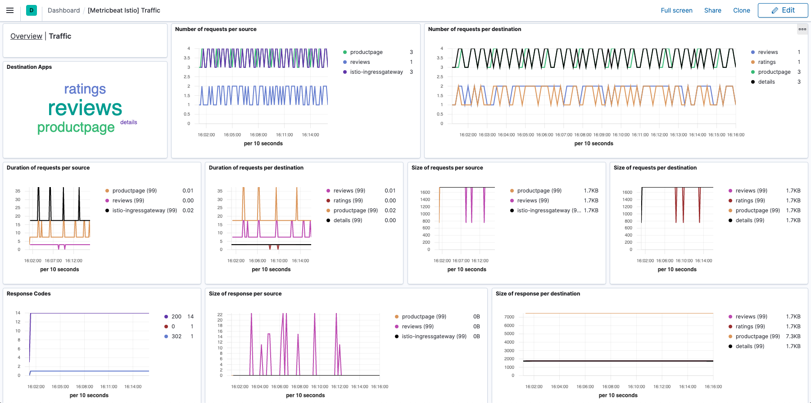

---
mapped_pages:
  - https://www.elastic.co/guide/en/beats/metricbeat/current/metricbeat-module-istio.html
---

# Istio module [metricbeat-module-istio]

::::{warning}
This functionality is in beta and is subject to change. The design and code is less mature than official GA features and is being provided as-is with no warranties. Beta features are not subject to the support SLA of official GA features.
::::


This is the Istio module. When using versions prior to `1.5` then the `mesh`, `mixer`, `pilot`, `galley`, `citadel` metricsets should be used.

In such case, the Istio module collects metrics from the pre v1.5 Istio [prometheus exporters endpoints](https://istio.io/v1.4/docs/tasks/observability/metrics/querying-metrics/#about-the-prometheus-add-on).

For versions after `1.5`, the `istiod` and `proxy` metricsets should be used. In such case, the `istiod` endpoint collects metrics directly from the Istio Daemon while the `proxy` endpoint collects from each of the proxy sidecars. The metrics exposed by Istio after version `1.5` are documented on [Istio Documentation > Reference > Configuration > Istio Standard Metrics](https://istio.io/latest/docs/reference/config/metrics/).


## Compatibility [_compatibility_24]

The Istio module is tested with Istio `1.4` for `mesh`, `mixer`, `pilot`, `galley`, `citadel`. The Istio module is tested with Istio `1.7` for `istiod` and `proxy`.


## Dashboard [_dashboard_30]

The Istio module includes predefined dashboards:

1. Overview information about Istio Daemon.
2. Traffic information collected from istio-proxies.

These dashboards are only compatible with versions of Istio after `1.5` which should be monitored with `istiod` and `proxy` metricsets.






## Example configuration [_example_configuration_33]

The Istio module supports the standard configuration options that are described in [Modules](/reference/metricbeat/configuration-metricbeat.md). Here is an example configuration:

```yaml
metricbeat.modules:
# Istio mesh. To collect all Mixer-generated metrics. For versions of Istio prior to 1.5.
- module: istio
  metricsets: ["mesh"]
  period: 10s
  # use istio-telemetry.istio-system:42422, when deploying Metricbeat in a kubernetes cluster as Pod or Daemonset
  hosts: ["localhost:42422"]

# Istio mixer. To monitor Mixer itself. For versions of Istio prior to 1.5.
- module: istio
  metricsets: ["mixer"]
  period: 10s
  # use istio-telemetry.istio-system:15014, when deploying Metricbeat in a kubernetes cluster as Pod or Daemonset
  hosts: ["localhost:15014"]

# Istio galley. To collect all Galley-generated metrics. For versions of Istio prior to 1.5.
- module: istio
  metricsets: ["galley"]
  period: 10s
  # use istio-galley.istio-system:15014, when deploying Metricbeat in a kubernetes cluster as Pod or Daemonset
  hosts: ["localhost:15014"]

# Istio pilot. To collect all Pilot-generated metrics. For versions of Istio prior to 1.5.
- module: istio
  metricsets: ["pilot"]
  period: 10s
  # use istio-pilot.istio-system:15014, when deploying Metricbeat in a kubernetes cluster as Pod or Daemonset
  hosts: ["localhost:15014"]

# Istio citadel. To collect all Citadel-generated metrics. For versions of Istio prior to 1.5.
- module: istio
  metricsets: ["citadel"]
  period: 10s
  # use istio-pilot.istio-system:15014, when deploying Metricbeat in a kubernetes cluster as Pod or Daemonset
  hosts: ["localhost:15014"]

# Istio istiod to monitor the Istio Daemon for versions of Istio after 1.5.
- module: istio
  metricsets: ['istiod']
  period: 10s
  # use istiod.istio-system:15014, when deploying Metricbeat in a kubernetes cluster as Pod or Daemonset
  hosts: ['localhost:15014']

# Istio proxy to monitor Envoy sidecars for versions of Istio after 1.5.
- module: istio
  metricsets: ['proxy']
  period: 10s
  # it's recommended to deploy this metricset with autodiscovery, see metricset's docs for more info
  hosts: ['localhost:15090']
```

This module supports TLS connections when using `ssl` config field, as described in [SSL](/reference/metricbeat/configuration-ssl.md). It also supports the options described in [Standard HTTP config options](/reference/metricbeat/configuration-metricbeat.md#module-http-config-options).


## Metricsets [_metricsets_39]

The following metricsets are available:

* [citadel](/reference/metricbeat/metricbeat-metricset-istio-citadel.md)
* [galley](/reference/metricbeat/metricbeat-metricset-istio-galley.md)
* [istiod](/reference/metricbeat/metricbeat-metricset-istio-istiod.md)
* [mesh](/reference/metricbeat/metricbeat-metricset-istio-mesh.md)
* [mixer](/reference/metricbeat/metricbeat-metricset-istio-mixer.md)
* [pilot](/reference/metricbeat/metricbeat-metricset-istio-pilot.md)
* [proxy](/reference/metricbeat/metricbeat-metricset-istio-proxy.md)


