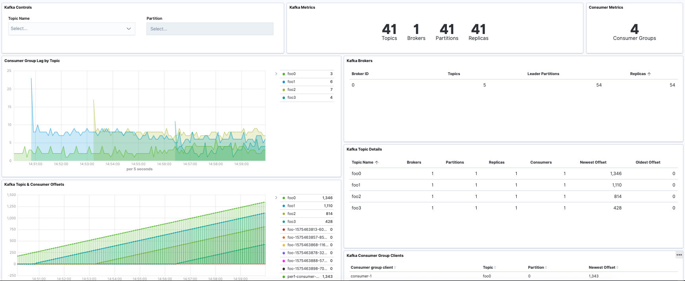

---
mapped_pages:
  - https://www.elastic.co/guide/en/beats/metricbeat/current/metricbeat-module-kafka.html
---

# Kafka module [metricbeat-module-kafka]

:::::{admonition} Prefer to use {{agent}} for this use case?
Refer to the [Elastic Integrations documentation](integration-docs://reference/kafka/index.md).

::::{dropdown} Learn more
{{agent}} is a single, unified way to add monitoring for logs, metrics, and other types of data to a host. It can also protect hosts from security threats, query data from operating systems, forward data from remote services or hardware, and more. Refer to the documentation for a detailed [comparison of {{beats}} and {{agent}}](docs-content://reference/fleet/index.md).

::::


:::::


This is the Kafka module.

The default metricsets are `consumergroup` and `partition`.

If authorization is configured in the Kafka cluster, the following ACLs are required for the Metricbeat user:

* READ Topic, for the topics to be monitored
* DESCRIBE Group, for the groups to be monitored

For example, if the `stats` user is being used for Metricbeat, to monitor all topics and all consumer groups, ACLS can be granted with the following commands:

```shell
kafka-acls --authorizer-properties zookeeper.connect=localhost:2181 --add --allow-principal User:stats --operation Read --topic '*'
kafka-acls --authorizer-properties zookeeper.connect=localhost:2181 --add --allow-principal User:stats --operation Describe --group '*'
```


## Compatibility [_compatibility_26]

This module is tested with Kafka 0.10.2.1, 1.1.0, 2.1.1, 2.2.2 and 3.6.0.

The Broker, Producer, Consumer metricsets require [Jolokia](/reference/metricbeat/metricbeat-module-jolokia.md) to fetch JMX metrics. Refer to the link for Jolokia’s compatibility notes.


## Usage [_usage_5]

The Broker, Producer, Consumer metricsets require [Jolokia](/reference/metricbeat/metricbeat-module-jolokia.md) to fetch JMX metrics. Refer to those Metricsets' documentation about how to use Jolokia.


## Dashboard [_dashboard_31]

The Kafka module comes with a predefined dashboard. For example:




## Example configuration [_example_configuration_35]

The Kafka module supports the standard configuration options that are described in [Modules](/reference/metricbeat/configuration-metricbeat.md). Here is an example configuration:

```yaml
metricbeat.modules:
# Kafka metrics collected using the Kafka protocol
- module: kafka
  #metricsets:
  #  - partition
  #  - consumergroup
  period: 10s
  hosts: ["localhost:9092"]

  #client_id: metricbeat
  #retries: 3
  #backoff: 250ms

  # List of Topics to query metadata for. If empty, all topics will be queried.
  #topics: []

  # Optional SSL. By default is off.
  # List of root certificates for HTTPS server verifications
  #ssl.certificate_authorities: ["/etc/pki/root/ca.pem"]

  # Certificate for SSL client authentication
  #ssl.certificate: "/etc/pki/client/cert.pem"

  # Client Certificate Key
  #ssl.key: "/etc/pki/client/cert.key"

  # Client Certificate Passphrase (in case your Client Certificate Key is encrypted)
  #ssl.key_passphrase: "yourKeyPassphrase"

  # SASL authentication
  #username: ""
  #password: ""

  # SASL authentication mechanism used. Can be one of PLAIN, SCRAM-SHA-256 or SCRAM-SHA-512.
  # Defaults to PLAIN when `username` and `password` are configured.
  #sasl.mechanism: ''

# Metrics collected from a Kafka broker using Jolokia
#- module: kafka
#  metricsets:
#    - broker
#  period: 10s
#  hosts: ["localhost:8779"]

# Metrics collected from a Java Kafka consumer using Jolokia
#- module: kafka
#  metricsets:
#    - consumer
#  period: 10s
#  hosts: ["localhost:8774"]

# Metrics collected from a Java Kafka producer using Jolokia
#- module: kafka
#  metricsets:
#    - producer
#  period: 10s
#  hosts: ["localhost:8775"]
```


## Metricsets [_metricsets_41]

The following metricsets are available:

* [broker](/reference/metricbeat/metricbeat-metricset-kafka-broker.md)
* [consumer](/reference/metricbeat/metricbeat-metricset-kafka-consumer.md)
* [consumergroup](/reference/metricbeat/metricbeat-metricset-kafka-consumergroup.md)
* [partition](/reference/metricbeat/metricbeat-metricset-kafka-partition.md)
* [producer](/reference/metricbeat/metricbeat-metricset-kafka-producer.md)


