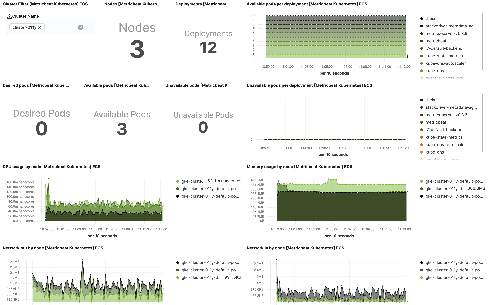
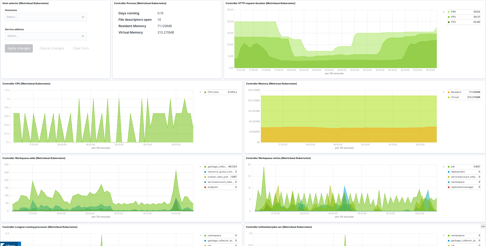
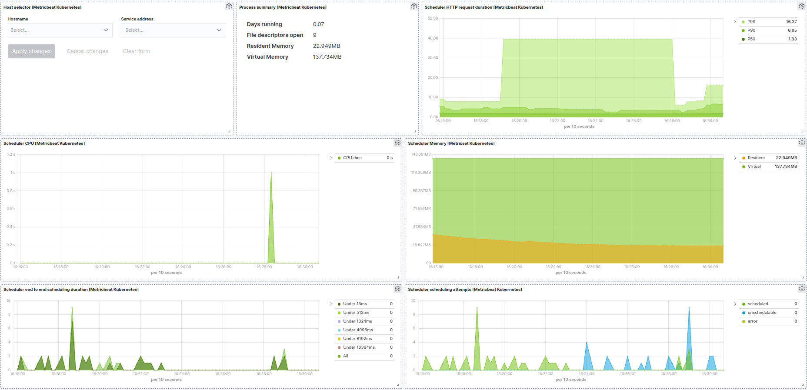
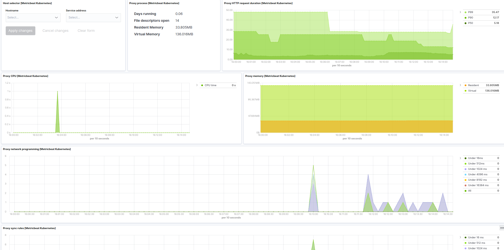

---
mapped_pages:
  - https://www.elastic.co/guide/en/beats/metricbeat/current/metricbeat-module-kubernetes.html
---

# Kubernetes module [metricbeat-module-kubernetes]

:::::{admonition} Prefer to use {{agent}} for this use case?
Refer to the [Elastic Integrations documentation](integration-docs://reference/kubernetes/index.md).

::::{dropdown} Learn more
{{agent}} is a single, unified way to add monitoring for logs, metrics, and other types of data to a host. It can also protect hosts from security threats, query data from operating systems, forward data from remote services or hardware, and more. Refer to the documentation for a detailed [comparison of {{beats}} and {{agent}}](docs-content://reference/fleet/index.md).

::::


:::::


As one of the main pieces provided for Kubernetes monitoring, this module is capable of fetching metrics from several components:

* [kubelet](https://kubernetes.io/docs/reference/command-line-tools-reference/kubelet/)
* [kube-state-metrics](https://github.com/kubernetes/kube-state-metrics)
* [apiserver](https://kubernetes.io/docs/reference/command-line-tools-reference/kube-apiserver/)
* [controller-manager](https://kubernetes.io/docs/reference/command-line-tools-reference/kube-controller-manager/)
* [scheduler](https://kubernetes.io/docs/reference/command-line-tools-reference/kube-scheduler/)
* [proxy](https://kubernetes.io/docs/reference/command-line-tools-reference/kube-proxy/)

Some of the previous components are running on each of the Kubernetes nodes (like `kubelet` or `proxy`) while others provide a single cluster-wide endpoint. This is important to determine the optimal configuration and running strategy for the different metricsets included in the module.

For a complete reference on how to configure and run this module on Kubernetes as part of a `DaemonSet` and a `Deployment`, there’s a complete example manifest available in [Running Metricbeat on Kubernetes](/reference/metricbeat/running-on-kubernetes.md) document.


## Kubernetes endpoints and metricsets [_kubernetes_endpoints_and_metricsets]

Kubernetes module is a bit complex as its internal metricsets require access to a wide variety of endpoints.

This section highlights and introduces some groups of metricsets with similar endpoint access needs. For more details on the metricsets see `configuration example` and the `metricsets` sections below.


### container / node / pod / system / volume [_container_node_pod_system_volume]

The default metricsets `container`, `node`, `pod`, `system`, and `volume` require access to the `kubelet endpoint` in each of the Kubernetes nodes, hence it’s recommended to include them as part of a `Metricbeat DaemonSet` or standalone Metricbeats running on the hosts.

Depending on the version and configuration of Kubernetes nodes, `kubelet` might provide a read only http port (typically 10255), which is used in some configuration examples. But in general, and lately, this endpoint requires SSL (`https`) access (to port 10250 by default) and token based authentication.


### state_* and event [_state_and_event]

All metricsets with the `state_` prefix require `hosts` field pointing to `kube-state-metrics service` within the cluster. As the service provides cluster-wide metrics, there’s no need to fetch them per node, hence the recommendation is to run these metricsets as part of a `Metricbeat Deployment` with one only replica.

Note: Kube-state-metrics is not deployed by default in Kubernetes. For these cases the instructions for its deployment are available [here](https://github.com/kubernetes/kube-state-metrics#kubernetes-deployment). Generally `kube-state-metrics` runs a `Deployment` and is accessible via a service called `kube-state-metrics` on `kube-system` namespace, which will be the service to use in our configuration.


### apiserver [_apiserver]

The apiserver metricset requires access to the Kubernetes API, which should be easily available in all Kubernetes environments. Depending on the Kubernetes configuration, the API access might require SSL (`https`) and token based authentication.

In order to access the `/metrics` path of the API service, some Kubernetes environments might require the following permission to be added to a ClusterRole.

```yaml
rules:
- nonResourceURLs:
  - /metrics
  verbs:
  - get
```


### proxy [_proxy]

The proxy metricset requires access to the proxy endpoint in each of Kubernetes nodes, hence it’s recommended to configure it as a part of a `Metricbeat DaemonSet`.


### scheduler and controllermanager [_scheduler_and_controllermanager]

These metricsets require access to the Kubernetes `controller-manager` and `scheduler` endpoints. By default, these pods run only on master nodes, and they are not exposed via a Service, but there are different strategies available for its configuration:

* Create `Kubernetes Services` to make `kube-controller-manager` and `kube-scheduler` available and configure the metricsets to point to these services as part of a Metricbeat `Deployment`.
* Use `Autodiscovery` functionality as part of a Metricbeat DaemonSet and include the metricsets in a conditional template applied for the specific pods.

Note: In some "As a Service" Kubernetes implementations, like `GKE`, the master nodes or even the pods running on the masters won’t be visible. In these cases it won’t be possible to use `scheduler` and `controllermanager` metricsets.


## Kubernetes RBAC [_kubernetes_rbac]

Metricbeat requires certain cluster level privileges in order to fetch the metrics. The following example creates a `ServiceAcount` named `metricbeat` with the necessary permissions to run all the metricsets from the module. A `ClusterRole` and a `ClusterRoleBinding` are created for this purpose:

```yaml
apiVersion: v1
kind: ServiceAccount
metadata:
  name: metricbeat
  namespace: kube-system
  labels:
    k8s-app: metricbeat
```

```yaml
apiVersion: rbac.authorization.k8s.io/v1
kind: ClusterRole
metadata:
  name: metricbeat
  labels:
    k8s-app: metricbeat
rules:
- apiGroups: [""]
  resources:
  - nodes
  - namespaces
  - events
  - pods
  verbs: ["get", "list", "watch"]
- apiGroups: ["batch"]
  resources:
  - jobs
  verbs: ["get", "list", "watch"]
- apiGroups: ["extensions"]
  resources:
  - replicasets
  verbs: ["get", "list", "watch"]
- apiGroups: ["apps"]
  resources:
  - statefulsets
  - deployments
  - replicasets
  verbs: ["get", "list", "watch"]
- apiGroups:
  - ""
  resources:
  - nodes/stats
  verbs:
  - get
- nonResourceURLs:
  - /metrics
  verbs:
  - get
```

```yaml
apiVersion: rbac.authorization.k8s.io/v1
kind: ClusterRoleBinding
metadata:
  name: metricbeat
subjects:
- kind: ServiceAccount
  name: metricbeat
  namespace: kube-system
roleRef:
  kind: ClusterRole
  name: metricbeat
  apiGroup: rbac.authorization.k8s.io
```


## Compatibility [_compatibility_31]

The Kubernetes module is tested with the following versions of Kubernetes: 1.28.x, 1.29.x, 1.30.x and 1.31.x


## Dashboard [_dashboard_32]

Kubernetes module is shipped including default dashboards for `cluster overview`, `apiserver`, `controllermanager`, `scheduler` and `proxy`.

If you are using HA for those components, be aware that when gathering data from all instances the dashboard will usually show and average of the metrics. For those scenarios filtering by hosts or service address is possible.

Dashboards for `controllermanager` `scheduler` and `proxy` are not compatible with kibana versions below `7.2.0`

Cluster selector in `cluster overview` dashboard helps in distinguishing and filtering metrics collected from multiple clusters. If you want to focus on a subset of the Kubernetes clusters for monitoring a specific scenario, this cluster selector could be a handy tool. Note that this selector gets populated from the `orchestrator.cluster.name` field that may not always be available. This field gets its value from sources like `kube_config`, `kubeadm-config` configMap, and Google Cloud’s meta API for GKE. If the sources mentioned above don’t provide this value, metricbeat will not report it. However, you can always use [add_fields processor](/reference/filebeat/add-fields.md) to set `orchestrator.cluster.name` fields and utilize it in the `cluster overview` dashboard:

```yaml
processors:
  - add_fields:
      target: orchestrator.cluster
      fields:
        name: clusterName
        url: clusterURL
```

Kubernetes cluster overview example:



If you are setting collection period to a value bigger than `2m` you will need to increase the Interval (in Panel Options) for "Desired Pods", "Available Pods" and "Unavailable Pods" visualisations.

Kubernetes controller manager example:



Kubernetes scheduler example:



Kubernetes proxy example:




## Example configuration [_example_configuration_37]

The Kubernetes module supports the standard configuration options that are described in [Modules](/reference/metricbeat/configuration-metricbeat.md). Here is an example configuration:

```yaml
metricbeat.modules:
# Node metrics, from kubelet:
- module: kubernetes
  metricsets:
    - container
    - node
    - pod
    - system
    - volume
  period: 10s
  enabled: true
  hosts: ["https://${NODE_NAME}:10250"]
  bearer_token_file: /var/run/secrets/kubernetes.io/serviceaccount/token
  ssl.verification_mode: "none"
  #ssl.certificate_authorities:
  #  - /var/run/secrets/kubernetes.io/serviceaccount/service-ca.crt
  #ssl.certificate: "/etc/pki/client/cert.pem"
  #ssl.key: "/etc/pki/client/cert.key"

  # Enriching parameters:
  add_metadata: true
  # If kube_config is not set, KUBECONFIG environment variable will be checked
  # and if not present it will fall back to InCluster
  #kube_config: ~/.kube/config
  #By default requests to kubeadm config map are made in order to enrich cluster name by requesting /api/v1/namespaces/kube-system/configmaps/kubeadm-config API endpoint.
  use_kubeadm: true
  #include_labels: []
  #exclude_labels: []
  #include_annotations: []
  #labels.dedot: true
  #annotations.dedot: true

  # When used outside the cluster:
  #node: node_name

  # To configure additionally node and namespace metadata `add_resource_metadata` can be defined.
  # By default all labels will be included while annotations are not added by default.
  # add_resource_metadata:
  #   namespace:
  #     include_labels: ["namespacelabel1"]
  #   node:
  #     include_labels: ["nodelabel2"]
  #     include_annotations: ["nodeannotation1"]
  #   deployment: false
  #   cronjob: false
  # Kubernetes client QPS and burst can be configured additionally
  #kube_client_options:
  #  qps: 5
  #  burst: 10

# State metrics from kube-state-metrics service:
- module: kubernetes
  enabled: true
  metricsets:
    - state_node
    - state_daemonset
    - state_deployment
    - state_replicaset
    - state_statefulset
    - state_pod
    - state_container
    - state_job
    - state_cronjob
    - state_resourcequota
    - state_service
    - state_persistentvolume
    - state_persistentvolumeclaim
    - state_storageclass
    # - state_horizontalpodautoscaler
    # Uncomment this to get k8s events:
    #- event  period: 10s
  hosts: ["kube-state-metrics:8080"]

  # Enriching parameters:
  add_metadata: true
  # If kube_config is not set, KUBECONFIG environment variable will be checked
  # and if not present it will fall back to InCluster
  #kube_config: ~/.kube/config
  #By default requests to kubeadm config map are made in order to enrich cluster name by requesting /api/v1/namespaces/kube-system/configmaps/kubeadm-config API endpoint.
  use_kubeadm: true
  #include_labels: []
  #exclude_labels: []
  #include_annotations: []
  #labels.dedot: true
  #annotations.dedot: true

  # When used outside the cluster:
  #node: node_name

  # Set the namespace to watch for resources
  #namespace: staging

  # To configure additionally node and namespace metadata `add_resource_metadata` can be defined.
  # By default all labels will be included while annotations are not added by default.
  # add_resource_metadata:
  #   namespace:
  #     include_labels: ["namespacelabel1"]
  #   node:
  #     include_labels: ["nodelabel2"]
  #     include_annotations: ["nodeannotation1"]
  #   deployment: false
  #   cronjob: false
  # Kubernetes client QPS and burst can be configured additionally
  #kube_client_options:
  #  qps: 5
  #  burst: 10

# Kubernetes Events
- module: kubernetes
  enabled: true
  metricsets:
    - event
  period: 10s
  # Skip events older than Metricbeat's statup time is enabled by default.
  # Setting to false the skip_older setting will stop filtering older events.
  # This setting is also useful went Event's timestamps are not populated properly.
  #skip_older: false
  # If kube_config is not set, KUBECONFIG environment variable will be checked
  # and if not present it will fall back to InCluster
  #kube_config: ~/.kube/config
  #By default requests to kubeadm config map are made in order to enrich cluster name by requesting /api/v1/namespaces/kube-system/configmaps/kubeadm-config API endpoint.
  use_kubeadm: true
  # Set the namespace to watch for events
  #namespace: staging
  # Set the sync period of the watchers
  #sync_period: 10m
  # Kubernetes client QPS and burst can be configured additionally
  #kube_client_options:
  #  qps: 5
  #  burst: 10

# Kubernetes API server
# (when running metricbeat as a deployment)
- module: kubernetes
  enabled: true
  metricsets:
    - apiserver
  hosts: ["https://${KUBERNETES_SERVICE_HOST}:${KUBERNETES_SERVICE_PORT}"]
  bearer_token_file: /var/run/secrets/kubernetes.io/serviceaccount/token
  ssl.certificate_authorities:
    - /var/run/secrets/kubernetes.io/serviceaccount/ca.crt
  period: 30s
  #By default requests to kubeadm config map are made in order to enrich cluster name by requesting /api/v1/namespaces/kube-system/configmaps/kubeadm-config API endpoint.
  use_kubeadm: true

# Kubernetes proxy server
# (when running metricbeat locally at hosts or as a daemonset + host network)
- module: kubernetes
  enabled: true
  metricsets:
    - proxy
  hosts: ["localhost:10249"]
  period: 10s
  #By default requests to kubeadm config map are made in order to enrich cluster name by requesting /api/v1/namespaces/kube-system/configmaps/kubeadm-config API endpoint.
  use_kubeadm: true

# Kubernetes controller manager
# (URL and deployment method should be adapted to match the controller manager deployment / service / endpoint)
- module: kubernetes
  enabled: true
  metricsets:
    - controllermanager
  hosts: ["http://localhost:10252"]
  period: 10s
  #By default requests to kubeadm config map are made in order to enrich cluster name by requesting /api/v1/namespaces/kube-system/configmaps/kubeadm-config API endpoint.
  use_kubeadm: true

# Kubernetes scheduler
# (URL and deployment method should be adapted to match scheduler deployment / service / endpoint)
- module: kubernetes
  enabled: true
  metricsets:
    - scheduler
  hosts: ["localhost:10251"]
  period: 10s
  #By default requests to kubeadm config map are made in order to enrich cluster name by requesting /api/v1/namespaces/kube-system/configmaps/kubeadm-config API endpoint.
  use_kubeadm: true
```

This module supports TLS connections when using `ssl` config field, as described in [SSL](/reference/metricbeat/configuration-ssl.md). It also supports the options described in [Standard HTTP config options](/reference/metricbeat/configuration-metricbeat.md#module-http-config-options).


## Metricsets [_metricsets_43]

The following metricsets are available:

* [apiserver](/reference/metricbeat/metricbeat-metricset-kubernetes-apiserver.md)
* [container](/reference/metricbeat/metricbeat-metricset-kubernetes-container.md)
* [controllermanager](/reference/metricbeat/metricbeat-metricset-kubernetes-controllermanager.md)
* [event](/reference/metricbeat/metricbeat-metricset-kubernetes-event.md)
* [node](/reference/metricbeat/metricbeat-metricset-kubernetes-node.md)
* [pod](/reference/metricbeat/metricbeat-metricset-kubernetes-pod.md)
* [proxy](/reference/metricbeat/metricbeat-metricset-kubernetes-proxy.md)
* [scheduler](/reference/metricbeat/metricbeat-metricset-kubernetes-scheduler.md)
* [state_container](/reference/metricbeat/metricbeat-metricset-kubernetes-state_container.md)
* [state_cronjob](/reference/metricbeat/metricbeat-metricset-kubernetes-state_cronjob.md)
* [state_daemonset](/reference/metricbeat/metricbeat-metricset-kubernetes-state_daemonset.md)
* [state_deployment](/reference/metricbeat/metricbeat-metricset-kubernetes-state_deployment.md)
* [state_job](/reference/metricbeat/metricbeat-metricset-kubernetes-state_job.md)
* [state_node](/reference/metricbeat/metricbeat-metricset-kubernetes-state_node.md)
* [state_persistentvolumeclaim](/reference/metricbeat/metricbeat-metricset-kubernetes-state_persistentvolumeclaim.md)
* [state_pod](/reference/metricbeat/metricbeat-metricset-kubernetes-state_pod.md)
* [state_replicaset](/reference/metricbeat/metricbeat-metricset-kubernetes-state_replicaset.md)
* [state_resourcequota](/reference/metricbeat/metricbeat-metricset-kubernetes-state_resourcequota.md)
* [state_service](/reference/metricbeat/metricbeat-metricset-kubernetes-state_service.md)
* [state_statefulset](/reference/metricbeat/metricbeat-metricset-kubernetes-state_statefulset.md)
* [state_storageclass](/reference/metricbeat/metricbeat-metricset-kubernetes-state_storageclass.md)
* [system](/reference/metricbeat/metricbeat-metricset-kubernetes-system.md)
* [volume](/reference/metricbeat/metricbeat-metricset-kubernetes-volume.md)


