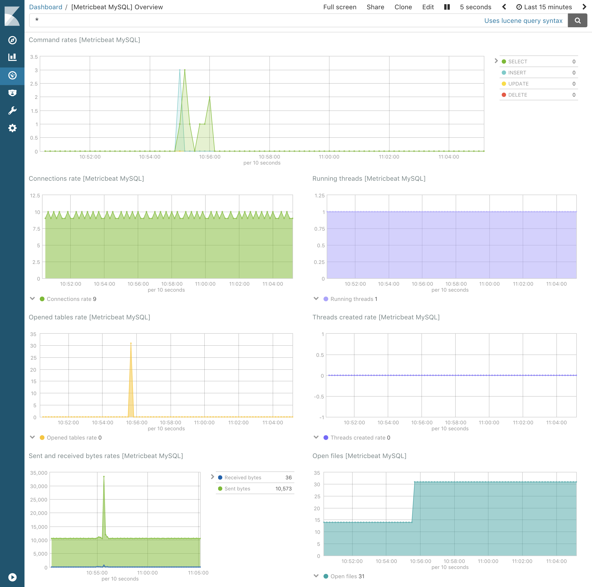

---
mapped_pages:
  - https://www.elastic.co/guide/en/beats/metricbeat/current/metricbeat-module-mysql.html
---

# MySQL module [metricbeat-module-mysql]

:::::{admonition} Prefer to use {{agent}} for this use case?
Refer to the [Elastic Integrations documentation](integration-docs://reference/mysql/index.md).

::::{dropdown} Learn more
{{agent}} is a single, unified way to add monitoring for logs, metrics, and other types of data to a host. It can also protect hosts from security threats, query data from operating systems, forward data from remote services or hardware, and more. Refer to the documentation for a detailed [comparison of {{beats}} and {{agent}}](docs-content://reference/fleet/index.md).

::::


:::::


This module periodically fetches metrics from [MySQL](https://www.mysql.com/) servers.

The default metricset is `status`.


## Module-specific configuration notes [_module_specific_configuration_notes_13]

When configuring the `hosts` option, you must use a MySQL Data Source Name (DSN) of the following format:

```
[username[:password]@][protocol[(address)]]/
```

You can also separately specify the username and password using the respective configuration options. Usernames and passwords specified in the DSN take precedence over those specified in the `username` and `password` config options.

```
- module: mysql
  metricsets: ["status"]
  hosts: ["tcp(127.0.0.1:3306)/"]
  username: root
  password: secret
```


## Compatibility [_compatibility_37]

The mysql MetricSets were tested with MySQL and Percona 5.7 and 8.0 and are expected to work with all versions >= 5.7.0. It is also tested with MariaDB 10.2, 10.3 and 10.4.


## Dashboard [_dashboard_33]

The mysql module comes with a predefined dashboard. For example:




## Example configuration [_example_configuration_46]

The MySQL module supports the standard configuration options that are described in [Modules](/reference/metricbeat/configuration-metricbeat.md). Here is an example configuration:

```yaml
metricbeat.modules:
- module: mysql
  metricsets:
    - status
  #  - galera_status
  #  - performance
  #  - query
  period: 10s

  # Host DSN should be defined as "user:pass@tcp(127.0.0.1:3306)/"
  # or "unix(/var/lib/mysql/mysql.sock)/",
  # or another DSN format supported by <https://github.com/Go-SQL-Driver/MySQL/>.
  # The username and password can either be set in the DSN or using the username
  # and password config options. Those specified in the DSN take precedence.
  hosts: ["root:secret@tcp(127.0.0.1:3306)/"]

  # Username of hosts. Empty by default.
  #username: root

  # Password of hosts. Empty by default.
  #password: secret

  # By setting raw to true, all raw fields from the status metricset will be added to the event.
  #raw: false

  # Optional SSL/TLS. By default is false.
  #ssl.enabled: true

  # List of root certificates for SSL/TLS server verification
  #ssl.certificate_authorities: ["/etc/pki/root/ca.crt"]

  # Certificate for SSL/TLS client authentication
  #ssl.certificate: "/etc/pki/client/cert.crt"

  # Client certificate key file
  #ssl.key: "/etc/pki/client/cert.key"
```


## Metricsets [_metricsets_53]

The following metricsets are available:

* [galera_status](/reference/metricbeat/metricbeat-metricset-mysql-galera_status.md)
* [performance](/reference/metricbeat/metricbeat-metricset-mysql-performance.md)
* [query](/reference/metricbeat/metricbeat-metricset-mysql-query.md)
* [status](/reference/metricbeat/metricbeat-metricset-mysql-status.md)


