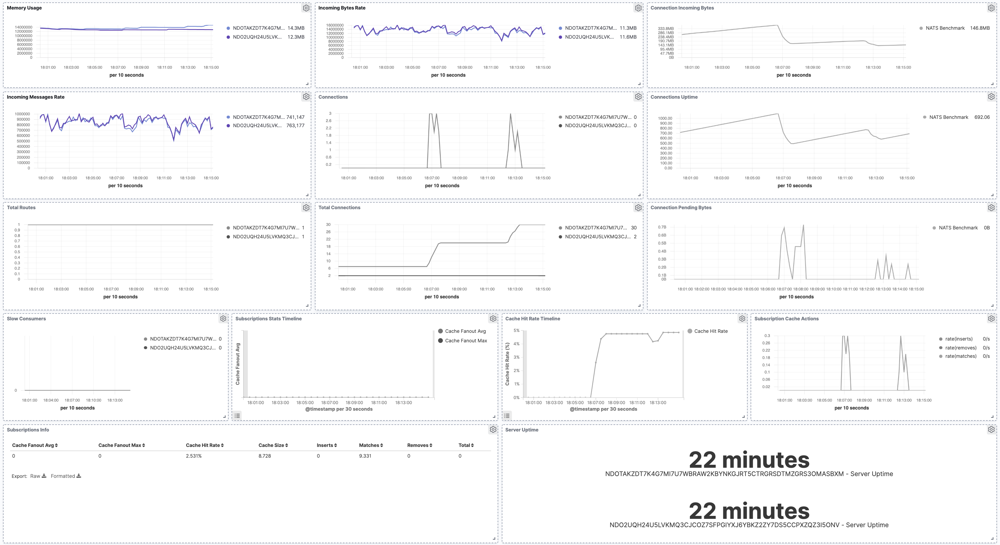

---
mapped_pages:
  - https://www.elastic.co/guide/en/beats/metricbeat/current/metricbeat-module-nats.html
---

# NATS module [metricbeat-module-nats]

:::::{admonition} Prefer to use {{agent}} for this use case?
Refer to the [Elastic Integrations documentation](integration-docs://reference/nats/index.md).

::::{dropdown} Learn more
{{agent}} is a single, unified way to add monitoring for logs, metrics, and other types of data to a host. It can also protect hosts from security threats, query data from operating systems, forward data from remote services or hardware, and more. Refer to the documentation for a detailed [comparison of {{beats}} and {{agent}}](docs-content://reference/fleet/index.md).

::::


:::::


The Nats module uses [Nats monitoring server APIs](https://nats.io/documentation/managing_the_server/monitoring/) to collect metrics.

The default metricsets are `stats`, `connections`, `routes` and `subscriptions` while `connection` and `route` metricsets can be enabled to collect detailed metrics per connection/route.


## Compatibility [_compatibility_39]

The Nats module is tested with Nats 1.3.0, 2.0.4 and 2.1.4


## Dashboard [_dashboard_34]

The Nats module comes with a predefined dashboard. For example:




## Example configuration [_example_configuration_47]

The NATS module supports the standard configuration options that are described in [Modules](/reference/metricbeat/configuration-metricbeat.md). Here is an example configuration:

```yaml
metricbeat.modules:
- module: nats
  metricsets:
    - "connections"
    - "routes"
    - "stats"
    - "subscriptions"
    #- "connection"
    #- "route"
  period: 10s
  hosts: ["localhost:8222"]
  #stats.metrics_path: "/varz"
  #connections.metrics_path: "/connz"
  #routes.metrics_path: "/routez"
  #subscriptions.metrics_path: "/subsz"
  #connection.metrics_path: "/connz"
  #route.metrics_path: "/routez"
```

This module supports TLS connections when using `ssl` config field, as described in [SSL](/reference/metricbeat/configuration-ssl.md). It also supports the options described in [Standard HTTP config options](/reference/metricbeat/configuration-metricbeat.md#module-http-config-options).


## Metricsets [_metricsets_54]

The following metricsets are available:

* [connection](/reference/metricbeat/metricbeat-metricset-nats-connection.md)
* [connections](/reference/metricbeat/metricbeat-metricset-nats-connections.md)
* [route](/reference/metricbeat/metricbeat-metricset-nats-route.md)
* [routes](/reference/metricbeat/metricbeat-metricset-nats-routes.md)
* [stats](/reference/metricbeat/metricbeat-metricset-nats-stats.md)
* [subscriptions](/reference/metricbeat/metricbeat-metricset-nats-subscriptions.md)


