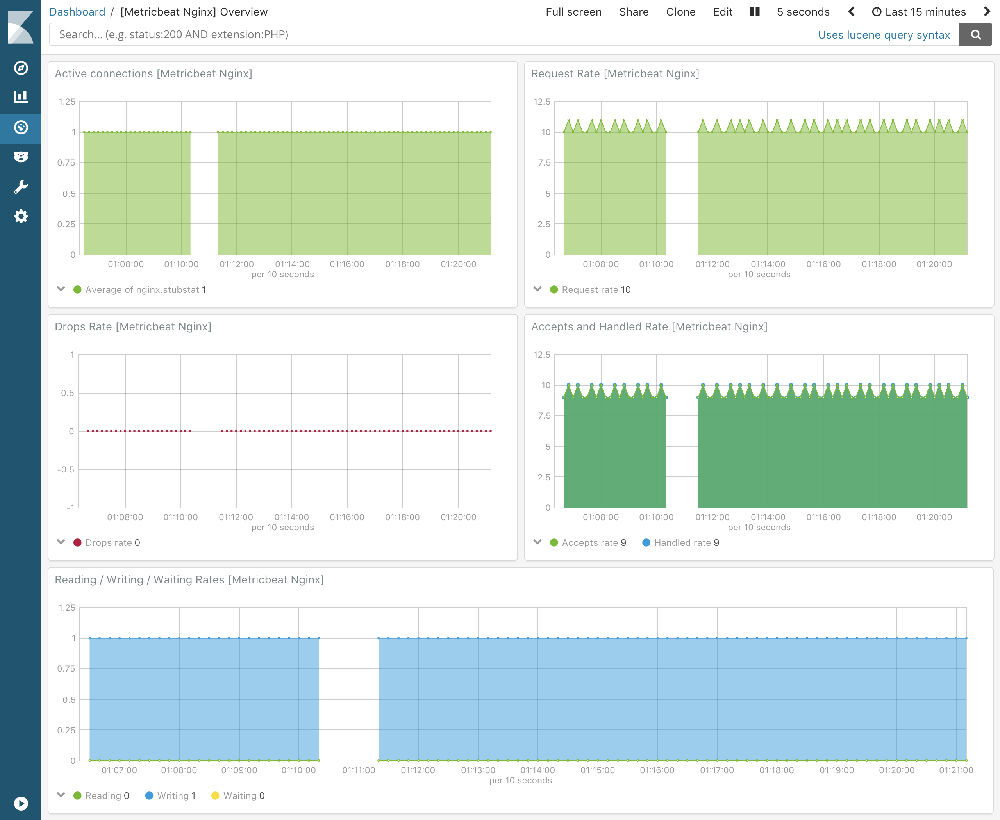

---
mapped_pages:
  - https://www.elastic.co/guide/en/beats/metricbeat/current/metricbeat-module-nginx.html
---

# Nginx module [metricbeat-module-nginx]

:::::{admonition} Prefer to use {{agent}} for this use case?
Refer to the [Elastic Integrations documentation](integration-docs://reference/nginx/index.md).

::::{dropdown} Learn more
{{agent}} is a single, unified way to add monitoring for logs, metrics, and other types of data to a host. It can also protect hosts from security threats, query data from operating systems, forward data from remote services or hardware, and more. Refer to the documentation for a detailed [comparison of {{beats}} and {{agent}}](docs-content://reference/fleet/index.md).

::::


:::::


This module periodically fetches metrics from [Nginx](https://nginx.org/) servers.

The default metricset is `stubstatus`.


## Compatibility [_compatibility_40]

The Nginx metricsets were tested with Nginx 1.23.2 and are expected to work with all version >= 1.9.


## Dashboard [_dashboard_35]

The nginx module comes with a predefined dashboard. For example:




## Example configuration [_example_configuration_48]

The Nginx module supports the standard configuration options that are described in [Modules](/reference/metricbeat/configuration-metricbeat.md). Here is an example configuration:

```yaml
metricbeat.modules:
- module: nginx
  metricsets: ["stubstatus"]
  enabled: true
  period: 10s

  # Nginx hosts
  hosts: ["http://127.0.0.1"]

  # Path to server status. Default nginx_status
  server_status_path: "nginx_status"
```

This module supports TLS connections when using `ssl` config field, as described in [SSL](/reference/metricbeat/configuration-ssl.md). It also supports the options described in [Standard HTTP config options](/reference/metricbeat/configuration-metricbeat.md#module-http-config-options).


## Metricsets [_metricsets_55]

The following metricsets are available:

* [stubstatus](/reference/metricbeat/metricbeat-metricset-nginx-stubstatus.md)


