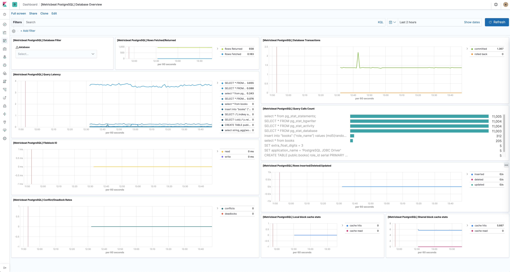

---
mapped_pages:
  - https://www.elastic.co/guide/en/beats/metricbeat/current/metricbeat-module-postgresql.html
---

# PostgreSQL module [metricbeat-module-postgresql]

:::::{admonition} Prefer to use {{agent}} for this use case?
Refer to the [Elastic Integrations documentation](integration-docs://reference/postgresql/index.md).

::::{dropdown} Learn more
{{agent}} is a single, unified way to add monitoring for logs, metrics, and other types of data to a host. It can also protect hosts from security threats, query data from operating systems, forward data from remote services or hardware, and more. Refer to the documentation for a detailed [comparison of {{beats}} and {{agent}}](docs-content://reference/fleet/index.md).

::::


:::::


This module periodically fetches metrics from [PostgreSQL](https://www.postgresql.org/) servers.

Default metricsets are `activity`, `bgwriter` and `database`.


## Dashboard [_dashboard_37]

The PostgreSQL module comes with a predefined dashboard showing databse related metrics. For example:




## Module-specific configuration notes [_module_specific_configuration_notes_17]

When configuring the `hosts` option, you must use Postgres URLs of the following format:

```
[postgres://][user:pass@]host[:port][?options]
```

The URL can be as simple as:

```yaml
- module: postgresql
  hosts: ["postgres://localhost"]
```

Or more complex like:

```yaml
- module: postgresql
  hosts: ["postgres://localhost:40001?sslmode=disable", "postgres://otherhost:40001"]
```

You can also separately specify the username and password using the respective configuration options. Usernames and passwords specified in the URL take precedence over those specified in the `username` and `password` config options.

```yaml
- module: postgresql
  metricsets: ["status"]
  hosts: ["postgres://localhost:5432"]
  username: root
  password: test
```


## Compatibility [_compatibility_43]

This module was tested with PostgreSQL 9, 10, 11, 12 and 13. It is expected to work with all versions >= 9.


## Example configuration [_example_configuration_54]

The PostgreSQL module supports the standard configuration options that are described in [Modules](/reference/metricbeat/configuration-metricbeat.md). Here is an example configuration:

```yaml
metricbeat.modules:
- module: postgresql
  enabled: true
  metricsets:
    # Stats about every PostgreSQL database
    - database

    # Stats about the background writer process's activity
    - bgwriter

    # Stats about every PostgreSQL process
    - activity

    # Stats about every statement executed in the server. It requires the
    # `pg_stats_statement` library to be configured in the server.
    #- statement

  period: 10s

  # The host must be passed as PostgreSQL URL. Example:
  # postgres://localhost:5432?sslmode=disable
  # The available parameters are documented here:
  # https://godoc.org/github.com/lib/pq#hdr-Connection_String_Parameters
  hosts: ["postgres://localhost:5432"]

  # Username to use when connecting to PostgreSQL. Empty by default.
  #username: user

  # Password to use when connecting to PostgreSQL. Empty by default.
  #password: pass
```


## Metricsets [_metricsets_63]

The following metricsets are available:

* [activity](/reference/metricbeat/metricbeat-metricset-postgresql-activity.md)
* [bgwriter](/reference/metricbeat/metricbeat-metricset-postgresql-bgwriter.md)
* [database](/reference/metricbeat/metricbeat-metricset-postgresql-database.md)
* [statement](/reference/metricbeat/metricbeat-metricset-postgresql-statement.md)


