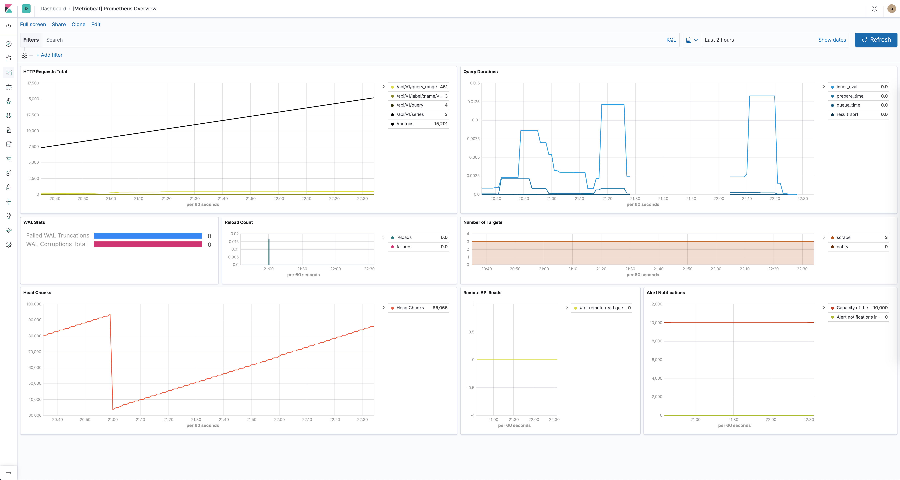

---
mapped_pages:
  - https://www.elastic.co/guide/en/beats/metricbeat/current/metricbeat-module-prometheus.html
---

# Prometheus module [metricbeat-module-prometheus]

:::::{admonition} Prefer to use {{agent}} for this use case?
Refer to the [Elastic Integrations documentation](integration-docs://reference/prometheus/index.md).

::::{dropdown} Learn more
{{agent}} is a single, unified way to add monitoring for logs, metrics, and other types of data to a host. It can also protect hosts from security threats, query data from operating systems, forward data from remote services or hardware, and more. Refer to the documentation for a detailed [comparison of {{beats}} and {{agent}}](docs-content://reference/fleet/index.md).

::::


:::::


$$$prometheus-module$$$
This module periodically scrapes metrics from [Prometheus exporters](https://prometheus.io/docs/instrumenting/exporters/).


## Dashboard [_dashboard_38]

The Prometheus module comes with a predefined dashboard for Prometheus specific stats. For example:




## Example configuration [_example_configuration_55]

The Prometheus module supports the standard configuration options that are described in [Modules](/reference/metricbeat/configuration-metricbeat.md). Here is an example configuration:

```yaml
metricbeat.modules:
# Metrics collected from a Prometheus endpoint
- module: prometheus
  period: 10s
  metricsets: ["collector"]
  hosts: ["localhost:9090"]
  metrics_path: /metrics
  #metrics_filters:
  #  include: []
  #  exclude: []
  #username: "user"
  #password: "secret"

  # Count number of metrics present in Elasticsearch document (default: false)
  #metrics_count: false

  # This can be used for service account based authorization:
  #bearer_token_file: /var/run/secrets/kubernetes.io/serviceaccount/token
  #ssl.certificate_authorities:
  #  - /var/run/secrets/kubernetes.io/serviceaccount/service-ca.crt


# Metrics sent by a Prometheus server using remote_write option
#- module: prometheus
#  metricsets: ["remote_write"]
#  host: "localhost"
#  port: "9201"

  # Count number of metrics present in Elasticsearch document (default: false)
  #metrics_count: false

  # Secure settings for the server using TLS/SSL:
  #ssl.certificate: "/etc/pki/server/cert.pem"
  #ssl.key: "/etc/pki/server/cert.key"

# Metrics that will be collected using a PromQL
#- module: prometheus
#  metricsets: ["query"]
#  hosts: ["localhost:9090"]
#  period: 10s
#  queries:
#  - name: "instant_vector"
#    path: "/api/v1/query"
#    params:
#      query: "sum(rate(prometheus_http_requests_total[1m]))"
#  - name: "range_vector"
#    path: "/api/v1/query_range"
#    params:
#      query: "up"
#      start: "2019-12-20T00:00:00.000Z"
#      end:  "2019-12-21T00:00:00.000Z"
#      step: 1h
#  - name: "scalar"
#    path: "/api/v1/query"
#    params:
#      query: "100"
#  - name: "string"
#    path: "/api/v1/query"
#    params:
#      query: "some_value"
```

This module supports TLS connections when using `ssl` config field, as described in [SSL](/reference/metricbeat/configuration-ssl.md). It also supports the options described in [Standard HTTP config options](/reference/metricbeat/configuration-metricbeat.md#module-http-config-options).


## Metricsets [_metricsets_64]

The following metricsets are available:

* [collector](/reference/metricbeat/metricbeat-metricset-prometheus-collector.md)
* [query](/reference/metricbeat/metricbeat-metricset-prometheus-query.md)
* [remote_write](/reference/metricbeat/metricbeat-metricset-prometheus-remote_write.md)


