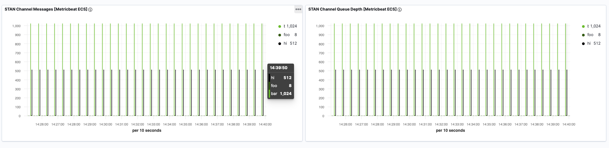

---
mapped_pages:
  - https://www.elastic.co/guide/en/beats/metricbeat/current/metricbeat-module-stan.html
---

# Stan module [metricbeat-module-stan]

:::::{admonition} Prefer to use {{agent}} for this use case?
Refer to the [Elastic Integrations documentation](integration-docs://reference/stan/index.md).

::::{dropdown} Learn more
{{agent}} is a single, unified way to add monitoring for logs, metrics, and other types of data to a host. It can also protect hosts from security threats, query data from operating systems, forward data from remote services or hardware, and more. Refer to the documentation for a detailed [comparison of {{beats}} and {{agent}}](docs-content://reference/fleet/index.md).

::::


:::::


The STAN module uses [STAN monitoring server APIs](https://github.com/nats-io/nats-streaming-server/blob/master/server/monitor.go) to collect metrics.

The default metricsets are `channels`, `stats` and `subscriptions`.


### Compatibility [_compatibility_47]

The STAN module is tested with STAN 0.15.1.


## Dashboard [_dashboard_41]

Dashboards for topic message count and queue depth are included:




### Example configuration [_example_configuration_60]

The Stan module supports the standard configuration options that are described in [Modules](/reference/metricbeat/configuration-metricbeat.md). Here is an example configuration:

```yaml
metricbeat.modules:
- module: stan
  metricsets: ["stats", "channels", "subscriptions"]
  period: 60s
  hosts: ["localhost:8222"]
  #stats.metrics_path: "/streaming/serverz"
  #channels.metrics_path: "/streaming/channelsz"
  #subscriptions.metrics_path: "/streaming/channelsz" # we retrieve streaming subscriptions with a detailed query param to the channelsz endpoint
```

This module supports TLS connections when using `ssl` config field, as described in [SSL](/reference/metricbeat/configuration-ssl.md). It also supports the options described in [Standard HTTP config options](/reference/metricbeat/configuration-metricbeat.md#module-http-config-options).


### Metricsets [_metricsets_69]

The following metricsets are available:

* [channels](/reference/metricbeat/metricbeat-metricset-stan-channels.md)
* [stats](/reference/metricbeat/metricbeat-metricset-stan-stats.md)
* [subscriptions](/reference/metricbeat/metricbeat-metricset-stan-subscriptions.md)


