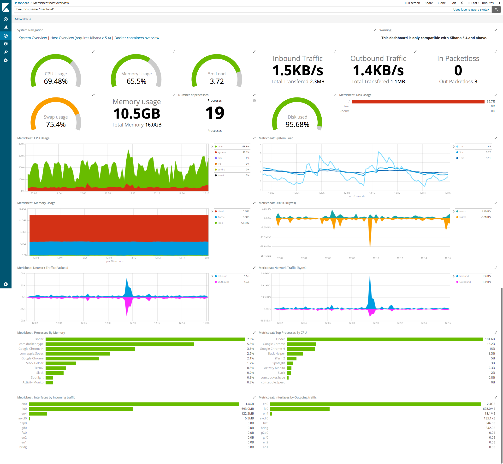

---
mapped_pages:
  - https://www.elastic.co/guide/en/beats/metricbeat/current/metricbeat-module-system.html
---

# System module [metricbeat-module-system]

:::::{admonition} Prefer to use {{agent}} for this use case?
Refer to the [Elastic Integrations documentation](integration-docs://reference/system/index.md).

::::{dropdown} Learn more
{{agent}} is a single, unified way to add monitoring for logs, metrics, and other types of data to a host. It can also protect hosts from security threats, query data from operating systems, forward data from remote services or hardware, and more. Refer to the documentation for a detailed [comparison of {{beats}} and {{agent}}](docs-content://reference/fleet/index.md).

::::


:::::


The System module allows you to monitor your servers. Because the System module always applies to the local server, the `hosts` config option is not needed.

The default metricsets are `cpu`, `load`, `memory`, `network`, `process`, `process_summary`, `socket_summary`, `filesystem`, `fsstat`, and `uptime`. To disable a default metricset, comment it out in the `modules.d/system.yml` configuration file. If *all* metricsets are commented out and the System module is enabled, Metricbeat uses the default metricsets.

Note that certain metricsets may access `/proc` to gather process information, and the resulting `ptrace_may_access()` call by the kernel to check for permissions can be blocked by [AppArmor and other LSM software](https://gitlab.com/apparmor/apparmor/wikis/TechnicalDoc_Proc_and_ptrace), even though the System module doesn’t use `ptrace` directly.

::::{admonition} How and when metrics are collected
:class: tip

Certain metrics monitored by the System module require multiple values to be collected. For example, the `system.process.cpu.total.norm.pct` field reports the percentage of CPU time spent by the process since the last event. For this percentage to be determined, the process needs to appear at least twice so that a performance delta can be calculated.

Note that in some cases a field like this may be missing from the System module metricset if the process has not been available long enough to be included in two periods of metric collection.

::::


## Dashboard [_dashboard_42]

The System module comes with a predefined dashboard. For example:




## Required permissions [_required_permissions]

The System metricsets collect different kinds of metric data, which may require dedicated permissions to be fetched. For security reasons it’s advised to grant the lowest possible permissions. This section justifies which permissions must be present for particular metricsets.

Please notice that modern Linux implementations divide the privileges traditionally associated with superuser into distinct units, known as capabilities, which can be independently enabled and disabled. Capabilities are a per-thread attribute.


### cpu [_cpu]

CPU statistics (idle, irq, user, system, iowait, softirq, cores, nice, steal, total) should be available without elevated permissions.


### load [_load]

CPU load data (1 min, 5 min, 15 min, cores) should be available without elevated permissions.


### memory [_memory]

Memory statistics (swap, total, used, free, actual) should be available without elevated permissions.


### network [_network]

Network metrics for interfaces (in, out, errors, dropped, bytes, packets) should be available without elevated permissions.


### process [_process]

Process execution data (state, memory, cpu, cmdline) should be available for an authorized user.

If the beats process is running as less privileged user, it may not be able to read process data belonging to other users. The issue should be reported in application logs:

```
2019-12-23T13:32:06.457+0100    DEBUG   [processes]     process/process.go:475  Skip process pid=235: error getting process state for pid=235: Could not read process info for pid 23
```


### process_summary [_process_summary]

General process summary (unknown, dead, total, sleeping, running, idle, stopped, zombie) should be available without elevated permissions. Please notice that if the process data belongs to the other users, it will be counted as unknown value (no error will be reported in application logs).


### socket_summary [_socket_summary]

Used sockets summary (TCP, UDP, count, listening, established, wait, etc.) should be available without elevated permissions.


### entropy [_entropy]

Entropy data (available, pool size) requires access to the `/proc/sys/kernel/random` path. Otherwise an error will be reported.


### core [_core]

Usage statistics for each CPU core (idle, irq, user, system, iowait, softirq, cores, nice, steal, total) should be available without elevated permissions.


### diskio [_diskio]

Disk IO metrics (io, read, write) should be available without elevated permissions.


### socket [_socket]

Events for each new TCP socket should be available for an authorized user.

If the beats process is running as less privileged user, it may not be able to view socket data belonging to other users.


### service [_service]

Systemd service data (memory, tasks, states) should be available for an authorized user.

If the beats process is running as less privileged user, it may not be able to read process data belonging to other users. The issue should be reported in application logs:

```
2020-01-02T08:19:50.635Z	INFO	module/wrapper.go:252	Error fetching data for metricset system.service: error getting list of running units: Rejected send message, 2 matched rules; type="method_call", sender=":1.35" (uid=1000 pid=4429 comm="./metricbeat -d * -e ") interface="org.freedesktop.systemd1.Manager" member="ListUnitsByPatterns" error name="(unset)" requested_reply="0" destination="org.freedesktop.systemd1" (uid=0 pid=1 comm="/usr/lib/systemd/systemd --switched-root --system ")
```


### filesystem [_filesystem_2]

Filesystem metrics data (total, available, type, mount point, files, free, used) should be available without elevated permissions.


### fsstat [_fsstat]

Fsstat metrics data (total size, free, total, used count) should be available without elevated permissions.


### uptime [_uptime]

Uptime metrics data (duration) should be available without elevated permissions.


### raid [_raid]

RAID metrics data (block, disks) requires access to the `/sys/block` mount point and all referenced devices. Otherwise an error will be reported.


## Example configuration [_example_configuration_63]

The System module supports the standard configuration options that are described in [Modules](/reference/metricbeat/configuration-metricbeat.md). Here is an example configuration:

```yaml
metricbeat.modules:
- module: system
  metricsets:
    - cpu             # CPU usage
    - load            # CPU load averages
    - memory          # Memory usage
    - network         # Network IO
    - process         # Per process metrics
    - process_summary # Process summary
    - uptime          # System Uptime
    - socket_summary  # Socket summary
    #- core           # Per CPU core usage
    #- diskio         # Disk IO
    #- filesystem     # File system usage for each mountpoint
    #- fsstat         # File system summary metrics
    #- raid           # Raid
    #- socket         # Sockets and connection info (linux only)
    #- service        # systemd service information
  enabled: true
  period: 10s
  processes: ['.*']

  # Configure the mount point of the host’s filesystem for use in monitoring a host from within a container
  #hostfs: "/hostfs"

  # Configure the metric types that are included by these metricsets.
  cpu.metrics:  ["percentages","normalized_percentages"]  # The other available option is ticks.
  core.metrics: ["percentages"]  # The other available option is ticks.

  # A list of filesystem types to ignore. The filesystem metricset will not
  # collect data from filesystems matching any of the specified types, and
  # fsstats will not include data from these filesystems in its summary stats.
  # If not set, types associated to virtual filesystems are automatically
  # added when this information is available in the system (e.g. the list of
  # `nodev` types in `/proc/filesystem`).
  #filesystem.ignore_types: []

  # These options allow you to filter out all processes that are not
  # in the top N by CPU or memory, in order to reduce the number of documents created.
  # If both the `by_cpu` and `by_memory` options are used, the union of the two sets
  # is included.
  #process.include_top_n:

    # Set to false to disable this feature and include all processes
    #enabled: true

    # How many processes to include from the top by CPU. The processes are sorted
    # by the `system.process.cpu.total.pct` field.
    #by_cpu: 0

    # How many processes to include from the top by memory. The processes are sorted
    # by the `system.process.memory.rss.bytes` field.
    #by_memory: 0

  # If false, cmdline of a process is not cached.
  #process.cmdline.cache.enabled: true

  # Enable collection of cgroup metrics from processes on Linux.
  #process.cgroups.enabled: true

  # A list of regular expressions used to whitelist environment variables
  # reported with the process metricset's events. Defaults to empty.
  #process.env.whitelist: []

  # Include the cumulative CPU tick values with the process metrics. Defaults
  # to false.
  #process.include_cpu_ticks: false

  # Raid mount point to monitor
  #raid.mount_point: '/'

  # Configure reverse DNS lookup on remote IP addresses in the socket metricset.
  #socket.reverse_lookup.enabled: false
  #socket.reverse_lookup.success_ttl: 60s
  #socket.reverse_lookup.failure_ttl: 60s

  # Diskio configurations
  #diskio.include_devices: []

  # Filter systemd services by status or sub-status
  #service.state_filter: ["active"]

  # Filter systemd services based on a name pattern
  #service.pattern_filter: ["ssh*", "nfs*"]

  # This option enables the use of performance counters to collect data for cpu/core metricset.
  # Only effective for Windows.
  # You should use this option if running beats on machins with more than 64 cores.
  #use_performance_counters: false
```


## Metricsets [_metricsets_73]

The following metricsets are available:

* [core](/reference/metricbeat/metricbeat-metricset-system-core.md)
* [cpu](/reference/metricbeat/metricbeat-metricset-system-cpu.md)
* [diskio](/reference/metricbeat/metricbeat-metricset-system-diskio.md)
* [entropy](/reference/metricbeat/metricbeat-metricset-system-entropy.md)
* [filesystem](/reference/metricbeat/metricbeat-metricset-system-filesystem.md)
* [fsstat](/reference/metricbeat/metricbeat-metricset-system-fsstat.md)
* [load](/reference/metricbeat/metricbeat-metricset-system-load.md)
* [memory](/reference/metricbeat/metricbeat-metricset-system-memory.md)
* [network](/reference/metricbeat/metricbeat-metricset-system-network.md)
* [network_summary](/reference/metricbeat/metricbeat-metricset-system-network_summary.md)
* [process](/reference/metricbeat/metricbeat-metricset-system-process.md)
* [process_summary](/reference/metricbeat/metricbeat-metricset-system-process_summary.md)
* [raid](/reference/metricbeat/metricbeat-metricset-system-raid.md)
* [service](/reference/metricbeat/metricbeat-metricset-system-service.md)
* [socket](/reference/metricbeat/metricbeat-metricset-system-socket.md)
* [socket_summary](/reference/metricbeat/metricbeat-metricset-system-socket_summary.md)
* [uptime](/reference/metricbeat/metricbeat-metricset-system-uptime.md)
* [users](/reference/metricbeat/metricbeat-metricset-system-users.md)


