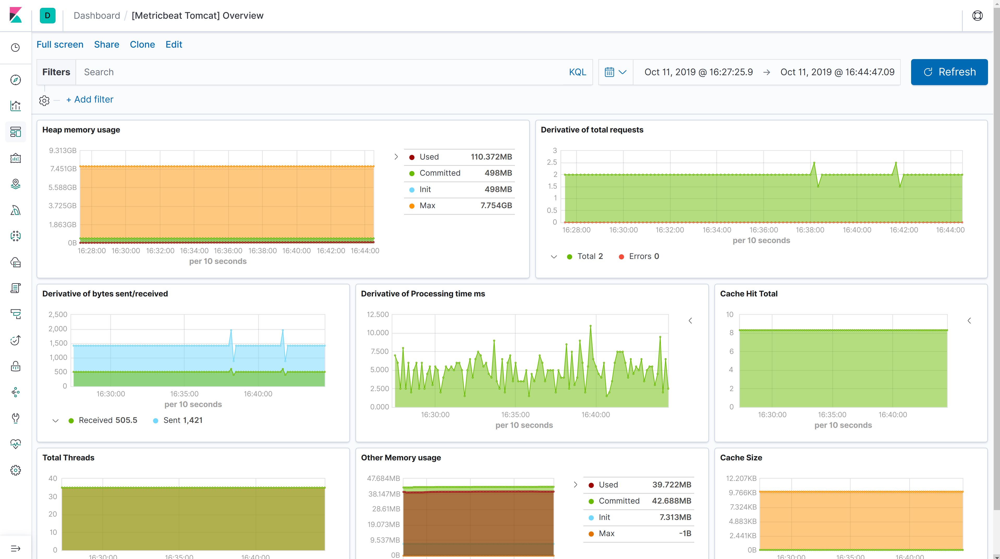

---
mapped_pages:
  - https://www.elastic.co/guide/en/beats/metricbeat/current/metricbeat-module-tomcat.html
---

# Tomcat module [metricbeat-module-tomcat]

::::{warning}
This functionality is in beta and is subject to change. The design and code is less mature than official GA features and is being provided as-is with no warranties. Beta features are not subject to the support SLA of official GA features.
::::


:::::{admonition} Prefer to use {{agent}} for this use case?
Refer to the [Elastic Integrations documentation](integration-docs://reference/tomcat/index.md).

::::{dropdown} Learn more
{{agent}} is a single, unified way to add monitoring for logs, metrics, and other types of data to a host. It can also protect hosts from security threats, query data from operating systems, forward data from remote services or hardware, and more. Refer to the documentation for a detailed [comparison of {{beats}} and {{agent}}](docs-content://reference/fleet/index.md).

::::


:::::


This module periodically fetches JMX metrics from Apache Tomcat.


### Compatibility [_compatibility_48]

The module has been tested with Tomcat 7.0.24 and 9.0.24. Other versions are expected to work.


## Dashboard [_dashboard_44]

An overview dashboard for Kibana is already included:




### Usage [_usage_9]

The Tomcat module requires [Jolokia](/reference/metricbeat/metricbeat-module-jolokia.md)to fetch JMX metrics. Refer to the link for instructions about how to use Jolokia.


### Example configuration [_example_configuration_64]

The Tomcat module supports the standard configuration options that are described in [Modules](/reference/metricbeat/configuration-metricbeat.md). Here is an example configuration:

```yaml
metricbeat.modules:
- module: tomcat
  metricsets: ['threading', 'cache', 'memory', 'requests']
  period: 10s
  hosts: ['localhost:8080']
  path: "/jolokia/?ignoreErrors=true&canonicalNaming=false"
```


### Metricsets [_metricsets_74]

The following metricsets are available:

* [cache](/reference/metricbeat/metricbeat-metricset-tomcat-cache.md)
* [memory](/reference/metricbeat/metricbeat-metricset-tomcat-memory.md)
* [requests](/reference/metricbeat/metricbeat-metricset-tomcat-requests.md)
* [threading](/reference/metricbeat/metricbeat-metricset-tomcat-threading.md)


