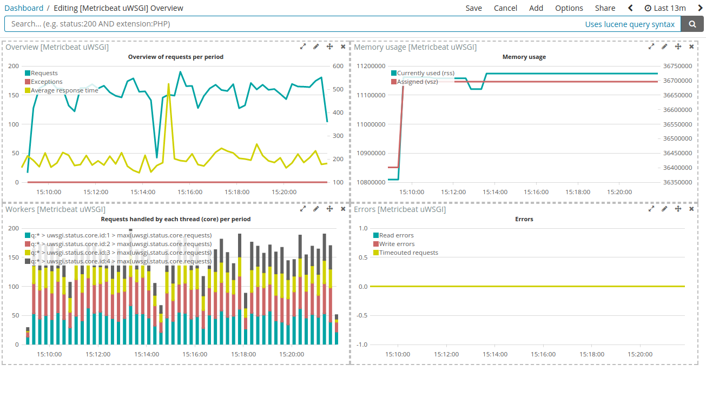

---
mapped_pages:
  - https://www.elastic.co/guide/en/beats/metricbeat/current/metricbeat-module-uwsgi.html
---

# uWSGI module [metricbeat-module-uwsgi]

This is the uwsgi module. By default collects the `stats` metricset, using [StatsServer](http://uwsgi-docs.readthedocs.io/en/latest/StatsServer.html).


## Module-specific configuration notes [_module_specific_configuration_notes_21]

The uWSGI module has these additional config options:

**`hosts`**
:   host URLs to get data from (e.g: `tcp://127.0.0.1:9191`). Can obtain data from 3 types of schemes: tcp (`tcp://ip:port`), unix socket (`unix:///tmp/uwsgi.sock`) and http/https server (`http://ip:port`)


## Dashboard [_dashboard_45]

The uwsgi module comes with a predefined dashboard. For example:




## Example configuration [_example_configuration_66]

The uWSGI module supports the standard configuration options that are described in [Modules](/reference/metricbeat/configuration-metricbeat.md). Here is an example configuration:

```yaml
metricbeat.modules:
- module: uwsgi
  metricsets: ["status"]
  enable: true
  period: 10s
  hosts: ["tcp://127.0.0.1:9191"]
```


## Metricsets [_metricsets_76]

The following metricsets are available:

* [status](/reference/metricbeat/metricbeat-metricset-uwsgi-status.md)


