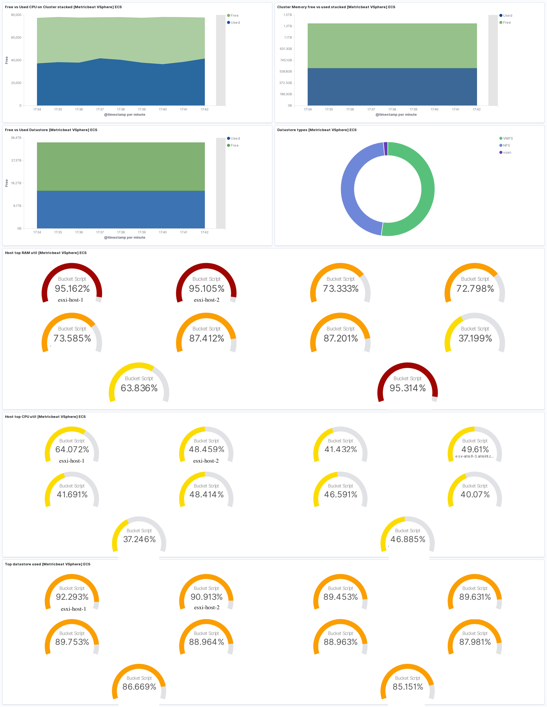
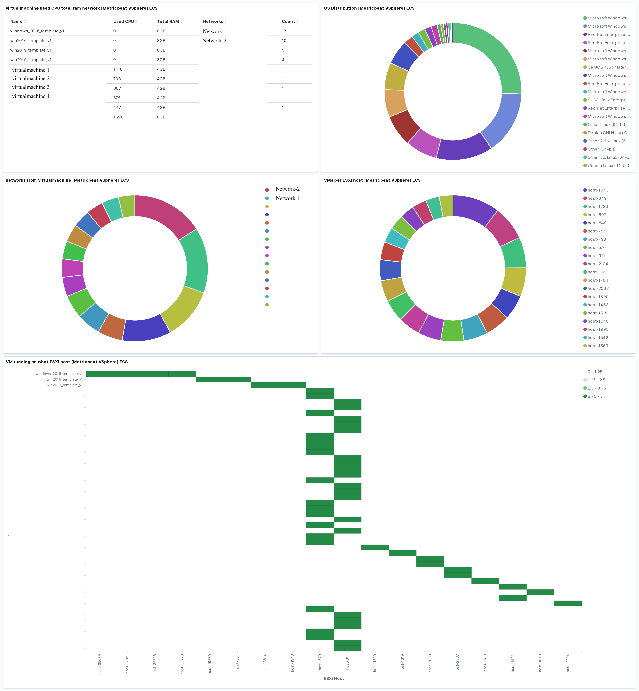

---
mapped_pages:
  - https://www.elastic.co/guide/en/beats/metricbeat/current/metricbeat-module-vsphere.html
---

# vSphere module [metricbeat-module-vsphere]

The vSphere module uses the [Govmomi](https://github.com/vmware/govmomi) library to collect metrics from any VMware SDK URL (ESXi/VCenter).

This module has been tested against ESXi and vCenter versions 5.5, 6.0, 6.5, and 7.0.3.

By default, the vSphere module enables the following metricsets:

1. cluster
2. datastore
3. datastorecluster
4. host
5. network
6. resourcepool
7. virtualmachine


## Supported Periods: [_supported_periods]

The Datastore and Host metricsets support performance data collection using the vSphere performance API. Given that the performance API imposes usage restrictions based on data collection intervals, users should configure the period optimally to ensure the receipt of real-time data. This configuration can be determined based on the [Data Collection Intervals](https://docs.vmware.com/en/VMware-vSphere/7.0/com.vmware.vsphere.monitoring.doc/GUID-247646EA-A04B-411A-8DD4-62A3DCFCF49B.md) and [Data Collection Levels](https://docs.vmware.com/en/VMware-vSphere/7.0/com.vmware.vsphere.monitoring.doc/GUID-25800DE4-68E5-41CC-82D9-8811E27924BC.md).

::::{important}
Only host and datastore metricsets have limitation of system configured period from vSphere instance. Users can still collect summary metrics if performance metrics are not supported for the configured instance.
::::


### Real-time data collection default interval: [_real_time_data_collection_default_interval]

* 20s


### Historical data collection default intervals: [_historical_data_collection_default_intervals]

* 300s
* 1800s
* 7200s
* 86400s


## Example: [_example_5]

If you need to configure multiple metricsets with different periods, you can achieve this by setting up multiple vSphere modules with different metricsets as demonstrated below:

```yaml
- module: vsphere
  metricsets:
   - cluster
   - datastorecluster
   - network
   - resourcepool
   - virtualmachine
  period: 10s
  hosts: ["https://localhost/sdk"]
  username: "user"
  password: "password"
  insecure: false

- module: vsphere
  metricsets:
   - datastore
   - host
  period: 300s
  hosts: ["https://localhost/sdk"]
  username: "user"
  password: "password"
  insecure: false
```


## Dashboard [_dashboard_46]

The vSphere module includes a predefined dashboard. For example:






## Example configuration [_example_configuration_67]

The vSphere module supports the standard configuration options that are described in [Modules](/reference/metricbeat/configuration-metricbeat.md). Here is an example configuration:

```yaml
metricbeat.modules:
- module: vsphere
  enabled: true
  metricsets: ["cluster", "datastore", "datastorecluster", "host", "network", "resourcepool", "virtualmachine"]

  # Real-time data collection – An ESXi Server collects data for each performance counter every 20 seconds by default.
  # Supported Periods:
  # The Datastore and Host metricsets support performance data collection using the vSphere performance API.
  # Since the performance API has usage restrictions based on data collection intervals,
  # users should ensure that the period is configured optimally to receive real-time data.
  # users can still collect summary metrics if performance metrics are not supported for the configured instance.
  # This configuration can be determined based on the Data Collection Intervals and Data Collection Levels.
  # Reference Links:
  # Data Collection Intervals: https://docs.vmware.com/en/VMware-vSphere/7.0/com.vmware.vsphere.monitoring.doc/GUID-247646EA-A04B-411A-8DD4-62A3DCFCF49B.html
  # Data Collection Levels: https://docs.vmware.com/en/VMware-vSphere/7.0/com.vmware.vsphere.monitoring.doc/GUID-25800DE4-68E5-41CC-82D9-8811E27924BC.html
  period: 20s
  hosts: ["https://localhost/sdk"]

  username: "user"
  password: "password"
  # If insecure is true, don't verify the server's certificate chain
  insecure: false
  # Get custom fields when using virtualmachine metricset. Default false.
  # get_custom_fields: false
```


## Metricsets [_metricsets_77]

The following metricsets are available:

* [cluster](/reference/metricbeat/metricbeat-metricset-vsphere-cluster.md)
* [datastore](/reference/metricbeat/metricbeat-metricset-vsphere-datastore.md)
* [datastorecluster](/reference/metricbeat/metricbeat-metricset-vsphere-datastorecluster.md)
* [host](/reference/metricbeat/metricbeat-metricset-vsphere-host.md)
* [network](/reference/metricbeat/metricbeat-metricset-vsphere-network.md)
* [resourcepool](/reference/metricbeat/metricbeat-metricset-vsphere-resourcepool.md)
* [virtualmachine](/reference/metricbeat/metricbeat-metricset-vsphere-virtualmachine.md)


