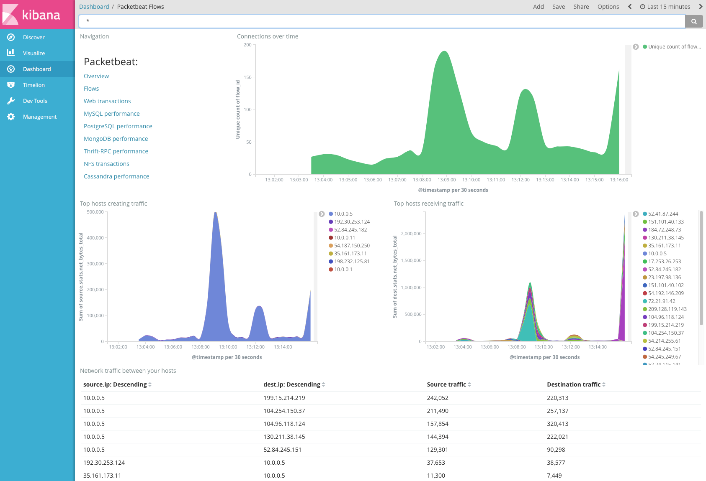

# Configure flows to monitor network traffic [configuration-flows]


You can configure Packetbeat to collect and report statistics on network flows. A *flow* is a group of packets sent over the same time period that share common properties, such as the same source and destination address and protocol. You can use this feature to analyze network traffic over specific protocols on your network.

For each flow, Packetbeat reports the number of packets and the total number of bytes sent from the source to the destination. Each flow event also contains information about the source and destination hosts, such as their IP address. For bi-directional flows, Packetbeat reports statistics for the reverse flow.

Packetbeat collects and reports statistics up to and including the transport layer. See [*Flow Event fields*](/reference/packetbeat/exported-fields-flows_event.md) for more info about the exported data.

Here’s an example of flow events visualized in the Flows dashboard:



To configure flows, use the `packetbeat.flows` option in the `packetbeat.yml` config file. Flows are enabled by default. If this section is missing from the configuration file, network flows are disabled.

```yaml
packetbeat.flows:
  timeout: 30s
  period: 10s
```

Here’s an example of a flow information sent by Packetbeat. See [*Flow Event fields*](/reference/packetbeat/exported-fields-flows_event.md) for a description of each field.

```json subs=true
{
  "@timestamp": "2018-11-15T14:41:24.000Z",
  "agent": {
    "hostname": "host.example.com",
    "name": "host.example.com",
    "version": "{{stack-version}}"
  },
  "destination": {
    "bytes": 460,
    "ip": "198.51.100.2",
    "mac": "06-05-04-03-02-01",
    "packets": 2,
    "port": 80
  },
  "event": {
    "dataset": "flow",
    "duration": 3000000000,
    "end": "2018-11-15T14:41:24.000Z",
    "start": "2018-11-15T14:41:21.000Z"
  },
  "flow": {
    "final": true, <1>
    "id": "FQQA/wz/Dv//////Fv8BAQEBAgMEBQYGBQQDAgGrAMsAcQPGM2QC9ZdQAA",
    "vlan": 171
  },
  "network": {
    "bytes": 470,
    "community_id": "1:t9T66/2c66NQyftAEsr4aMZv4Hc=",
    "packets": 3,
    "transport": "tcp",
    "type": "ipv4"
  },
  "source": {
    "bytes": 10,
    "ip": "203.0.113.3",
    "mac": "01-02-03-04-05-06",
    "packets": 1,
    "port": 38901
  }
}
```

1. Packetbeat sets the `flow.final` flag to `false` to indicate that the event contains an intermediate report about a flow that it’s tracking. When the flow completes, Packetbeat sends one last event with `flow.final` set to `true`. If you want to aggregate sums of traffic, you need to filter on `final:true`, or use some other technique, so that you get only the latest update from each flow. You can disable intermediate reports by setting `period: -1s`.


## Configuration options [_configuration_options]

You can specify the following options in the `packetbeat.flows` section of the `packetbeat.yml` config file:


### `enabled` [_enabled]

Enables flows support if set to true. Set to false to disable network flows support without having to delete or comment out the flows section. The default value is true.


### `timeout` [_timeout]

Timeout configures the lifetime of a flow. If no packets have been received for a flow within the timeout time window, the flow is killed and reported. The default value is 30s.


### `period` [_period]

Configure the reporting interval. All flows are reported at the very same point in time. Periodical reporting can be disabled by setting the value to -1. If disabled, flows are still reported once being timed out. The default value is 10s.


### `enable_delta_flow_reports` [_enable_delta_flow_reports]

Configure network.bytes and network.packets to be a delta value instead of a cumlative sum for each flow period. The default value is false.


### `fields` [packetbeat-configuration-flows-fields]

Optional fields that you can specify to add additional information to the output. For example, you might add fields that you can use for filtering log data. Fields can be scalar values, arrays, dictionaries, or any nested combination of these. By default, the fields that you specify here will be grouped under a `fields` sub-dictionary in the output document. To store the custom fields as top-level fields, set the `fields_under_root` option to true. If a duplicate field is declared in the general configuration, then its value will be overwritten by the value declared here.


### `fields_under_root` [_fields_under_root]

If this option is set to true, the custom [fields](#packetbeat-configuration-flows-fields) are stored as top-level fields in the output document instead of being grouped under a `fields` sub-dictionary. If the custom field names conflict with other field names added by Packetbeat, then the custom fields overwrite the other fields.


### `tags` [_tags]

A list of tags that will be sent with the protocol event. This setting is optional.


### `processors` [_processors]

A list of processors to apply to the data generated by the protocol.

See [Processors](/reference/packetbeat/filtering-enhancing-data.md) for information about specifying processors in your config.


### `keep_null` [_keep_null]

If this option is set to true, fields with `null` values will be published in the output document. By default, `keep_null` is set to `false`.


### `index` [_index]

Overrides the index that flow events are published to.

