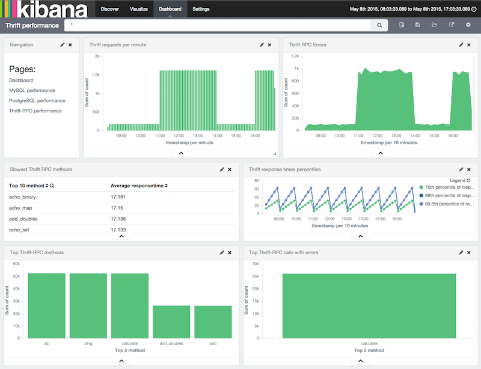

# Capture Thrift traffic [configuration-thrift]


[Apache Thrift](https://thrift.apache.org/) is a communication protocol and RPC framework initially created at Facebook. It is sometimes used in [microservices](http://martinfowler.com/articles/microservices.html) architectures because it provides better performance when compared to the more obvious HTTP/RESTful API choice, while still supporting a wide range of programming languages and frameworks.

Packetbeat works based on a copy of the traffic, which means that you get performance management features without having to modify your services in any way and without any latency overhead. Packetbeat captures the transactions from the network and indexes them in Elasticsearch so that they can be analyzed and searched.

Packetbeat indexes the method, parameters, return value, and exceptions of each Thrift-RPC call. You can search by and create statistics based on any of these fields. Packetbeat automatically fills in the `status` column with either `OK` or `Error`, so it’s easy to find the problematic RPC calls. A transaction is put into the `Error` state if it returned an exception.

Packetbeat also indexes the `event.duration` field so you can get performance analytics and find the slow RPC calls.

Here is an example performance dashboard:



Thrift supports multiple [transport and protocol types](http://en.wikipedia.org/wiki/Apache_Thrift). Currently Packetbeat supports the default `TSocket` transport as well as the `TFramed` transport. From the protocol point of view, Packetbeat currently supports only the default `TBinary` protocol.

Packetbeat also has several configuration options that allow you to get the right balance between visibility, disk usage, and data protection. You can, for example, choose to obfuscate all strings or to store the requests but not the responses, while still capturing the response time for each of the RPC calls. You can also choose to limit the size of strings and lists to a given number of elements, so you can fine tune how much data you want to have stored in Elasticsearch.

The Thrift protocol has several specific configuration options. Here is an example configuration section for the Thrift protocol in the `packetbeat.yml` config file:

```yaml
packetbeat.protocols:
- type: thrift
  transport_type: socket
  protocol_type: binary
  idl_files: ["tutorial.thrift", "shared.thrift"]
  string_max_size: 200
  collection_max_size: 20
  capture_reply: true
  obfuscate_strings: true
  drop_after_n_struct_fields: 100
```

Providing the Thrift IDL files to Packetbeat is optional. The binary Thrift messages include the called method name and enough structural information to decode the messages without needing the IDL files. However, if you provide the IDL files, Packetbeat can also resolve the service name, arguments, and exception names.

## Configuration options [_configuration_options_10]

Also see [Common protocol options](/reference/packetbeat/common-protocol-options.md).

### `transport_type` [_transport_type]

The Thrift transport type. Currently this option accepts the values `socket` for TSocket, which is the default Thrift transport, and `framed` for the TFramed Thrift transport. The default is `socket`.


### `protocol_type` [_protocol_type]

The Thrift protocol type. Currently the only accepted value is `binary` for the TBinary protocol, which is the default Thrift protocol.


### `idl_files` [_idl_files]

The Thrift interface description language (IDL) files for the service that Packetbeat is monitoring. Providing the IDL files is optional, because the Thrift messages contain enough information to decode them without having the IDL files. However, providing the IDL enables Packetbeat to include parameter and exception names.


### `string_max_size` [_string_max_size]

The maximum length for strings in parameters or return values. If a string is longer than this value, the string is automatically truncated to this length. Packetbeat adds dots at the end of the string to mark that it was truncated. The default is 200.


### `collection_max_size` [_collection_max_size]

The maximum number of elements in a Thrift list, set, map, or structure. If a collection has more elements than this value, Packetbeat captures only the specified number of elements. Packetbeat adds a fictive last element `...` to the end of the collection to mark that it was truncated. The default is 15.


### `capture_reply` [_capture_reply]

If this option is set to false, Packetbeat decodes the method name from the reply and simply skips the rest of the response message. This setting can be useful for performance, disk usage, or data retention reasons. The default is true.


### `obfuscate_strings` [_obfuscate_strings]

If this option is set to true, Packetbeat replaces all strings found in method parameters, return codes, or exception structures with the `"*"` string.


### `drop_after_n_struct_fields` [_drop_after_n_struct_fields]

The maximum number of fields that a structure can have before Packetbeat ignores the whole transaction. This is a memory protection mechanism (so that Packetbeat’s memory doesn’t grow indefinitely), so you would typically set this to a relatively high value. The default is 500.


