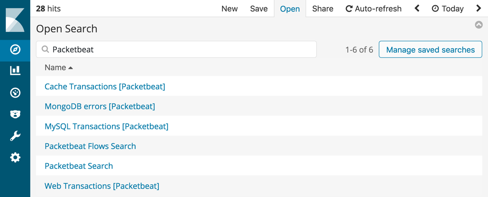

---
mapped_pages:
  - https://www.elastic.co/guide/en/beats/packetbeat/current/customizing-discover.html
---

# Customize the Discover page [customizing-discover]

To make it easier for you to search and discover Packetbeat data in Kibana, the sample dashboards contain predefined searches. These searches are not default views on the **Discover** page. To use these searches, make sure you’ve [set up the example Kibana dashboards](/reference/packetbeat/load-kibana-dashboards.md). Then go to the **Discover** page and click **Open**.

Type `Packetbeat` in the Search field to filter the list of searches.

% TO DO: Use `:class: screenshot`

You can use the predefined searches to customize the columns in the Discover table. For example, select the **Packetbeat Search** to customize the columns in the Discover table:

% TO DO: Use `:class: screenshot`

Select the **Packetbeat Flows Search** to display the most important information for Packetbeat flows:

% TO DO: Use `:class: screenshot`

