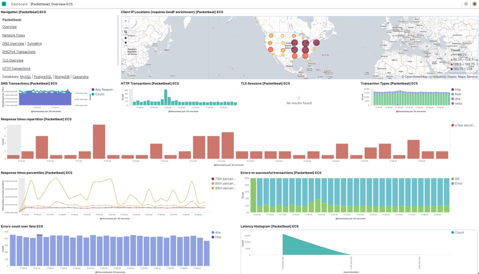

# Packetbeat quick start: installation and configuration [packetbeat-installation-configuration]


The best way to understand the value of a network packet analytics system like Packetbeat is to try it on your own traffic.

This guide describes how to get started quickly with network packets analytics. You’ll learn how to:

* install Packetbeat on each system you want to monitor
* specify the network devices and protocols to sniff
* parse the packet data into fields and send it to {{es}}
* visualize the packet data in {{kib}}

% TO DO: Use `:class: screenshot`



## Before you begin [_before_you_begin]

* You need {{es}} for storing and searching your data, and {{kib}} for visualizing and managing it.

:::::::{tab-set}

::::::{tab-item} Elasticsearch Service
To get started quickly, spin up a deployment of our [hosted {{ess}}](https://www.elastic.co/cloud/elasticsearch-service). The {{ess}} is available on AWS, GCP, and Azure. [Try it out for free](https://cloud.elastic.co/registration?page=docs&placement=docs-body).
::::::

::::::{tab-item} Self-managed
To install and run {{es}} and {{kib}}, see [Installing the {{stack}}](docs-content://deploy-manage/deploy/self-managed/installing-elasticsearch.md).
::::::

::::::{tab-item} DEB
```sh
sudo apt-get install libpcap0.8
```
::::::

::::::{tab-item} RPM
```sh
sudo yum install libpcap
```
::::::

::::::{tab-item} MacOS
You probably do not need to install libpcap.
::::::

::::::{tab-item} Linux
You probably do not need to install libpcap.
::::::

::::::{tab-item} Windows
You probably do not need to install libpcap. The default distribution of {{packetbeat}} for Windows comes bundled with the Npcap library.

    For the OSS-only distribution, you must download and install a packet sniffing library, such as [Npcap](https://nmap.org/npcap/), that implements the [libpcap](https://github.com/the-tcpdump-group/libpcap) interfaces.

    If you use Npcap, make sure you install it in WinPcap API-compatible mode. If you plan to capture traffic from the loopback device (127.0.0.1 traffic), also select the option to support loopback traffic.
::::::

:::::::


## Step 1: Install Packetbeat [install]

:::::::{tab-set}

::::::{tab-item} DEB
```shell subs=true
curl -L -O https://artifacts.elastic.co/downloads/beats/packetbeat/packetbeat-{{stack-version}}-amd64.deb
sudo dpkg -i packetbeat-{{stack-version}}-amd64.deb
```
::::::

::::::{tab-item} RPM
```shell subs=true
curl -L -O https://artifacts.elastic.co/downloads/beats/packetbeat/packetbeat-{{stack-version}}-x86_64.rpm
sudo rpm -vi packetbeat-{{stack-version}}-x86_64.rpm
```
::::::

::::::{tab-item} MacOS
```shell subs=true
curl -L -O https://artifacts.elastic.co/downloads/beats/packetbeat/packetbeat-{{stack-version}}-darwin-x86_64.tar.gz
tar xzvf packetbeat-{{stack-version}}-darwin-x86_64.tar.gz
```
::::::

::::::{tab-item} Linux
```shell subs=true
curl -L -O https://artifacts.elastic.co/downloads/beats/packetbeat/packetbeat-{{stack-version}}-linux-x86_64.tar.gz
tar xzvf packetbeat-{{stack-version}}-linux-x86_64.tar.gz
```
::::::

::::::{tab-item} Windows
1. Download the [Packetbeat Windows zip file](https://artifacts.elastic.co/downloads/beats/packetbeat/packetbeat-{{stack-version}}-windows-x86_64.zip).

2. Extract the contents of the zip file into `C:\Program Files`.

3. Rename the `packetbeat-[version]-windows-x86_64` directory to `Packetbeat`.

4. Open a PowerShell prompt as an Administrator (right-click the PowerShell icon and select *Run As Administrator*).

5. From the PowerShell prompt, run the following commands to install Packetbeat as a Windows service:

  ```shell subs=true
  PS > cd 'C:\Program Files\Packetbeat'
  PS C:\Program Files\Packetbeat> .\install-service-packetbeat.ps1
  ```

:::{note}
If script execution is disabled on your system, you need to set the execution policy for the current session to allow the script to run. For example: `PowerShell.exe -ExecutionPolicy UnRestricted -File .\install-service-packetbeat.ps1`.
:::
::::::

:::::::
The commands shown are for AMD platforms, but ARM packages are also available. Refer to the [download page](https://www.elastic.co/downloads/beats/packetbeat) for the full list of available packages.


### Other installation options [other-installation-options]

* [APT or YUM](/reference/packetbeat/setup-repositories.md)
* [Download page](https://www.elastic.co/downloads/beats/packetbeat)
* [Docker](/reference/packetbeat/running-on-docker.md)


## Step 2: Connect to the {{stack}} [set-connection]

Connections to {{es}} and {{kib}} are required to set up Packetbeat.

Set the connection information in `packetbeat.yml`. To locate this configuration file, see [Directory layout](/reference/packetbeat/directory-layout.md).

:::::::{tab-set}

::::::{tab-item} Elasticsearch Service
Specify the [cloud.id](/reference/packetbeat/configure-cloud-id.md) of your {{ess}}, and set [cloud.auth](/reference/packetbeat/configure-cloud-id.md) to a user who is authorized to set up Packetbeat. For example:

```yaml
cloud.id: "staging:dXMtZWFzdC0xLmF3cy5mb3VuZC5pbyRjZWM2ZjI2MWE3NGJmMjRjZTMzYmI4ODExYjg0Mjk0ZiRjNmMyY2E2ZDA0MjI0OWFmMGNjN2Q3YTllOTYyNTc0Mw=="
cloud.auth: "packetbeat_setup:YOUR_PASSWORD" <1>
```

1. This examples shows a hard-coded password, but you should store sensitive values in the [secrets keystore](/reference/packetbeat/keystore.md).
::::::

::::::{tab-item} Self-managed
1. Set the host and port where Packetbeat can find the {{es}} installation, and set the username and password of a user who is authorized to set up Packetbeat. For example:

    ```yaml
    output.elasticsearch:
      hosts: ["https://myEShost:9200"]
      username: "packetbeat_internal"
      password: "YOUR_PASSWORD" <1>
      ssl:
        enabled: true
        ca_trusted_fingerprint: "b9a10bbe64ee9826abeda6546fc988c8bf798b41957c33d05db736716513dc9c" <2>
    ```

    1. This example shows a hard-coded password, but you should store sensitive values in the [secrets keystore](/reference/packetbeat/keystore.md).
    2. This example shows a hard-coded fingerprint, but you should store sensitive values in the [secrets keystore](/reference/packetbeat/keystore.md). The fingerprint is a HEX encoded SHA-256 of a CA certificate, when you start {{es}} for the first time, security features such as network encryption (TLS) for {{es}} are enabled by default. If you are using the self-signed certificate generated by {{es}} when it is started for the first time, you will need to add its fingerprint here. The fingerprint is printed on {{es}} start up logs, or you can refer to [connect clients to {{es}} documentation](docs-content://deploy-manage/security/security-certificates-keys.md#_connect_clients_to_es_5) for other options on retrieving it. If you are providing your own SSL certificate to {{es}} refer to [Packetbeat documentation on how to setup SSL](/reference/packetbeat/configuration-ssl.md#ssl-client-config).

2. If you plan to use our pre-built {{kib}} dashboards, configure the {{kib}} endpoint. Skip this step if {{kib}} is running on the same host as {{es}}.

    ```yaml
      setup.kibana:
        host: "mykibanahost:5601" <1>
        username: "my_kibana_user" <2> <3>
        password: "YOUR_PASSWORD"
    ```

    1. The hostname and port of the machine where {{kib}} is running, for example, `mykibanahost:5601`. If you specify a path after the port number, include the scheme and port: `http://mykibanahost:5601/path`.
    2. The `username` and `password` settings for {{kib}} are optional. If you don’t specify credentials for {{kib}}, Packetbeat uses the `username` and `password` specified for the {{es}} output.
    3. To use the pre-built {{kib}} dashboards, this user must be authorized to view dashboards or have the `kibana_admin` [built-in role](elasticsearch://reference/elasticsearch/roles.md).
::::::

:::::::
To learn more about required roles and privileges, see [*Grant users access to secured resources*](/reference/packetbeat/feature-roles.md).

::::{note}
You can send data to other [outputs](/reference/packetbeat/configuring-output.md), such as {{ls}}, but that requires additional configuration and setup.
::::


## Step 3: Configure sniffing [configuration]

In `packetbeat.yml`, configure the network devices and protocols to capture traffic from.

1. Set the sniffer type. By default, Packetbeat uses `pcap`, which uses the libpcap library and works on most platforms.

    On Linux, set the sniffer type to `af_packet` to use memory-mapped sniffing. This option is faster than libpcap and doesn’t require a kernel module, but it’s Linux-specific:

    ```yaml
    packetbeat.interfaces.type: af_packet
    ```

2. Specify the network device to capture traffic from. For example:

    ```yaml
    packetbeat.interfaces.device: eth0
    ```

    ::::{tip}
    On Linux, specify `packetbeat.interfaces.device: any` to capture all messages sent or received by the server where Packetbeat is installed. The `any` setting does not work on macOS.

    ::::


    To see a list of available devices, run:

    :::::::{tab-set}

    ::::::{tab-item} DEB
    ```shell
    packetbeat devices
    ```
    ::::::

    ::::::{tab-item} RPM
    ```shell
    packetbeat devices
    ```
    ::::::

    ::::::{tab-item} MacOS
    ```shell
    ./packetbeat devices
    ```
    ::::::

    ::::::{tab-item} Linux
    ```shell
    ./packetbeat devices
    ```
    ::::::

    ::::::{tab-item} Windows
    ```shell
    PS C:\Program Files\Packetbeat> .\packetbeat.exe devices

    0: \Device\NPF_{113535AD-934A-452E-8D5F-3004797DE286} (Intel(R) PRO/1000 MT Desktop Adapter)
    ```

    In this example, there’s only one network card, with the index 0, installed on the system. If there are multiple network cards, remember the index of the device you want to use for capturing the traffic.

    Modify the `device` setting to point to the index of the device:

    ```shell
    packetbeat.interfaces.device: 0
    ```
    ::::::

    ::::::{tab-item} DEB
    ```sh
    packetbeat setup -e
    ```
    ::::::

    ::::::{tab-item} RPM
    ```sh
    packetbeat setup -e
    ```
    ::::::

    ::::::{tab-item} MacOS
    ```sh
    ./packetbeat setup -e
    ```
    ::::::

    ::::::{tab-item} Linux
    ```sh
    ./packetbeat setup -e
    ```
    ::::::

    ::::::{tab-item} Windows
    ```sh
    PS > .\packetbeat.exe setup -e
    ```
    ::::::

    ::::::{tab-item} DEB
    ```sh
    sudo service packetbeat start
    ```

    ::::{note}
    If you use an `init.d` script to start Packetbeat, you can’t specify command line flags (see [Command reference](/reference/packetbeat/command-line-options.md)). To specify flags, start Packetbeat in the foreground.
    ::::


    Also see [Packetbeat and systemd](/reference/packetbeat/running-with-systemd.md).
    ::::::

    ::::::{tab-item} RPM
    ```sh
    sudo service packetbeat start
    ```

    ::::{note}
    If you use an `init.d` script to start Packetbeat, you can’t specify command line flags (see [Command reference](/reference/packetbeat/command-line-options.md)). To specify flags, start Packetbeat in the foreground.
    ::::


    Also see [Packetbeat and systemd](/reference/packetbeat/running-with-systemd.md).
    ::::::

    ::::::{tab-item} MacOS
    ```sh
    sudo chown root packetbeat.yml <1>
    sudo ./packetbeat -e
    ```

    1. You’ll be running Packetbeat as root, so you need to change ownership of the configuration file, or run Packetbeat with `--strict.perms=false` specified. See [Config File Ownership and Permissions](/reference/libbeat/config-file-permissions.md).
    ::::::

    ::::::{tab-item} Linux
    ```sh
    sudo chown root packetbeat.yml <1>
    sudo ./packetbeat -e
    ```

    1. You’ll be running Packetbeat as root, so you need to change ownership of the configuration file, or run Packetbeat with `--strict.perms=false` specified. See [Config File Ownership and Permissions](/reference/libbeat/config-file-permissions.md).
    ::::::

    ::::::{tab-item} Windows
    ```sh
    PS C:\Program Files\packetbeat> Start-Service packetbeat
    ```

    By default, Windows log files are stored in `C:\ProgramData\packetbeat\Logs`.
    ::::::

    :::::::

Packetbeat should begin streaming data to {{es}}.


## Step 6: View your data in {{kib}} [view-data]

Packetbeat comes with pre-built {{kib}} dashboards and UIs for visualizing log data. You loaded the dashboards earlier when you ran the `setup` command.

To open the dashboards:

1. Launch {{kib}}:

    :::::::{tab-set}
    ::::::{tab-item} Elasticsearch Service
    1. [Log in](https://cloud.elastic.co/) to your {{ecloud}} account.
    2. Navigate to the {{kib}} endpoint in your deployment.
    ::::::
    ::::::{tab-item} Self-managed
    Point your browser to [http://localhost:5601](http://localhost:5601), replacing `localhost` with the name of the {{kib}} host.
    ::::::
    :::::::

2. In the side navigation, click **Discover**. To see Packetbeat data, make sure the predefined `packetbeat-*` data view is selected.

    ::::{tip}
    If you don’t see data in {{kib}}, try changing the time filter to a larger range. By default, {{kib}} shows the last 15 minutes.
    ::::

3. In the side navigation, click **Dashboard**, then select the dashboard that you want to open.

The dashboards are provided as examples. We recommend that you [customize](docs-content://explore-analyze/dashboards.md) them to meet your needs.

::::{tip}
To populate the client locations map in the overview dashboard, follow the steps described in [*Enrich events with geoIP information*](/reference/packetbeat/packetbeat-geoip.md).
::::


## What’s next? [_whats_next]

Now that you have your data streaming into {{es}}, learn how to unify your logs, metrics, uptime, and application performance data.

1. Ingest data from other sources by installing and configuring other Elastic {{beats}}:

    | Elastic {{beats}} | To capture |
    | --- | --- |
    | [{{metricbeat}}](/reference/metricbeat/metricbeat-installation-configuration.md) | Infrastructure metrics |
    | [{{filebeat}}](/reference/filebeat/filebeat-installation-configuration.md) | Logs |
    | [{{winlogbeat}}](/reference/winlogbeat/winlogbeat-installation-configuration.md) | Windows event logs |
    | [{{heartbeat}}](/reference/heartbeat/heartbeat-installation-configuration.md) | Uptime information |
    | [APM](docs-content://solutions/observability/apm/index.md) | Application performance metrics |
    | [{{auditbeat}}](/reference/auditbeat/auditbeat-installation-configuration.md) | Audit events |

2. Use the Observability apps in {{kib}} to search across all your data:

    | Elastic apps | Use to |
    | --- | --- |
    | [{{metrics-app}}](docs-content://solutions/observability/infra-and-hosts/analyze-infrastructure-host-metrics.md) | Explore metrics about systems and services across your ecosystem |
    | [{{logs-app}}](docs-content://solutions/observability/logs/explore-logs.md) | Tail related log data in real time |
    | [{{uptime-app}}](docs-content://solutions/observability/synthetics/index.md#monitoring-uptime) | Monitor availability issues across your apps and services |
    | [APM app](docs-content://solutions/observability/apm/overviews.md) | Monitor application performance |
    | [{{siem-app}}](docs-content://solutions/security.md) | Analyze security events |


