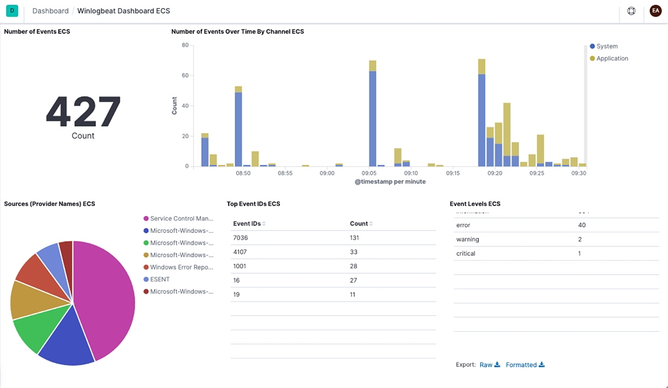

# Winlogbeat quick start: installation and configuration [winlogbeat-installation-configuration]


This guide describes how to get started quickly with Windows log monitoring. You’ll learn how to:

* install Winlogbeat on each system you want to monitor
* specify the location of your log files
* parse log data into fields and send it to {{es}}
* visualize the log data in {{kib}}

% TO DO: Use `:class: screenshot`



## Before you begin [_before_you_begin]

You need {{es}} for storing and searching your data, and {{kib}} for visualizing and managing it.

:::::::{tab-set}
:group: deployment

::::::{tab-item} {{ech}}
:sync: hosted
To get started quickly, spin up an [{{ech}}](https://www.elastic.co/cloud?page=docs&placement=docs-body) deployment. {{ech}} is available on AWS, GCP, and Azure. [Try it out for free](https://cloud.elastic.co/registration?page=docs&placement=docs-body).
::::::

::::::{tab-item} Self-managed
:sync: self
To install and run {{es}} and {{kib}}, see [Installing the {{stack}}](docs-content://deploy-manage/deploy/self-managed/installing-elasticsearch.md).
::::::

:::::::

## Step 1: Install Winlogbeat [installation]

1. Download the Winlogbeat zip file from the [downloads page](https://www.elastic.co/downloads/beats/winlogbeat).
2. Extract the contents into `C:\Program Files`.
3. Rename the `winlogbeat-<version>` directory to `Winlogbeat`.
4. Open a PowerShell prompt as an Administrator (right-click on the PowerShell icon and select Run As Administrator).
5. From the PowerShell prompt, run the following commands to install the service.

```sh
PS C:\Users\Administrator> cd 'C:\Program Files\Winlogbeat'
PS C:\Program Files\Winlogbeat> .\install-service-winlogbeat.ps1

Security warning
Run only scripts that you trust. While scripts from the internet can be useful,
this script can potentially harm your computer. If you trust this script, use
the Unblock-File cmdlet to allow the script to run without this warning message.
Do you want to run C:\Program Files\Winlogbeat\install-service-winlogbeat.ps1?
[D] Do not run  [R] Run once  [S] Suspend  [?] Help (default is "D"): R

Status   Name               DisplayName
------   ----               -----------
Stopped  winlogbeat         winlogbeat
```

:::{note}
If script execution is disabled on your system, you need to set the execution policy for the current session to allow the script to run. For example: `PowerShell.exe -ExecutionPolicy UnRestricted -File .\install-service-winlogbeat.ps1`.
:::


:::{note}
To use a local non-Administrator account to run Winlogbeat, follow [these additional steps](#local-user-account-setup).
:::


## Step 2: Connect to the {{stack}} [set-connection]

Connections to {{es}} and {{kib}} are required to set up Winlogbeat.

Set the connection information in `winlogbeat.yml`. To locate this configuration file, see [Directory layout](/reference/winlogbeat/directory-layout.md).

:::::::{tab-set}
:group: deployment

::::::{tab-item} {{ech}}
:sync: hosted
Specify the [cloud.id](/reference/winlogbeat/configure-cloud-id.md) of your {{ech}} deployment, and set [cloud.auth](/reference/winlogbeat/configure-cloud-id.md) to a user who is authorized to set up Winlogbeat. For example:

```yaml
cloud.id: "staging:dXMtZWFzdC0xLmF3cy5mb3VuZC5pbyRjZWM2ZjI2MWE3NGJmMjRjZTMzYmI4ODExYjg0Mjk0ZiRjNmMyY2E2ZDA0MjI0OWFmMGNjN2Q3YTllOTYyNTc0Mw=="
cloud.auth: "winlogbeat_setup:YOUR_PASSWORD" <1>
```

1. This examples shows a hard-coded password, but you should store sensitive values in the [secrets keystore](/reference/winlogbeat/keystore.md).
::::::

::::::{tab-item} Self-managed
:sync: self
1. Set the host and port where Winlogbeat can find the {{es}} installation, and set the username and password of a user who is authorized to set up Winlogbeat. For example:

    ```yaml
    output.elasticsearch:
      hosts: ["https://myEShost:9200"]
      username: "winlogbeat_internal"
      password: "YOUR_PASSWORD" <1>
      ssl:
        enabled: true
        ca_trusted_fingerprint: "b9a10bbe64ee9826abeda6546fc988c8bf798b41957c33d05db736716513dc9c" <2>
    ```

    1. This example shows a hard-coded password, but you should store sensitive values in the [secrets keystore](/reference/winlogbeat/keystore.md).
    2. This example shows a hard-coded fingerprint, but you should store sensitive values in the [secrets keystore](/reference/winlogbeat/keystore.md). The fingerprint is a HEX encoded SHA-256 of a CA certificate, when you start {{es}} for the first time, security features such as network encryption (TLS) for {{es}} are enabled by default. If you are using the self-signed certificate generated by {{es}} when it is started for the first time, you will need to add its fingerprint here. The fingerprint is printed on {{es}} start up logs, or you can refer to [connect clients to {{es}} documentation](docs-content://deploy-manage/security/security-certificates-keys.md#_connect_clients_to_es_5) for other options on retrieving it. If you are providing your own SSL certificate to {{es}} refer to [Winlogbeat documentation on how to setup SSL](/reference/winlogbeat/configuration-ssl.md#ssl-client-config).

2. If you plan to use our pre-built {{kib}} dashboards, configure the {{kib}} endpoint. Skip this step if {{kib}} is running on the same host as {{es}}.

    ```yaml
      setup.kibana:
        host: "mykibanahost:5601" <1>
        username: "my_kibana_user" <2> <3>
        password: "YOUR_PASSWORD"
    ```

    1. The hostname and port of the machine where {{kib}} is running, for example, `mykibanahost:5601`. If you specify a path after the port number, include the scheme and port: `http://mykibanahost:5601/path`.
    2. The `username` and `password` settings for {{kib}} are optional. If you don’t specify credentials for {{kib}}, Winlogbeat uses the `username` and `password` specified for the {{es}} output.
    3. To use the pre-built {{kib}} dashboards, this user must be authorized to view dashboards or have the `kibana_admin` [built-in role](elasticsearch://reference/elasticsearch/roles.md).
::::::

:::::::
To learn more about required roles and privileges, see [*Grant users access to secured resources*](/reference/winlogbeat/feature-roles.md).


## Step 3: Configure Winlogbeat [configuration]

In `winlogbeat.yml`, configure the event logs that you want to monitor.

1. Under `winlogbeat.event_log`, specify a list of event logs to monitor. By default, Winlogbeat monitors application, security, and system logs.

    ```yaml
    winlogbeat.event_logs:
      - name: Application
      - name: Security
      - name: System
    ```

    To obtain a list of available event logs, run `Get-EventLog *` in PowerShell. For more information about this command, see the configuration details for [event_logs.name](/reference/winlogbeat/configuration-winlogbeat-options.md#configuration-winlogbeat-options-event_logs-name).

2. (Optional) Set logging options to write Winlogbeat logs to a file:

    ```yaml
    logging.to_files: true
    logging.files:
      path: C:\ProgramData\winlogbeat\Logs
    logging.level: info
    ```

3. After you save your configuration file, test it with the following command.

    ```shell
    PS C:\Program Files\Winlogbeat> .\winlogbeat.exe test config -c .\winlogbeat.yml -e
    ```


For more information about configuring Winlogbeat, also see:

* [Configure Winlogbeat](/reference/winlogbeat/configuring-howto-winlogbeat.md)
* [Config file format](/reference/libbeat/config-file-format.md)
* [`winlogbeat.reference.yml`](/reference/winlogbeat/winlogbeat-reference-yml.md): This reference configuration file shows all non-deprecated options. You’ll find it in the same location as `winlogbeat.yml`.


## Step 4: Set up assets [setup-assets]

Winlogbeat comes with predefined assets for parsing, indexing, and visualizing your data. To load these assets:

1. Make sure the user specified in `winlogbeat.yml` is [authorized to set up Winlogbeat](/reference/winlogbeat/privileges-to-setup-beats.md).
2. From the installation directory, run:

    ```sh
    PS > .\winlogbeat.exe setup -e
    ```


This step loads the recommended [index template](docs-content://manage-data/data-store/templates.md) for writing to {{es}} , loads the ingest pipelines to parse the events (x-pack only), and deploys the sample dashboards for visualizing the data in {{kib}}.

::::{tip}
A connection to {{es}} (or {{ech}}) is required to set up the initial environment. If you’re using a different output, such as {{ls}}, see:

* [Load the index template manually](/reference/winlogbeat/winlogbeat-template.md#load-template-manually)
* [*Load {{kib}} dashboards*](/reference/winlogbeat/load-kibana-dashboards.md)
* [*Load ingest pipelines*](/reference/winlogbeat/load-ingest-pipelines.md) (x-pack only)

::::


## Step 5: Start Winlogbeat [start]

Before starting Winlogbeat, modify the user credentials in `winlogbeat.yml` and specify a user who is [authorized to publish events](/reference/winlogbeat/privileges-to-publish-events.md).

To start the Winlogbeat service, run:

```shell
PS C:\Program Files\Winlogbeat> Start-Service winlogbeat
```

Winlogbeat should now be running. If you used the logging configuration described here, you can view the log file at `C:\ProgramData\winlogbeat\Logs\winlogbeat`.

You can view the status of the service and control it from the Services management console in Windows. To launch the management console, run this command:

```shell
PS C:\Program Files\Winlogbeat> services.msc
```


### Stop Winlogbeat [_stop_winlogbeat]

Stop the Winlogbeat service with the following command:

```shell
PS C:\Program Files\Winlogbeat> Stop-Service winlogbeat
```


## Step 6: View your data in {{kib}} [view-data]

Winlogbeat comes with pre-built {{kib}} dashboards and UIs for visualizing log data. You loaded the dashboards earlier when you ran the `setup` command.

To open the dashboards:

1. Launch {{kib}}:

    :::::::{tab-set}
    :group: deployment
    ::::::{tab-item} {{ech}}
    :sync: hosted
    1. [Log in](https://cloud.elastic.co/) to your {{ecloud}} account.
    2. Navigate to the {{kib}} endpoint in your deployment.
    ::::::
    ::::::{tab-item} Self-managed
    :sync: self
    Point your browser to [http://localhost:5601](http://localhost:5601), replacing `localhost` with the name of the {{kib}} host.
    ::::::
    :::::::


2. In the side navigation, click **Discover**. To see Winlogbeat data, make sure the predefined `winlogbeat-*` data view is selected.

    ::::{tip}
    If you don’t see data in {{kib}}, try changing the time filter to a larger range. By default, {{kib}} shows the last 15 minutes.
    ::::

3. In the side navigation, click **Dashboard**, then select the dashboard that you want to open.

The dashboards are provided as examples. We recommend that you [customize](docs-content://explore-analyze/dashboards.md) them to meet your needs.


## Using a local non-Administrator account to run Winlogbeat [local-user-account-setup]

By default, the `Winlogbeat` service runs as the `Local System` account. If you want to run the `Winlogbeat` service as a local user account that is not an Administrator, then follow the steps below. The local user account must be granted `Log on as a service` in the security policy and be made part of the `Builtin\Event Log Readers` group to read the event log.

1. Open the Services Management console with this command:

    ```shell
    PS C:\Program Files\Winlogbeat> services.msc
    ```

2. Right-click on service named `winlogbeat` and select `Properties`
3. Under `Log On` tab, select `This account:` and browse for the local account user that you want to run Winlogbeat service as.
4. Enter local user account’s password and click `Apply`.
5. Search and open `Local Group Policy Editor` in Windows search or run `gpedit.msc` from Powershell.
6. Navigate to path: `Computer Settings → Security Settings → Local Policies` and open `User Rights Assignment` under it.
7. Inside `User Rights Assignment`, add your local user account to the policy named `Log on as a service`. This should allow your local user account log on as a service.
8. Open `Local Users and Group Manager` by running `lusrmgr.msc` in Powershell.
9. Under `Users`, right-click on your local account user and open `Properties`.
10. Select `Member of` tab and click on `Add...`
11. Find and select the group named `Event Log Readers` and click `Apply`. This should allow your local account user to read the event log.


## What’s next? [_whats_next]

Now that you have your logs streaming into {{es}}, learn how to unify your logs, metrics, uptime, and application performance data.

1. Ingest data from other sources by installing and configuring other Elastic {{beats}}:

    | Elastic {{beats}} | To capture |
    | --- | --- |
    | [{{metricbeat}}](/reference/metricbeat/metricbeat-installation-configuration.md) | Infrastructure metrics |
    | [{{filebeat}}](/reference/filebeat/filebeat-installation-configuration.md) | Logs |
    | [{{heartbeat}}](/reference/heartbeat/heartbeat-installation-configuration.md) | Uptime information |
    | [APM](docs-content://solutions/observability/apm/index.md) | Application performance metrics |
    | [{{auditbeat}}](/reference/auditbeat/auditbeat-installation-configuration.md) | Audit events |

2. Use the Observability apps in {{kib}} to search across all your data:

    | Elastic apps | Use to |
    | --- | --- |
    | [{{metrics-app}}](docs-content://solutions/observability/infra-and-hosts/analyze-infrastructure-host-metrics.md) | Explore metrics about systems and services across your ecosystem |
    | [{{logs-app}}](docs-content://solutions/observability/logs/explore-logs.md) | Tail related log data in real time |
    | [{{uptime-app}}](docs-content://solutions/observability/synthetics/index.md#monitoring-uptime) | Monitor availability issues across your apps and services |
    | [APM app](docs-content://solutions/observability/apm/overviews.md) | Monitor application performance |
    | [{{siem-app}}](docs-content://solutions/security.md) | Analyze security events |


