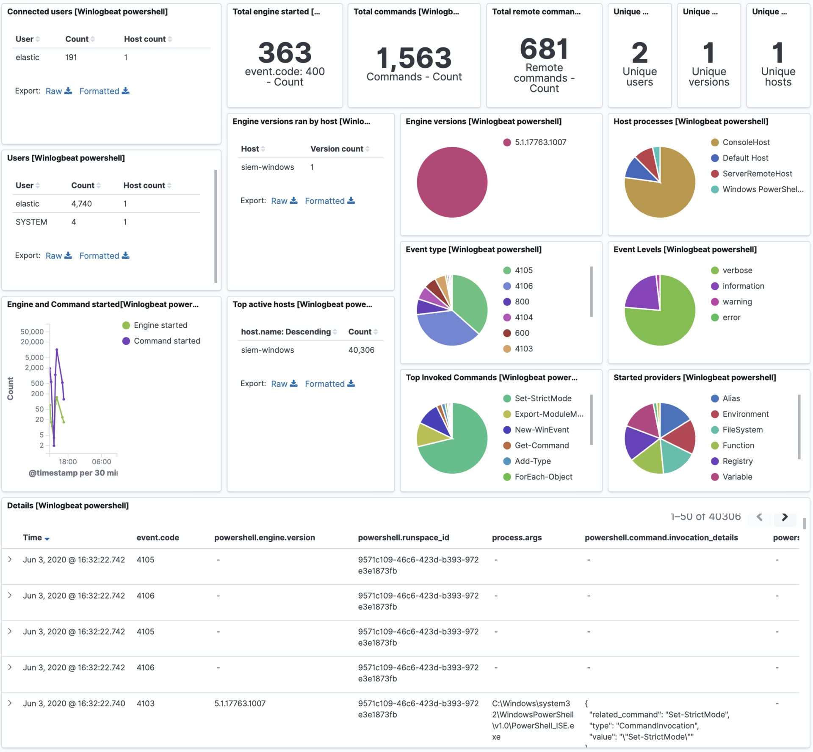

---
mapped_pages:
  - https://www.elastic.co/guide/en/beats/winlogbeat/current/winlogbeat-module-powershell.html
---

# PowerShell Module [winlogbeat-module-powershell]

The PowerShell module processes event log records from the Microsoft-Windows-PowerShell/Operational and Windows PowerShell logs.

The module has transformations for the following event IDs:

* 400 - Engine state is changed from None to Available.
* 403 - Engine state is changed from Available to Stopped.
* 600 - A Provider is Started.
* 800 - Pipeline executed.
* 4103 - Module logging.
* 4104 - Script block logging.
* 4105 - Command started.
* 4106 - Command completed.


## Configuration [_configuration_2]

By default, module and script block logging (event ID’s 410x) are disabled, to enable them you can do so through "Windows Powershell" GPO settings and set "Turn on Module Logging" and "Turn on PowerShell Script Block Logging" to enabled.

Alternatively they can be enabled setting the following registry values:

```
HKCU/HKLM\SOFTWARE\Policies\Microsoft\Windows\PowerShell\ModuleLogging: EnableModuleLogging = 1
HKCU/HKLM\SOFTWARE\Policies\Microsoft\Windows\PowerShell\ModuleLogging \ModuleNames: * = *
HKCU/HKLM\SOFTWARE\Policies\Microsoft\Windows\PowerShell\ScriptBlockLogging: EnableScriptBlockLogging = 1
HKCU/HKLM\SOFTWARE\Policies\Microsoft\Windows\PowerShell\ScriptBlockLogging: EnableScriptBlockInvocationLogging = 1
```

```yaml
winlogbeat.event_logs:
  - name: Windows PowerShell
    event_id: 400, 403, 600, 800

  - name: Microsoft-Windows-PowerShell/Operational
    event_id: 4103, 4104, 4105, 4106

output.elasticsearch.pipeline: winlogbeat-%{[agent.version]}-routing <1>
```

1. All module processing is handled via Elasticsearch Ingest Node pipelines. See [Setup of Ingest Node pipelines](/reference/winlogbeat/winlogbeat-modules.md#winlogbeat-modules-setup) for details.


## Example dashboard [_example_dashboard]

This module comes with a sample dashboard.

% TO DO: Use `:class: screenshot`


