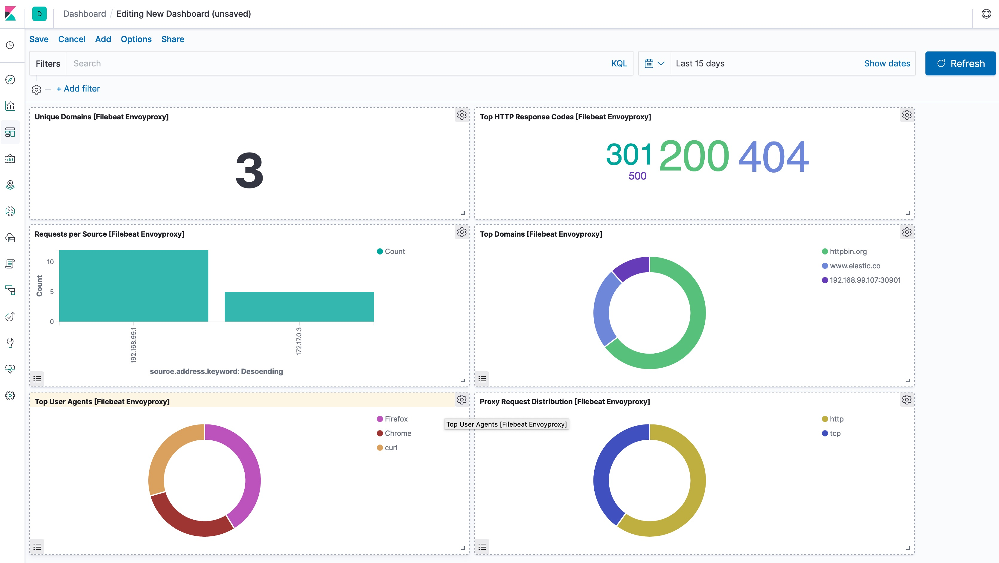

This is a Filebeat module for Envoy proxy access log ([https://www.envoyproxy.io/docs/envoy/v1.10.0/configuration/access_log](https://www.envoyproxy.io/docs/envoy/v1.10.0/configuration/access_log)). It supports both standalone deployment and Envoy proxy deployment in Kubernetes.

::::{tip}
Read the [quick start](/reference/filebeat/filebeat-installation-configuration.md) to learn how to configure and run modules.
::::

## Compatibility [_compatibility_11]

Although this module has been developed against Envoy proxy 1.10.0 and Kubernetes v1.13.x, it is expected to work with other versions of Envoy proxy and Kubernetes.

## Example dashboard [_example_dashboard_6]

This module comes with a sample dashboard.

% TO DO: Use `:class: screenshot`

